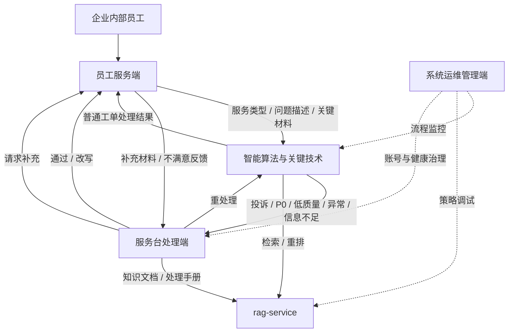
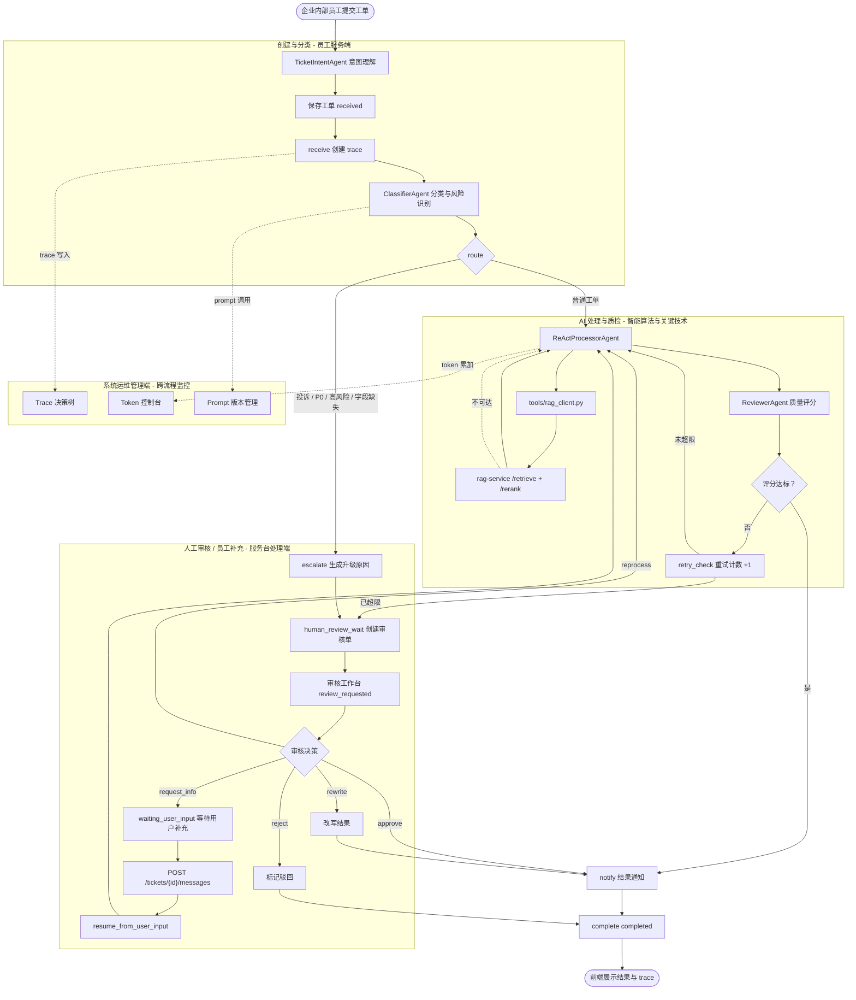

# 系统功能与总体架构

> v2.2 修订（2026-07-10）：老师反馈后定稿，本文档将业务场景收敛为企业内部服务台工单处理，并与框架图统一为员工服务端、服务台处理端、系统运维管理端、智能算法与关键技术四个架构分区。完整业务架构见 [04_业务架构梳理.md](./04_业务架构梳理.md)，定稿口径见 [../../specs/2026-07-10-ticket-processing-system-final-design.md](../../specs/2026-07-10-ticket-processing-system-final-design.md)。

## 1. 业务架构概览

系统定位为**基于知识增强智能体协同的工单处理系统**，面向企业内部服务台工单场景。工单提交人是企业内部员工，业务范围覆盖账号权限、业务系统、办公设备、网络环境、行政服务等内部服务请求。系统主线不是单纯展示 Agent、RAG、Trace 等技术能力，而是完成一条可解释、可追踪、可人工接管的工单处理闭环：

**工单提交 -> 意图理解 -> 分类路由 -> 知识增强处理 -> 质量审核 -> 人工复核 -> 用户补充 -> 反馈归档。**

围绕这条业务主线，系统对外划分为 4 个架构分区：

| 架构分区 | 面向角色 | 业务职责 |
| --- | --- | --- |
| 员工服务端 | 企业内部员工 / 工单提交人 | 员工档案、工单提报、进度协同、验收反馈 |
| 服务台处理端 | 服务台处理人员 / 工单审核员 / 知识维护员 | 工单受理、人工审核、知识维护、运营分析 |
| 系统运维管理端 | 系统管理员 / 开发运维人员 | 账号管理、流程监控、策略调试、系统健康 |
| 智能算法与关键技术 | 智能处理引擎（非登录角色） | 工单理解分类、知识检索增强、智能体协同、流程编排 |

## 2. 功能概览（v2.2 四个架构分区）

v2.2 对外采用与框架图一致的四个架构分区；原 U-/A-/D-/I- 编号继续作为需求追踪标识，完整清单见 [assets/system-module-architecture-v2-ascii.md](../assets/system-module-architecture-v2-ascii.md)。

| 架构分区 | 功能数 | 支撑的业务阶段 | 主要功能 | 对应源码 |
| --- | --- | --- | --- | --- |
| **员工服务端** | 8 | 服务请求发起、材料补充、进度协同、结果验收 | 员工档案、工单提报、进度协同、验收反馈 | `api/auth_routes.py`、`api/routes.py`、`agents/ticket_intent.py`、`web/src/pages/Login.tsx`、`Tickets.tsx`、`TicketDetail.tsx`、`Profile.tsx`（待建） |
| **服务台处理端** | 7 | 人工受理、审核决策、知识维护、运营分析 | 工单受理、人工审核、知识维护、运营分析、操作审计 | `api/routes.py`（review/knowledge）、`agents/coordinator.py`、`web/src/pages/ReviewWorkbench.tsx`、`Knowledge.tsx`、`AuditLog.tsx`（待建） |
| **系统运维管理端** | 6 + 账号/配置能力 | 账号治理、流程观测、策略调试、系统健康 | 账号管理、流程监控、Prompt/RAG 调试、Token 成本、Agent 统计、服务健康 | `api/admin_trace.py`（待建）、`api/admin_stats.py`（待建）、`api/admin_prompts.py`（待建）、`web/src/pages/dev/`、`UserManagement.tsx`（待建）、`SystemConfig.tsx`（待建） |
| **智能算法与关键技术** | 8 | 自动理解、分类路由、知识增强、质量审核、状态编排 | TicketIntentAgent、ClassifierAgent、ReActProcessorAgent、ReviewerAgent、CoordinatorAgent、LangGraph 编排、工具层、决策追踪 | `agents/`、`workflow/graph.py`、`tools/rag_client.py`（待建）、`core/trace.py` |

跨模块共享能力：

| 能力 | 说明 | 对应源码 |
| --- | --- | --- |
| 登录鉴权 | 用户名密码登录、session 保护、`auth_enabled=false` 演示模式 | `api/auth_routes.py`、`core/auth.py` |
| 执行追踪 | trace/span 记录、决策点结构化、human_decision span | `core/trace.py`、`core/database.py` |
| 统计分析 | 分类分布、优先级分布、处理成功率、满意度、Token 用量 | `tools/analytics.py`、`api/admin_stats.py`（待建） |
| 实时推送 | WebSocket 节点进度、审核事件、用户补充提醒 | `api/routes.py`（WebSocket） |

## 3. 总体架构

### 3.1 四个架构分区协作视图

该视图说明：员工服务端负责发起请求、补充材料和验收反馈；智能算法与关键技术负责自动理解、检索、处理、审核和编排；服务台处理端负责人工受理、审核决策、知识维护和运营分析；系统运维管理端负责账号治理、流程观测、策略调试和系统健康。

### 3.2 双系统协作视图

v2.0 将 RAG 能力抽离为独立项目 `rag-service`，主系统通过 HTTP API 调用。两层职责严格分离：

- **主系统 ai-agent-learning**（端口 8000）：业务流程 + Agent 编排 + 4 大角色模块前端
- **rag-service**（端口 8001）：PDF 复杂解析 + 检索/重排 + Qdrant 管理，可独立部署、对外复用

降级策略：rag-service 不可达时，`ReActProcessorAgent` 走"无知识增强"分支，工单仍能完成处理（保持 v1.x 的降级能力）。

### 3.3 主系统模块架构（实现视角）

> 源文件：[system-4-modules-tree.drawio](../assets/architecture/system-4-modules-tree.drawio)（用 draw.io 打开可编辑）· [SVG 矢量版](../assets/architecture/system-4-modules-tree.svg) · [PDF 打印版](../assets/architecture/system-4-modules-tree.pdf)

该图按 4 个架构分区展开，业务含义如下：

- **员工服务端**支撑内部员工“建档 -> 提报 -> 协同 -> 验收反馈”的服务请求链条。
- **服务台处理端**支撑服务台人员“受理 -> 审核 -> 知识维护 -> 运营分析”的人工兜底链条。
- **系统运维管理端**支撑系统管理员和开发运维人员“账号 -> 流程 -> 策略 -> 健康”的治理链条。
- **智能算法与关键技术**支撑后台“理解分类 -> 检索增强 -> 智能体协同 -> 流程编排”的自动处理链条。

### 3.4 v2.0 架构演进说明

相比 v1.x，v2.0 完成三项关键演进（**回应答辩反馈**）：

1. **拆分双项目**：RAG 能力从内部模块抽离为 `rag-service` 独立项目，论文可独立成章，未来其他项目可直接复用。详细设计见 [11_RAG服务独立项目设计.md](../01_正式设计/11_RAG服务独立项目设计.md)。
2. **4 大实现模块重构**：主系统从扁平的「表现层/接口层/编排层/Agent层/工具层/数据层」6 层，重构为「用户/管理员/开发人员/智能算法」4 大实现模块。
3. **新增开发人员工作台**：复用 farm-manager 项目（`/Users/ljn/Documents/demo/explore/`）的 Token 成本控制台与 Trace 时间线组件，新增 Prompt 版本对比、RAG 检索调试器，构成完整的智能流程运维工具链。详细设计见 [13_开发人员工作台设计.md](../01_正式设计/13_开发人员工作台设计.md)。
4. **v2.2 业务定稿表达**：将业务场景收敛为企业内部服务台工单，并把框架图统一为员工服务端、服务台处理端、系统运维管理端、智能算法与关键技术四个分区，避免论文呈现为技术清单。

v1.x 的 TicketIntentAgent、SQLAlchemy async + MySQL、人工审核闭环、用户补充恢复子图等能力均保留。

## 4. 架构分区说明

### 4.1 员工服务端

员工服务端面向企业内部员工，承担服务请求全生命周期交互。该分区不能只理解为“提交工单入口”，而应作为内部员工的服务请求门户：员工先整理问题和材料，系统辅助结构化提单，处理过程中持续查看进度并补充信息，处理完成后完成验收、评价或申诉升级。包含：

- **员工档案模块**：账号登录、会话保护、联系方式、部门岗位，为后续提单、服务台回访和权限判断提供基础信息。
- **工单提报模块**：服务类型选择、问题描述提单、关键信息填写，覆盖账号权限、业务系统、办公设备、网络环境、行政服务等内部服务请求。
- **进度协同模块**：工单列表、详情、状态追踪、时间线展示和补充沟通，通过 WebSocket 实时接收工单节点进度。
- **验收反馈模块**：展示处理方案、AI 依据摘要和人工审核结果，员工确认是否解决问题，不满意时发起申诉升级，并可查询历史工单。

### 4.2 服务台处理端

服务台处理端面向服务台处理人员、工单审核员和知识维护员，承担人工兜底与知识沉淀。包含：

- **工单受理模块**：待办工单筛选、工单详情核查、分类优先级确认，帮助服务台人员快速理解当前待处理事项。
- **人工审核模块**：双栏布局，左栏待审核队列，右栏审核面板（详情 + trace + AI 建议 + 决策区），支持通过、改写、重处理、驳回、请求补充。详细设计见 [09_人工审核工作台设计.md](../01_正式设计/09_人工审核工作台设计.md)。
- **知识维护模块**：上传处理手册、FAQ、故障经验和业务规则，调用 `rag-service` 完成解析、分块、向量化、入库和发布；支持知识内容更新和版本回滚。详细设计见 [04_知识库与RAG设计.md](../01_正式设计/04_知识库与RAG设计.md)。
- **运营分析模块**：处理状态统计、审核质量统计、用户反馈分析和操作日志审计，用于评估服务台处理效率与 AI 建议采纳情况。

### 4.3 系统运维管理端

系统运维管理端面向系统管理员和开发运维人员，承担账号、流程、策略和系统健康治理。它不直接处理普通业务工单，而是保障智能工单流程稳定运行。包含：

- **账号管理模块**：账号列表查询、角色状态维护、封禁 / 解封处理，覆盖企业内部员工、服务台处理人员和系统运维人员。
- **流程监控模块**：状态机画布、Trace 决策树、节点输入输出和异常日志定位，用于回答“这条工单为什么这样流转”。
- **策略调试模块**：Prompt 版本管理、RAG 检索调试器、Agent 调用统计，用于调优分类、检索、处理和审核策略。
- **系统健康模块**：Token 成本控制台、模型用量统计、rag-service / Qdrant / LLM / Embedding 健康检查。详细设计见 [12_Token成本控制台设计.md](../01_正式设计/12_Token成本控制台设计.md) 与 [13_开发人员工作台设计.md](../01_正式设计/13_开发人员工作台设计.md)。

### 4.4 智能算法与关键技术

智能算法与关键技术是后台处理引擎，承担多 Agent 协同的业务处理。包含：

- **工单理解分类算法**：TicketIntentAgent 进行自然语言工单结构化，ClassifierAgent 识别分类、优先级和风险标签，同时保留关键词和规则兜底。
- **知识检索增强算法**：通过 `rag-service` 完成查询改写、向量召回、关键词召回、融合排序和交叉编码重排，为处理 Agent 提供可引用依据。
- **智能体协同算法**：ReActProcessorAgent 生成处理方案，ReviewerAgent 进行质量评分，CoordinatorAgent 生成升级摘要和人工审核辅助建议。
- **流程编排策略**：LangGraph 定义 receive → classify → route → process → review → notify → complete 主流程，含 human_review_wait / apply_human_decision / pause_for_user_input / resume_from_user_input 等人工恢复子图；trace/span 记录每个节点输入、输出和决策依据。

详细设计见 [01_多智能体协同架构.md](../01_正式设计/01_多智能体协同架构.md)。

## 5. 核心流程

v2.0 流程相对 v1.3 的关键变化：

- **RAG 调用方式变化**：`ReActProcessorAgent` 通过 `tools/rag_client.py` 发起 HTTP 请求到 `rag-service:8001/retrieve`，取代 v1.x 直接调用 `tools/knowledge_search.py` 的内部 Qdrant 访问。
- **降级链路保留**：rag-service 不可达时，`rag_client.py` 抛出 `RagServiceUnavailable`，Agent 捕获后走"无知识增强"分支，工单仍能完成。

可渲染的简化流程如下：

## 6. 架构特点

- **业务主线清晰**：系统围绕工单提交、分类路由、处理审核、人工兜底、员工补充和反馈归档展开。
- **职责清晰**：对外按员工服务端、服务台处理端、系统运维管理端、智能算法与关键技术 4 个架构分区说明。
- **算法可独立演进**：rag-service 独立部署，可单独迭代 PDF 解析 / 检索 / 重排算法，不影响主系统稳定。
- **流程可解释**：trace + 决策点五元组，每个 Agent 的 trigger/options/selection 都能被结构化追溯。
- **可降级运行**：LLM、rag-service、Qdrant 任一不可用时，主流程保留关键词规则和占位处理能力。
- **可人工接管**：投诉、P0、异常、审核失败、员工不满意反馈均可进入人工审核队列。
- **可监控成本**：Token 控制台支持日/周/月用量统计、按 model + call_type 分组（服务性工单系统按系统级总用量统计，不按用户分摊）。
- **可独立复用**：rag-service 可被 ai-agent-learning 之外的其他项目（如未来的 NSQA 集成）直接调用。
- **体量适度**：保留多智能体 + RAG + 人机协同三大亮点，不引入企业级业务复杂度。
