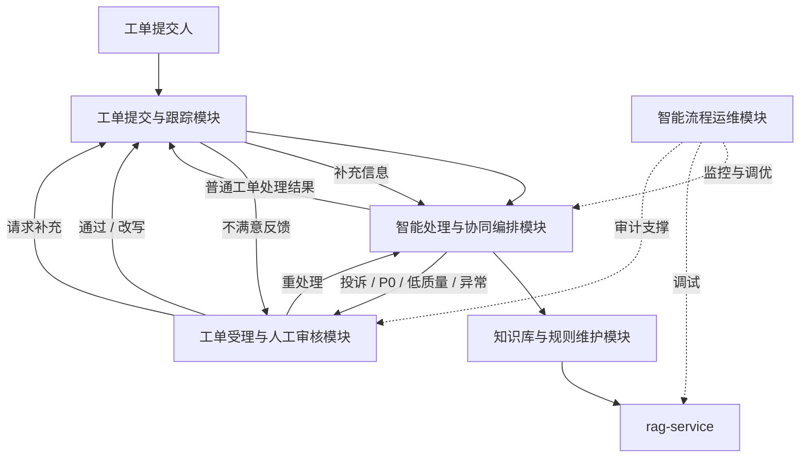

# 系统功能与总体架构

> v2.1 修订（2026-07-09）：根据“业务不清晰”反馈，本文档从“4 大角色模块优先”调整为“工单业务闭环优先”。角色模块仍作为实现视角保留，完整业务架构见 [04_业务架构梳理.md](./04_业务架构梳理.md)。

## 1. 业务架构概览

系统定位为**基于知识增强智能体协同的智能工单处理系统**，面向客服、运维和企业内部服务类工单场景。系统主线不是单纯展示 Agent、RAG、Trace 等技术能力，而是完成一条可解释、可追踪、可人工接管的工单处理闭环：

**工单提交 -> 意图理解 -> 分类路由 -> 知识增强处理 -> 质量审核 -> 人工复核 -> 用户补充 -> 反馈归档。**

围绕这条业务主线，系统对外划分为 5 个业务模块：

| 业务模块 | 业务职责 | 对应实现模块 |
| --- | --- | --- |
| 工单提交与跟踪模块 | 用户维护服务档案、自助预诊断、智能提单、材料采集、进度协同、用户补充、结果验收、申诉升级与历史复盘 | 用户模块 |
| 工单受理与人工审核模块 | 审核员处理高风险、低质量、异常和用户不满意工单 | 管理员模块 |
| 知识库与规则维护模块 | 沉淀 FAQ、处理手册、故障经验和业务规则，为 Agent 提供处理依据 | 管理员模块 + rag-service |
| 智能处理与协同编排模块 | 执行意图理解、分类路由、知识增强处理、质量审核和状态流转 | 智能算法模块 |
| 智能流程运维模块 | 监控 Trace、Prompt、RAG、Token、Agent 调用和服务健康 | 开发人员模块 |

## 2. 功能概览（v2.1 业务模块 + v2.0 实现模块）

v2.1 对外采用业务化模块名称；v2.0 的“用户 / 管理员 / 开发人员 / 智能算法”继续作为实现视角。完整功能编号清单（U-/A-/D-/I- 前缀）见 [assets/system-module-architecture-v2-ascii.md](../assets/system-module-architecture-v2-ascii.md)。

| 实现模块 | 功能数 | 支撑的业务模块 | 主要功能 | 对应源码 |
| --- | --- | --- | --- | --- |
| **用户模块** | 8 | 工单提交与跟踪 | 服务账号与档案、自助预诊断、智能提单、材料采集、进度协同、处理结果验收、申诉升级、历史工单复盘 | `api/auth_routes.py`、`api/routes.py`、`agents/ticket_intent.py`、`web/src/pages/Login.tsx`、`Tickets.tsx`、`TicketDetail.tsx`、`Profile.tsx`（待建） |
| **管理员模块** | 7 | 工单受理与人工审核、知识库与规则维护、账号管理 | 人工审核工作台、知识库管理、知识库版本回滚、账号管理、决策采纳率统计、系统配置查看、操作日志审计 | `api/routes.py`（review/knowledge）、`agents/coordinator.py`、`web/src/pages/ReviewWorkbench.tsx`、`Knowledge.tsx`、`UserManagement.tsx`（待建）、`SystemConfig.tsx`（待建）、`AuditLog.tsx`（待建） |
| **开发人员模块** | 6 | 智能流程运维 | Trace 决策树、Prompt 版本对比、RAG 检索调试器、Token 成本控制台、Agent 调用统计、服务健康检查 | `api/admin_trace.py`（待建）、`api/admin_stats.py`（待建）、`api/admin_prompts.py`（待建）、`web/src/pages/dev/`（待建，复用 explore/TokenDashboard） |
| **智能算法模块** | 8 | 智能处理与协同编排 | TicketIntentAgent、ClassifierAgent、ReActProcessorAgent、ReviewerAgent、CoordinatorAgent、LangGraph 编排、工具层（含 RAG Client）、决策追踪 | `agents/`、`workflow/graph.py`、`tools/rag_client.py`（待建）、`core/trace.py` |

跨模块共享能力：

| 能力 | 说明 | 对应源码 |
| --- | --- | --- |
| 登录鉴权 | 用户名密码登录、session 保护、`auth_enabled=false` 演示模式 | `api/auth_routes.py`、`core/auth.py` |
| 执行追踪 | trace/span 记录、决策点结构化、human_decision span | `core/trace.py`、`core/database.py` |
| 统计分析 | 分类分布、优先级分布、处理成功率、满意度、Token 用量 | `tools/analytics.py`、`api/admin_stats.py`（待建） |
| 实时推送 | WebSocket 节点进度、审核事件、用户补充提醒 | `api/routes.py`（WebSocket） |

## 3. 总体架构

### 3.1 业务模块协作视图

该视图说明：用户侧负责发起和反馈，智能处理模块负责自动闭环，知识库模块提供处理依据，人工审核模块负责风险兜底，开发运维模块保障流程稳定与可解释。

### 3.2 双系统协作视图

v2.0 将 RAG 能力抽离为独立项目 `rag-service`，主系统通过 HTTP API 调用。两层职责严格分离：

- **主系统 ai-agent-learning**（端口 8000）：业务流程 + Agent 编排 + 4 大角色模块前端
- **rag-service**（端口 8001）：PDF 复杂解析 + 检索/重排 + Qdrant 管理，可独立部署、对外复用

降级策略：rag-service 不可达时，`ReActProcessorAgent` 走"无知识增强"分支，工单仍能完成处理（保持 v1.x 的降级能力）。

### 3.3 主系统模块架构（实现视角）

> 源文件：[system-4-modules-tree.drawio](../assets/architecture/system-4-modules-tree.drawio)（用 draw.io 打开可编辑）· [SVG 矢量版](../assets/architecture/system-4-modules-tree.svg) · [PDF 打印版](../assets/architecture/system-4-modules-tree.pdf)

该图按 4 大实现模块展开，但用户区已经按服务请求门户重构，突出用户侧“服务档案 -> 自助预诊断 -> 智能提单 -> 材料采集 -> 进度协同 -> 用户补充 -> 结果验收 / 申诉升级 -> 历史复盘”的业务链条。论文中使用该图时，建议先说明它是实现视角，再在正文中用业务模块名称解释：

- **用户模块**支撑“工单提交与跟踪”。
- **管理员模块**支撑“工单受理与人工审核”以及“知识库与规则维护”。
- **开发人员模块**支撑“智能流程运维”。
- **智能算法模块**支撑“智能处理与协同编排”。

### 3.4 v2.0 架构演进说明

相比 v1.x，v2.0 完成三项关键演进（**回应答辩反馈**）：

1. **拆分双项目**：RAG 能力从内部模块抽离为 `rag-service` 独立项目，论文可独立成章，未来其他项目可直接复用。详细设计见 [11_RAG服务独立项目设计.md](../01_正式设计/11_RAG服务独立项目设计.md)。
2. **4 大实现模块重构**：主系统从扁平的「表现层/接口层/编排层/Agent层/工具层/数据层」6 层，重构为「用户/管理员/开发人员/智能算法」4 大实现模块。
3. **新增开发人员工作台**：复用 farm-manager 项目（`/Users/ljn/Documents/demo/explore/`）的 Token 成本控制台与 Trace 时间线组件，新增 Prompt 版本对比、RAG 检索调试器，构成完整的智能流程运维工具链。详细设计见 [13_开发人员工作台设计.md](../01_正式设计/13_开发人员工作台设计.md)。
4. **v2.1 业务化表达**：在实现模块之上补充 5 个业务模块，统一围绕工单生命周期解释系统功能，避免论文呈现为技术清单。

v1.x 的 TicketIntentAgent、SQLAlchemy async + MySQL、人工审核闭环、用户补充恢复子图等能力均保留。

## 4. 业务模块说明

### 4.1 工单提交与跟踪模块

对应原用户模块，承担普通用户的服务请求全生命周期交互。该模块不能只理解为“提交工单入口”，而应作为用户侧的服务请求门户：用户先整理问题和材料，系统辅助预诊断与结构化提单，处理过程中持续查看进度并补充信息，处理完成后完成验收、评价或申诉升级。包含：

- **服务账号与档案**：注册登录、会话保护、联系方式、常见问题偏好和服务身份上下文，为后续提单和人工跟进提供基础资料。
- **自助预诊断**：在正式提交前提供问题类型、紧急程度、是否需要补充材料的提示，降低无效工单和反复沟通。
- **智能提单**：用户用自然语言描述问题，`TicketIntentAgent` 自动提取标题、分类、优先级、影响范围和联系方式。
- **材料采集**：根据工单类型收集订单号、支付流水、错误截图、设备环境、影响范围等补充材料，既支持提单时填写，也支持后续 `waiting_user_input` 状态补充。
- **进度协同**：列表筛选、详情查看、状态追踪、时间线展示，通过 WebSocket 实时接收工单节点进度。
- **处理结果验收**：展示处理方案、AI 依据摘要和人工审核结果，用户确认是否解决问题。
- **申诉升级**：用户对结果不满意时发起升级，自动进入人工复核或二次处理。
- **历史工单复盘**：用户查看历史工单、处理结果和反馈记录，复用相似问题经验。

### 4.2 工单受理与人工审核模块

对应原管理员模块中的人工审核、统计和审计能力。包含：

- **人工审核工作台**：双栏布局，左栏待审核队列，右栏审核面板（详情 + trace + AI 建议 + 决策区）。详细设计见 [09_人工审核工作台设计.md](../01_正式设计/09_人工审核工作台设计.md)。
- **账号管理**：账号列表查询、角色状态维护、封禁 / 解封处理，覆盖普通用户、工单运营人员和开发运维人员。
- **决策采纳率统计**：`ai_adoption_rate` 指标，衡量 CoordinatorAgent 建议被审核员采纳的比例。
- **操作日志审计**：记录审核决策、知识库维护、账号管理和 Prompt 版本切换等写操作。

### 4.3 知识库与规则维护模块

对应原管理员模块中的知识库能力，以及独立 `rag-service`。包含：

- **知识库管理**：管理员上传知识文档，调用 `rag-service` 的 `/ingest` 接口完成解析 -> 分块 -> 向量化 -> 写入 Qdrant。详细设计见 [04_知识库与RAG设计.md](../01_正式设计/04_知识库与RAG设计.md)。
- **知识版本记录与回滚**：每次入库保留版本记录，支持错误发布后的回滚。
- **知识检索支撑**：为 ReActProcessorAgent 提供 FAQ、处理手册、故障经验和业务规则依据。

### 4.4 智能流程运维模块（v2.0 新增）

对应原开发人员模块，承担开发/运维人员的调试与监控工作。包含：

- **Trace 决策树**：渲染工单处理的完整执行树，包含 Agent 决策点结构化展示（trigger → options → selection → execution → reflection 五元组）。
- **Prompt 版本对比**：管理 5 个 Agent 的 Prompt 模板版本，支持 diff 对比、灰度切换、回滚。
- **RAG 检索调试器**：输入查询语句，展示 rag-service 的检索结果（向量 / BM25 / 混合三种模式）、重排前后对比、命中片段详情。
- **Token 成本控制台**：日/周/月维度的 Token 用量统计、按 model + call_type 分组（服务性工单系统，不按用户分摊/计费）。详细设计见 [12_Token成本控制台设计.md](../01_正式设计/12_Token成本控制台设计.md)。

详细设计见 [13_开发人员工作台设计.md](../01_正式设计/13_开发人员工作台设计.md)。

### 4.5 智能处理与协同编排模块

对应原智能算法模块，承担多 Agent 协同的业务处理。包含：

- **5 个 Agent**：TicketIntentAgent（意图理解）、ClassifierAgent（分类与风险识别）、ReActProcessorAgent（工具调用与方案生成）、ReviewerAgent（质量评分）、CoordinatorAgent（升级/异常/辅助决策）。
- **LangGraph 编排**：状态机定义 receive → classify → route → process → review → notify → complete 主流程，含 human_review_wait / apply_human_decision / pause_for_user_input / resume_from_user_input 等人工恢复子图。
- **工具层**：`rag_client.py`（HTTP 调用 rag-service）、通知工具、统计分析工具、数据库工具。
- **决策追踪**：trace/span 结构化记录，决策点入 `span.metadata.decision` 五元组。

详细设计见 [01_多智能体协同架构.md](../01_正式设计/01_多智能体协同架构.md)。

## 5. 核心流程

v2.0 流程相对 v1.3 的关键变化：

- **RAG 调用方式变化**：`ReActProcessorAgent` 通过 `tools/rag_client.py` 发起 HTTP 请求到 `rag-service:8001/retrieve`，取代 v1.x 直接调用 `tools/knowledge_search.py` 的内部 Qdrant 访问。
- **降级链路保留**：rag-service 不可达时，`rag_client.py` 抛出 `RagServiceUnavailable`，Agent 捕获后走"无知识增强"分支，工单仍能完成。

可渲染的简化流程如下：

## 6. 架构特点

- **业务主线清晰**：系统围绕工单提交、分类路由、处理审核、人工兜底、用户补充和反馈归档展开。
- **职责清晰**：对外按 5 个业务模块说明，对内按 4 大实现模块落地。
- **算法可独立演进**：rag-service 独立部署，可单独迭代 PDF 解析 / 检索 / 重排算法，不影响主系统稳定。
- **流程可解释**：trace + 决策点五元组，每个 Agent 的 trigger/options/selection 都能被结构化追溯。
- **可降级运行**：LLM、rag-service、Qdrant 任一不可用时，主流程保留关键词规则和占位处理能力。
- **可人工接管**：投诉、P0、异常、审核失败、用户不满意反馈均可进入人工审核队列。
- **可监控成本**：Token 控制台支持日/周/月用量统计、按 model + call_type 分组（服务性工单系统按系统级总用量统计，不按用户分摊）。
- **可独立复用**：rag-service 可被 ai-agent-learning 之外的其他项目（如未来的 NSQA 集成）直接调用。
- **体量适度**：保留多智能体 + RAG + 人机协同三大亮点，不引入企业级业务复杂度。
