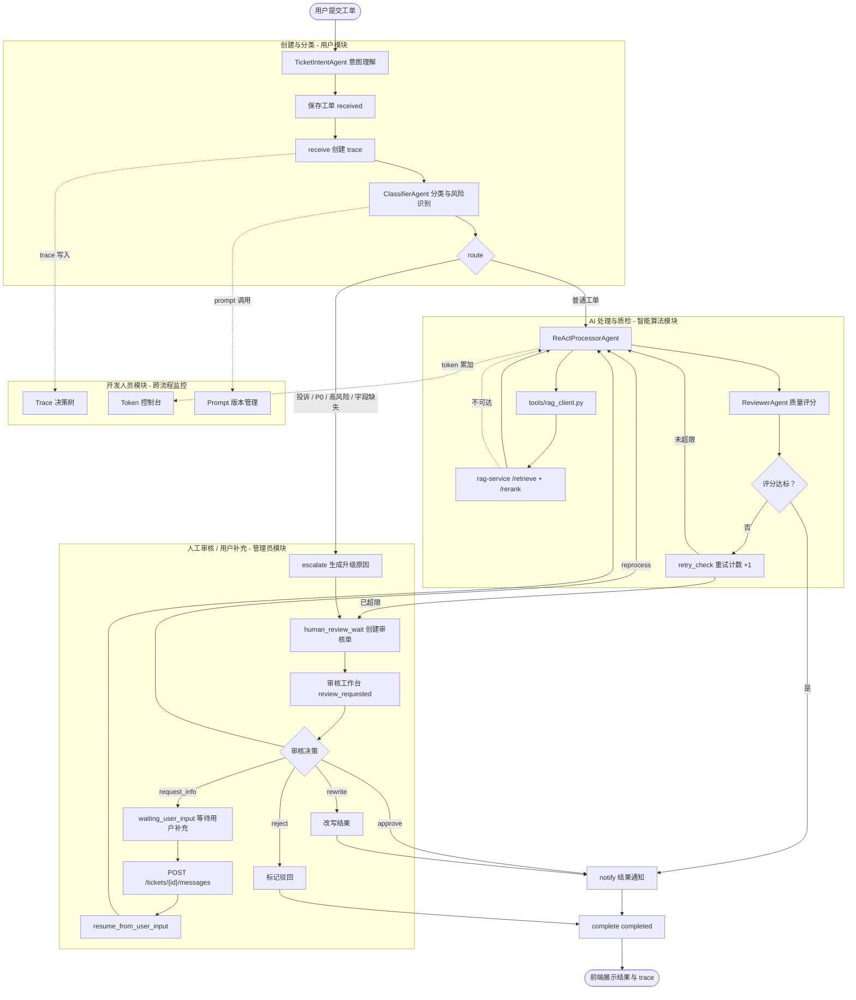

# 系统功能与总体架构

## 1. 功能概览（v2.0 4 大角色模块，共 30 个功能）

v2.0 起，主系统按"角色 + 算法"拆分为 4 大模块共 **30 个功能**。每个模块对应用户角色或核心算法能力，回应答辩反馈"模块要按角色分层、工作量不够"。完整功能编号清单（U-/A-/D-/I- 前缀）见 [assets/system-module-architecture-v2-ascii.md](../assets/system-module-architecture-v2-ascii.md)。

| 模块 | 功能数 | 主要功能 | 对应源码 |
| --- | --- | --- | --- |
| **用户模块** | 8 | 登录账户、用户注册、用户信息管理、修改密码、工单提交、工单查询与详情、消息补充、满意度反馈 | `api/auth_routes.py`、`api/routes.py`、`agents/ticket_intent.py`、`web/src/pages/Login.tsx`、`Tickets.tsx`、`TicketDetail.tsx`、`Profile.tsx`（待建） |
| **管理员模块** | 7 | 人工审核工作台、知识库管理、知识库版本回滚、用户管理、决策采纳率统计、系统配置查看、操作日志审计 | `api/routes.py`（review/knowledge）、`agents/coordinator.py`、`web/src/pages/ReviewWorkbench.tsx`、`Knowledge.tsx`、`UserManagement.tsx`（待建）、`SystemConfig.tsx`（待建）、`AuditLog.tsx`（待建） |
| **开发人员模块** | 7 | Trace 决策树、Prompt 版本对比、RAG 检索调试器、Token 成本控制台、Agent 调用统计、服务健康检查、配额管理 | `api/admin_trace.py`（待建）、`api/admin_stats.py`（待建）、`api/admin_prompts.py`（待建）、`web/src/pages/dev/`（待建，复用 explore/TokenDashboard） |
| **智能算法模块** | 8 | TicketIntentAgent、ClassifierAgent、ReActProcessorAgent、ReviewerAgent、CoordinatorAgent、LangGraph 编排、工具层（含 RAG Client）、决策追踪 | `agents/`、`workflow/graph.py`、`tools/rag_client.py`（待建）、`core/trace.py` |

跨模块共享能力：

| 能力 | 说明 | 对应源码 |
| --- | --- | --- |
| 登录鉴权 | 用户名密码登录、session 保护、`auth_enabled=false` 演示模式 | `api/auth_routes.py`、`core/auth.py` |
| 执行追踪 | trace/span 记录、决策点结构化、human_decision span | `core/trace.py`、`core/database.py` |
| 统计分析 | 分类分布、优先级分布、处理成功率、满意度、Token 用量 | `tools/analytics.py`、`api/admin_stats.py`（待建） |
| 实时推送 | WebSocket 节点进度、审核事件、用户补充提醒 | `api/routes.py`（WebSocket） |

## 2. 总体架构

### 2.1 双系统协作视图

v2.0 将 RAG 能力抽离为独立项目 `rag-service`，主系统通过 HTTP API 调用。两层职责严格分离：

- **主系统 ai-agent-learning**（端口 8000）：业务流程 + Agent 编排 + 4 大角色模块前端
- **rag-service**（端口 8001）：PDF 复杂解析 + 检索/重排 + Qdrant 管理，可独立部署、对外复用

降级策略：rag-service 不可达时，`ReActProcessorAgent` 走"无知识增强"分支，工单仍能完成处理（保持 v1.x 的降级能力）。

### 2.2 主系统模块架构（按老师参考图风格的「总系统 → 一级模块 → 二级子模块」三层）

模块架构图按 4 大角色展开：

- **用户模块**：工单提交 / 工单查询 / 消息补充 / 状态订阅 / 满意度反馈
- **管理员模块**：人工审核工作台 / 知识库管理 / 用户管理 / 决策采纳率统计
- **开发人员模块**：Trace 决策树 / Prompt 版本对比 / RAG 检索调试器 / Token 成本控制台
- **智能算法模块**：5 Agent + LangGraph 编排 + 工具层（含 RAG Client）+ 决策追踪

### 2.3 v2.0 架构演进说明

相比 v1.x，v2.0 完成三项关键演进（**回应答辩反馈**）：

1. **拆分双项目**：RAG 能力从内部模块抽离为 `rag-service` 独立项目，论文可独立成章，未来其他项目可直接复用。详细设计见 [11_RAG服务独立项目设计.md](../01_正式设计/11_RAG服务独立项目设计.md)。
2. **4 大角色模块重构**：主系统从扁平的「表现层/接口层/编排层/Agent层/工具层/数据层」6 层，重构为「用户/管理员/开发人员/智能算法」4 大角色模块，每个模块对应一个一级章节，二级子模块对应论文小节。
3. **新增开发人员工作台**：复用 farm-manager 项目（`/Users/ljn/Documents/demo/explore/`）的 Token 成本控制台与 Trace 时间线组件，新增 Prompt 版本对比、RAG 检索调试器，构成完整的开发人员工具链。详细设计见 [13_开发人员工作台设计.md](../01_正式设计/13_开发人员工作台设计.md)。

v1.x 的 TicketIntentAgent、SQLAlchemy async + MySQL、人工审核闭环、用户补充恢复子图等能力均保留。

## 3. 分层说明

### 3.1 用户模块

承担普通用户的工单全生命周期交互。包含：

- **工单提交**：用户输入自然语言描述，`TicketIntentAgent` 自动提取标题/分类/优先级/影响范围/联系方式。
- **工单查询**：列表筛选、详情查看、状态追踪。
- **消息补充**：审核员请求补充后，用户在 `waiting_user_input` 状态提交订单号/支付流水等。
- **状态订阅**：通过 WebSocket 实时接收工单节点进度。
- **满意度反馈**：工单完成后用户提交满意/不满意评分。

### 3.2 管理员模块

承担系统管理员的审核与运营操作。包含：

- **人工审核工作台**：双栏布局，左栏待审核队列，右栏审核面板（详情 + trace + AI 建议 + 决策区）。详细设计见 [09_人工审核工作台设计.md](../01_正式设计/09_人工审核工作台设计.md)。
- **知识库管理**：管理员上传知识文档，调用 `rag-service` 的 `/ingest` 接口完成解析→分块→向量化→写入 Qdrant。详细设计见 [04_知识库与RAG设计.md](../01_正式设计/04_知识库与RAG设计.md)。
- **用户管理**：用户列表、封禁、Token 配额调整（per-user）。
- **决策采纳率统计**：`ai_adoption_rate` 指标，衡量 CoordinatorAgent 建议被审核员采纳的比例。

### 3.3 开发人员模块（v2.0 新增）

承担开发/运维人员的调试与监控工作。包含：

- **Trace 决策树**：渲染工单处理的完整执行树，包含 Agent 决策点结构化展示（trigger → options → selection → execution → reflection 五元组）。
- **Prompt 版本对比**：管理 5 个 Agent 的 Prompt 模板版本，支持 diff 对比、灰度切换、回滚。
- **RAG 检索调试器**：输入查询语句，展示 rag-service 的检索结果（向量 / BM25 / 混合三种模式）、重排前后对比、命中片段详情。
- **Token 成本控制台**：日/周/月维度的 Token 用量统计、按 model + call_type 分组、配额管理与超限降级。详细设计见 [12_Token成本控制台设计.md](../01_正式设计/12_Token成本控制台设计.md)。

详细设计见 [13_开发人员工作台设计.md](../01_正式设计/13_开发人员工作台设计.md)。

### 3.4 智能算法模块

承担多 Agent 协同的算法执行。包含：

- **5 个 Agent**：TicketIntentAgent（意图理解）、ClassifierAgent（分类与风险识别）、ReActProcessorAgent（工具调用与方案生成）、ReviewerAgent（质量评分）、CoordinatorAgent（升级/异常/辅助决策）。
- **LangGraph 编排**：状态机定义 receive → classify → route → process → review → notify → complete 主流程，含 human_review_wait / apply_human_decision / pause_for_user_input / resume_from_user_input 等人工恢复子图。
- **工具层**：`rag_client.py`（HTTP 调用 rag-service）、通知工具、统计分析工具、数据库工具。
- **决策追踪**：trace/span 结构化记录，决策点入 `span.metadata.decision` 五元组。

详细设计见 [01_多智能体协同架构.md](../01_正式设计/01_多智能体协同架构.md)。

## 4. 核心流程

v2.0 流程相对 v1.3 的关键变化：

- **RAG 调用方式变化**：`ReActProcessorAgent` 通过 `tools/rag_client.py` 发起 HTTP 请求到 `rag-service:8001/retrieve`，取代 v1.x 直接调用 `tools/knowledge_search.py` 的内部 Qdrant 访问。
- **降级链路保留**：rag-service 不可达时，`rag_client.py` 抛出 `RagServiceUnavailable`，Agent 捕获后走"无知识增强"分支，工单仍能完成。

可渲染的简化流程如下：

## 5. 架构特点

- **职责清晰**：4 大模块按角色切分，论文每个模块可独立成章。
- **算法可独立演进**：rag-service 独立部署，可单独迭代 PDF 解析 / 检索 / 重排算法，不影响主系统稳定。
- **流程可解释**：trace + 决策点五元组，每个 Agent 的 trigger/options/selection 都能被结构化追溯。
- **可降级运行**：LLM、rag-service、Qdrant 任一不可用时，主流程保留关键词规则和占位处理能力。
- **可人工接管**：投诉、P0、异常、审核失败、用户不满意反馈均可进入人工审核队列。
- **可监控成本**：Token 控制台支持月/周配额、per-user 限制、超限降级。
- **可独立复用**：rag-service 可被 ai-agent-learning 之外的其他项目（如未来的 NSQA 集成）直接调用。
- **体量适度**：保留多智能体 + RAG + 人机协同三大亮点，不引入企业级业务复杂度。
