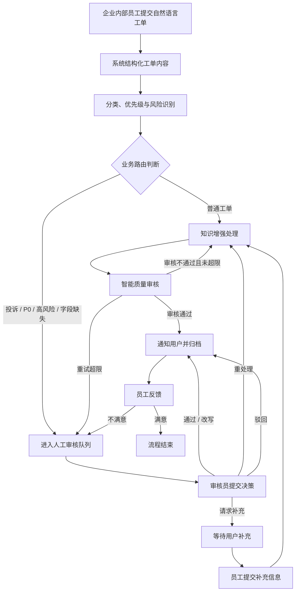
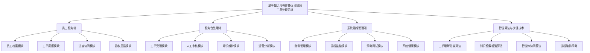
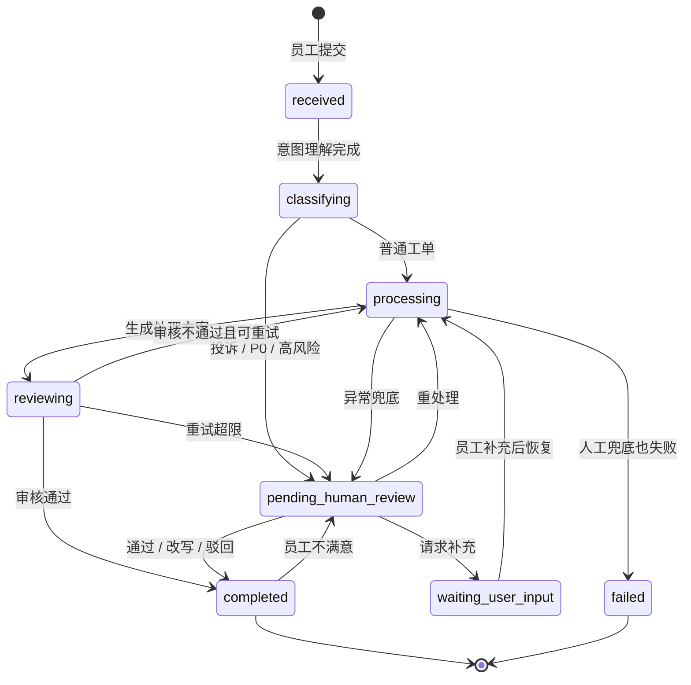

# 业务架构梳理

> 版本：v2.2
> 日期：2026-07-10
> 状态：老师反馈后定稿，业务场景收敛为企业内部服务台工单处理，不扩大为完整 ITSM
> 依据：[../../specs/2026-07-10-ticket-processing-system-final-design.md](../../specs/2026-07-10-ticket-processing-system-final-design.md)

## 1. 编写目的

当前系统已经实现用户提单、工单分类、知识增强处理、质量审核、人工审核、用户补充、结果反馈、执行追踪、Prompt 管理、RAG 调试和 Token 成本统计等能力。原 v2.0 文档主要按“用户 / 管理员 / 开发人员 / 智能算法”四类角色组织，容易被理解为功能堆叠，而不是围绕业务流程展开。

本文档将系统重新梳理为“智能工单处理业务闭环”，重点回答三个问题：

1. 系统服务什么业务场景。
2. 工单从提交到归档经历哪些业务阶段。
3. 各功能模块分别支撑工单业务中的哪一段。

本文档不新增财务报销、企业 OA、完整 ITSM、SLA 排班、多人会签、真实支付退款等业务范围。

## 2. 业务定位

系统定位为：

**基于知识增强智能体协同的工单处理系统。**

系统面向企业内部服务台工单场景。工单提交人是企业内部员工，业务范围覆盖账号权限、业务系统、办公设备、网络环境、行政服务等内部服务请求。员工用自然语言描述问题后，系统自动完成意图理解、分类与优先级识别、知识库检索、处理方案生成和质量审核。对投诉、P0、高风险、信息不足、处理异常、AI 审核失败或员工不满意的工单，系统进入人工审核或员工补充流程，形成可解释、可追踪、可人工接管的工单处理闭环。

## 3. 业务问题与系统应对

| 业务问题 | 具体表现 | 系统应对方式 |
| --- | --- | --- |
| 员工不知道如何报障 | 员工不清楚该选什么服务类型、紧急程度和需要准备哪些材料 | 员工服务端提示问题类型、风险等级和材料清单 |
| 员工描述不规范 | 员工以自然语言提交问题，缺少结构化字段 | TicketIntentAgent 提取标题、分类、优先级、影响范围和联系方式 |
| 员工材料提交不完整 | 订单号、系统入口、错误截图、设备环境等材料遗漏，导致处理反复 | 提单材料采集 + waiting_user_input 补充信息流程 |
| 人工初筛成本高 | 审核员需要逐条判断类型、紧急程度和风险 | ClassifierAgent 自动识别分类、优先级和风险标签 |
| 常见问题重复处理 | 同类问题反复查知识库、复制处理话术 | ReActProcessorAgent 结合 rag-service 检索结果生成处理方案 |
| 自动结果不稳定 | 大模型可能生成不完整、不可靠或不可执行的答案 | ReviewerAgent 评分，不通过则重试或转人工 |
| 高风险工单不能自动闭环 | 投诉、P0、权限变更、资金核查等场景需要人工判断 | human_review_wait 挂起工单并创建人工审核单 |
| 信息不足导致流程中断 | 员工未提供订单号、系统入口、设备环境、联系方式等关键字段 | request_info 让工单进入 waiting_user_input，员工补充后恢复处理 |
| 处理过程难以解释 | 无法说明为什么分类、升级、重试或转人工 | Trace / Span 记录节点输入输出和决策点 |
| 智能流程难以调优 | Prompt、RAG、Token、Agent 调用情况不可见 | 系统运维管理端提供状态机、Prompt、RAG、Token 和健康检查视图 |

## 4. 业务角色

| 架构分区 | 角色 | 业务职责 |
| --- | --- | --- |
| 员工服务端 | 企业内部员工 / 工单提交人 | 建立服务档案，提交服务请求，查看进度，补充材料，验收结果，发起申诉升级，复盘历史工单 |
| 服务台处理端 | 服务台处理人员 / 工单审核员 / 知识维护员 | 受理待办工单，核查 AI 建议，提交审核决策，维护处理手册和知识内容，查看运营统计 |
| 系统运维管理端 | 系统管理员 / 开发运维人员 | 管理账号角色，监控流程状态，调试检索和提示词策略，检查系统健康 |
| 智能算法与关键技术 | 智能处理引擎（非登录角色） | 执行意图理解、分类路由、知识增强处理、质量审核、状态机编排和决策追踪 |

“智能处理引擎”不是登录用户，而是系统内部的业务执行者。它承担普通工单自动闭环能力；服务台人工审核和员工补充流程负责兜底。

## 5. 核心业务闭环

该闭环体现系统的业务主线：**提交 -> 理解 -> 分类 -> 处理 -> 审核 -> 人工兜底 -> 用户补充 -> 反馈归档**。

## 6. 业务模块架构

对外展示和论文描述时，系统按当前框架图的 4 个架构分区组织：员工服务端、服务台处理端、系统运维管理端、智能算法与关键技术。

### 6.1 员工服务端

员工服务端服务于企业内部员工。该分区应定位为员工侧的“服务请求门户”，而不是简单的“提交工单页面”。它覆盖员工从发现问题、组织材料、发起请求、跟踪处理、补充资料、验收结果到申诉复盘的完整业务链条。

| 功能 | 业务说明 |
| --- | --- |
| 员工档案模块 | 账号登录、联系方式、部门岗位，绑定服务请求人身份 |
| 工单提报模块 | 服务类型选择、问题描述提单、关键信息填写，覆盖账号、系统、设备、网络、行政等内部服务请求 |
| 进度协同模块 | 工单状态跟踪、员工补充沟通、处理进度通知 |
| 验收反馈模块 | 结果验收、申诉升级、历史工单查询 |

### 6.2 服务台处理端

服务台处理端服务于服务台处理人员、工单审核员和知识维护员。它负责处理智能系统无法可靠自动闭环的工单，并把处理经验沉淀为知识。

| 功能 | 业务说明 |
| --- | --- |
| 工单受理模块 | 工单列表筛选、工单详情核查、分类优先级确认 |
| 人工审核模块 | 待审工单队列、智能建议核查、审核决策提交、补充信息请求 |
| 知识维护模块 | 文档上传解析、入库审核发布、知识内容更新 |
| 运营分析模块 | 处理状态统计、审核质量统计、用户反馈分析 |

该分区对外不应只描述为“管理员模块”，而要强调它承担服务台人工兜底、知识维护和运营分析职责。

### 6.3 系统运维管理端

系统运维管理端服务于系统管理员和开发运维人员。它不直接处理普通业务工单，而是保障智能工单流程可观测、可调优、可稳定运行。

| 功能 | 业务说明 |
| --- | --- |
| 账号管理模块 | 账号列表查询、角色状态维护、封禁解封处理 |
| 流程监控模块 | 流程状态监控、执行轨迹查询、节点输入输出 |
| 策略调试模块 | 提示词版本、检索效果调试、智能体调用统计 |
| 系统健康模块 | 模型用量统计、服务健康检查、异常日志定位 |

### 6.4 智能算法与关键技术

智能算法与关键技术是系统自动处理工单的核心。该分区需要从业务处理动作中凝练算法能力，说明输入、输出和业务价值。

| 功能 | 业务说明 | 技术实现 |
| --- | --- | --- |
| 工单理解分类算法 | 将自然语言问题转为结构化字段，并判断类别、优先级和风险 | TicketIntentAgent + ClassifierAgent + 关键词/规则兜底 |
| 知识检索增强算法 | 检索知识并为处理方案提供依据 | rag-service + Hybrid Retrieval + RRF 融合 + Cross-Encoder 重排 |
| 智能体协同算法 | 生成处理方案、质量评分和人工审核辅助建议 | ReActProcessorAgent + ReviewerAgent + CoordinatorAgent |
| 流程编排策略 | 控制自动处理、人工审核、员工补充和恢复流程 | LangGraph 状态机 + 条件路由 + Trace / Span |

## 7. 业务对象与数据关系

| 业务对象 | 业务含义 | 关键状态 / 字段 |
| --- | --- | --- |
| User | 企业内部员工、服务台处理人员、系统管理员或开发运维人员 | username、contact、role、status |
| Ticket | 工单主实体，贯穿完整业务流程 | category、priority、status、processing_result、review_score |
| TicketMessage | 员工补充和审核员请求补充的沟通记录 | sender_type、content、metadata |
| HumanReview | 人工审核记录 | trigger_type、recommend_decision、decision、decision_reason |
| KnowledgeDocument | 可检索知识和规则文档 | title、content_hash、version、chunk_count |
| Trace / Span | 执行轨迹和节点级决策记录 | node_name、duration、decision、rag_stats、token_usage |
| PromptVersion | Agent 提示词版本 | agent_name、version、is_active、note |
| TokenDailyStats | 系统级 Token 用量统计 | date、model、call_type、total_tokens、estimated_cost |

## 8. 状态生命周期

## 9. 业务触发条件与处理策略

| 触发条件 | 业务含义 | 系统处理策略 |
| --- | --- | --- |
| 分类为 complaint | 员工表达投诉或强烈不满 | 进入人工审核，避免自动闭环 |
| 优先级为 P0 | 严重故障、紧急问题或高影响范围 | 进入人工审核或升级处理 |
| requires_human_review=true | 风险策略判断需要人工复核 | 创建人工审核单 |
| requires_business_operation=true 且字段缺失 | 涉及权限变更、扣费核查、服务处理等业务操作但缺少关键信息 | 请求员工补充或转人工 |
| review_score 低于阈值 | 处理结果质量不达标 | 未超限则重试，超限转人工 |
| 工作流异常 | Agent 或工具执行失败 | 优先创建 error_fallback 人工审核 |
| 员工反馈不满意 | 员工认为处理结果无效 | 创建 user_request 人工审核 |
| rag-service 不可达 | 知识增强服务异常 | 降级为无知识增强处理，流程不中断 |

## 10. 技术能力与业务阶段映射

| 技术能力 | 所在业务阶段 | 输入 | 输出 | 业务价值 |
| --- | --- | --- | --- | --- |
| TicketIntentAgent | 工单提交后 | 员工自然语言描述 | 结构化工单字段 | 降低提单门槛 |
| ClassifierAgent | 分类路由阶段 | 工单内容和初步字段 | 分类、优先级、风险 | 降低人工初筛成本 |
| rag-service | 知识增强处理阶段 | 查询文本、分类、上下文 | 知识片段、相关度、重排结果 | 提供处理依据 |
| ReActProcessorAgent | 自动处理阶段 | 工单上下文和知识片段 | 处理方案 | 自动处理普通工单 |
| ReviewerAgent | 质量审核阶段 | 原始工单和处理结果 | 评分、问题类型、重试建议 | 避免低质量结果返回员工 |
| CoordinatorAgent | 人工审核阶段 | 触发原因、处理结果、评分 | AI 辅助审核建议 | 帮助审核员快速决策 |
| LangGraph | 全流程 | 节点状态和条件判断 | 下一节点 | 保证流程可控、可暂停、可恢复 |
| Trace / Span | 全流程 | 节点输入输出和元数据 | 执行轨迹、决策点 | 支撑解释、复盘和调试 |

## 11. 论文与答辩表述口径

论文中建议先使用四个架构分区名称，再在小节中说明技术实现。可采用以下表述：

> 本系统面向企业内部服务台工单处理场景，服务对象为企业内部员工、服务台处理人员和系统运维管理人员。系统以“工单提交、分类路由、知识增强处理、质量审核、人工复核、员工补充、结果反馈与归档”为业务主线，划分为员工服务端、服务台处理端、系统运维管理端、智能算法与关键技术四个架构分区。员工服务端负责服务请求发起、进度协同和结果验收；服务台处理端负责人工受理、审核决策、知识维护和运营分析；系统运维管理端负责账号、流程、策略和健康治理；智能算法与关键技术负责工单理解分类、知识检索增强、智能体协同和流程编排。

## 12. 范围边界

本系统是面向本科毕设的智能工单处理系统，不扩展为完整客服平台或企业 ITSM 平台。

| 不纳入范围 | 原因 |
| --- | --- |
| 多租户组织架构和细粒度 RBAC | 偏企业权限系统，超出主线 |
| SLA 排班、认领锁定、多人会签、转派链路 | 会显著扩大工单平台复杂度 |
| 真实支付、退款、短信邮件对接 | 外部依赖多，演示风险高 |
| 复杂审批流或企业 OA | 会偏离智能工单处理主线 |
| 自训练模型和微调 | 成本高，不是本系统重点 |
| 知识图谱和 GraphRAG | 可作为后续展望，不进入当前实现 |
