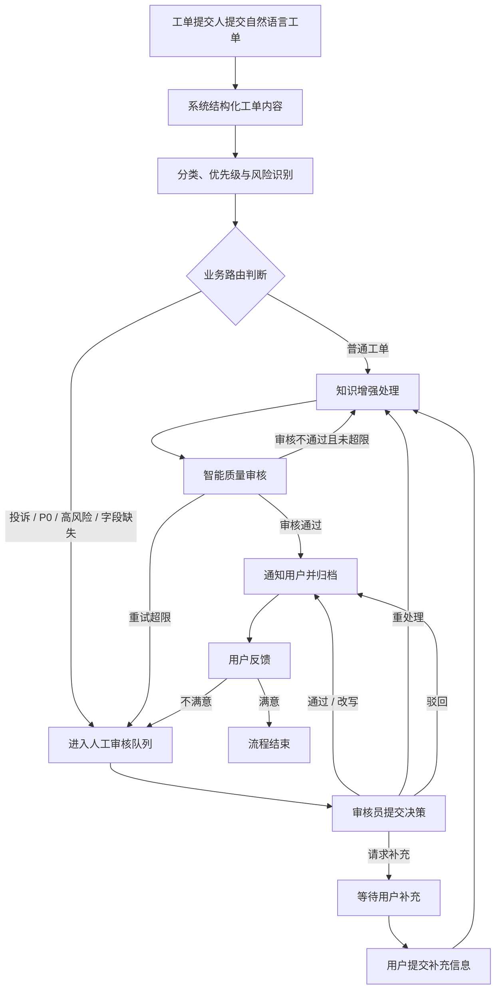

# 业务架构梳理

> 版本：v2.1.1
> 日期：2026-07-09
> 状态：根据“业务不清晰”和“用户模块业务量不足”反馈补充，基于现有系统整理业务主线，不扩大为完整 ITSM
> 依据：[../../specs/2026-07-09-business-module-redesign.md](../../specs/2026-07-09-business-module-redesign.md)

## 1. 编写目的

当前系统已经实现用户提单、工单分类、知识增强处理、质量审核、人工审核、用户补充、结果反馈、执行追踪、Prompt 管理、RAG 调试和 Token 成本统计等能力。原 v2.0 文档主要按“用户 / 管理员 / 开发人员 / 智能算法”四类角色组织，容易被理解为功能堆叠，而不是围绕业务流程展开。

本文档将系统重新梳理为“智能工单处理业务闭环”，重点回答三个问题：

1. 系统服务什么业务场景。
2. 工单从提交到归档经历哪些业务阶段。
3. 各功能模块分别支撑工单业务中的哪一段。

本文档不新增财务报销、企业 OA、完整 ITSM、SLA 排班、多人会签、真实支付退款等业务范围。

## 2. 业务定位

系统定位为：

**基于知识增强智能体协同的智能工单处理系统。**

系统面向客服、运维和企业内部服务类场景。工单提交人用自然语言描述问题后，系统自动完成意图理解、分类与优先级识别、知识库检索、处理方案生成和质量审核。对投诉、P0、高风险、信息不足、处理异常、AI 审核失败或用户不满意的工单，系统进入人工审核或用户补充流程，形成可解释、可追踪、可人工接管的工单处理闭环。

## 3. 业务问题与系统应对

| 业务问题 | 具体表现 | 系统应对方式 |
| --- | --- | --- |
| 用户不知道如何报障 | 用户不清楚该选什么分类、紧急程度和需要准备哪些材料 | 用户侧自助预诊断提示问题类型、风险等级和材料清单 |
| 用户描述不规范 | 用户以自然语言提交问题，缺少结构化字段 | TicketIntentAgent 提取标题、分类、优先级、影响范围和联系方式 |
| 用户材料提交不完整 | 订单号、支付流水、错误截图、环境信息等材料遗漏，导致处理反复 | 提单材料采集 + waiting_user_input 补充信息流程 |
| 人工初筛成本高 | 审核员需要逐条判断类型、紧急程度和风险 | ClassifierAgent 自动识别分类、优先级和风险标签 |
| 常见问题重复处理 | 同类问题反复查知识库、复制处理话术 | ReActProcessorAgent 结合 rag-service 检索结果生成处理方案 |
| 自动结果不稳定 | 大模型可能生成不完整、不可靠或不可执行的答案 | ReviewerAgent 评分，不通过则重试或转人工 |
| 高风险工单不能自动闭环 | 投诉、P0、资金核查等场景需要人工判断 | human_review_wait 挂起工单并创建人工审核单 |
| 信息不足导致流程中断 | 用户未提供订单号、支付流水、联系方式等关键字段 | request_info 让工单进入 waiting_user_input，用户补充后恢复处理 |
| 处理过程难以解释 | 无法说明为什么分类、升级、重试或转人工 | Trace / Span 记录节点输入输出和决策点 |
| 智能流程难以调优 | Prompt、RAG、Token、Agent 调用情况不可见 | 开发人员工作台提供状态机、Prompt、RAG、Token 和健康检查视图 |

## 4. 业务角色

| 角色 | 业务职责 | 对应系统能力 |
| --- | --- | --- |
| 工单提交人 | 建立服务档案，进行自助预诊断，提交服务请求，查看进度，补充材料，验收结果，发起申诉升级，复盘历史工单 | 工单提交与跟踪模块 |
| 工单审核员 | 处理待人工审核工单，核查 AI 建议，提交审核决策 | 工单受理与人工审核模块 |
| 系统管理员 / 知识维护员 | 维护知识文档、用户状态、系统配置摘要和操作日志 | 知识库与规则维护模块、系统管理能力 |
| 开发运维人员 | 监控 Agent 流程、Trace、Prompt、RAG 检索效果和 Token 成本 | 智能流程运维模块 |
| 智能处理引擎 | 执行意图理解、分类路由、知识增强处理、质量审核和状态编排 | 智能处理与协同编排模块 |

“智能处理引擎”不是登录用户，而是系统内部的业务执行者。它承担普通工单自动闭环能力；人工审核员和用户补充流程负责兜底。

## 5. 核心业务闭环

该闭环体现系统的业务主线：**提交 -> 理解 -> 分类 -> 处理 -> 审核 -> 人工兜底 -> 用户补充 -> 反馈归档**。

## 6. 业务模块架构

对外展示和论文描述时，系统按 5 个业务模块组织；原“用户 / 管理员 / 开发人员 / 智能算法”仍作为实现视角保留。

```mermaid
flowchart TB
    S[基于知识增强智能体协同的智能工单处理系统]

    S --> M1[工单提交与跟踪模块]
    S --> M2[工单受理与人工审核模块]
    S --> M3[知识库与规则维护模块]
    S --> M4[智能处理与协同编排模块]
    S --> M5[智能流程运维模块]

    M1 --> M11[服务账号与档案]
    M1 --> M12[自助预诊断]
    M1 --> M13[智能提单]
    M1 --> M14[材料采集]
    M1 --> M15[进度协同]
    M1 --> M16[结果验收]
    M1 --> M17[申诉升级]
    M1 --> M18[历史复盘]

    M2 --> M21[待审核队列]
    M2 --> M22[工单详情核查]
    M2 --> M23[AI 建议核查]
    M2 --> M24[人工决策]
    M2 --> M25[账号管理]
    M2 --> M26[审核统计与审计]

    M3 --> M31[知识文档维护]
    M3 --> M32[知识入库与发布]
    M3 --> M33[版本记录与回滚]
    M3 --> M34[检索依据支撑]

    M4 --> M41[意图理解]
    M4 --> M42[分类路由]
    M4 --> M43[知识增强处理]
    M4 --> M44[质量审核]
    M4 --> M45[状态机编排]
    M4 --> M46[决策追踪]

    M5 --> M51[Trace 决策树]
    M5 --> M52[Prompt 版本管理]
    M5 --> M53[RAG 检索调试]
    M5 --> M54[Token 成本统计]
    M5 --> M55[Agent 统计与健康检查]
```

### 6.1 工单提交与跟踪模块

对应原用户模块，服务于工单提交人。该模块应定位为用户侧的“服务请求门户”，而不是简单的“提交工单页面”。它覆盖用户从发现问题、组织材料、发起请求、跟踪处理、补充资料、验收结果到申诉复盘的完整业务链条。

| 功能 | 业务说明 |
| --- | --- |
| 服务账号与档案 | 用户注册、登录、退出、会话保护，维护昵称、联系方式、常见问题偏好和服务身份上下文 |
| 自助预诊断 | 用户提交前获得问题类型、紧急程度、风险提示和所需材料提示，减少无效工单 |
| 智能提单 | 用户直接用自然语言描述问题，由系统自动结构化为标题、分类、优先级、影响范围和联系方式 |
| 材料采集 | 按问题类型采集订单号、支付流水、错误截图、设备环境、影响范围等材料 |
| 进度协同 | 查看个人工单列表、详情、状态、处理时间线和节点进度，支持实时状态订阅 |
| 用户补充与双向沟通 | 在 `waiting_user_input` 状态下补充关键资料，推动工单恢复处理 |
| 处理结果验收 | 查看处理方案、AI 依据摘要和人工审核结果，确认问题是否解决 |
| 申诉升级与历史复盘 | 对不满意结果发起人工复核，查看历史工单、反馈记录和相似问题处理经验 |

### 6.2 工单受理与人工审核模块

对应原管理员模块中的人工审核、工单分析和审计能力，服务于审核员。

| 功能 | 业务说明 |
| --- | --- |
| 待审核工单队列 | 展示 pending_human_review 工单 |
| 工单详情核查 | 查看原始描述、分类、优先级、处理结果和 trace 摘要 |
| AI 建议核查 | 查看 CoordinatorAgent 生成的辅助决策建议 |
| 审核决策提交 | 支持通过、改写、重处理、驳回、请求补充 |
| 账号管理 | 查询账号列表，维护普通用户、工单运营人员、开发运维人员的角色与状态 |
| 审核质量统计 | 统计 AI 建议采纳率、审核通过率、重处理率 |
| 用户反馈分析 | 分析满意度和不满意升级情况 |
| 操作日志审计 | 记录审核、知识库、账号管理等写操作 |

### 6.3 知识库与规则维护模块

对应原管理员模块中的知识库管理能力，以及智能处理依赖的业务知识来源。

| 功能 | 业务说明 |
| --- | --- |
| 知识文档上传 | 上传 FAQ、处理手册、故障经验、业务规则等文档 |
| 知识入库与发布 | 调用 rag-service 完成解析、分块、向量化和入库 |
| 知识内容更新 | 更新过期文档和处理规则 |
| 知识版本记录与回滚 | 保留历史版本，支持错误发布后的回滚 |
| 检索依据支撑 | 为处理 Agent 提供可引用的处理依据 |

该模块对外不应只描述为“RAG 接口”或“Qdrant 入库”，而应强调其业务价值：沉淀服务经验，提供处理依据，减少重复人工处理。

### 6.4 智能处理与协同编排模块

对应原智能算法模块，是系统自动处理工单的核心。

| 功能 | 业务说明 | 技术实现 |
| --- | --- | --- |
| 工单意图理解 | 将自然语言问题转为结构化字段 | TicketIntentAgent |
| 分类与优先级识别 | 判断工单类别、紧急程度和风险 | ClassifierAgent |
| 知识增强处理 | 检索知识并生成处理方案 | ReActProcessorAgent + rag-service |
| 质量审核评分 | 判断处理结果是否可返回用户 | ReviewerAgent |
| 协调与升级建议 | 为人工审核生成辅助决策 | CoordinatorAgent |
| 状态机编排 | 控制自动处理、人工审核、用户补充和恢复流程 | LangGraph |
| 决策追踪 | 记录节点输入、输出和决策依据 | Trace / Span |

### 6.5 智能流程运维模块

对应原开发人员模块，服务于开发运维人员。

| 功能 | 业务说明 |
| --- | --- |
| 状态机画布与 Trace 决策树 | 查看工单在各节点间的流转和决策依据 |
| Prompt 版本管理 | 管理 5 个 Agent 的提示词版本和回滚 |
| RAG 检索调试 | 检查知识检索是否命中正确片段 |
| Agent 调用统计 | 统计各 Agent 的调用次数、耗时、成功率和错误率 |
| Token 成本统计 | 按系统维度统计模型调用成本，不做用户计费 |
| 服务健康检查 | 检查主系统、rag-service、Qdrant、LLM、Embedding 状态 |

该模块不直接处理普通业务工单，而是保障智能工单流程可观测、可调优、可稳定运行。

## 7. 业务对象与数据关系

| 业务对象 | 业务含义 | 关键状态 / 字段 |
| --- | --- | --- |
| User | 工单提交人、审核员、管理员或开发运维人员 | username、contact、role、status |
| Ticket | 工单主实体，贯穿完整业务流程 | category、priority、status、processing_result、review_score |
| TicketMessage | 用户补充和审核员请求补充的沟通记录 | sender_type、content、metadata |
| HumanReview | 人工审核记录 | trigger_type、recommend_decision、decision、decision_reason |
| KnowledgeDocument | 可检索知识和规则文档 | title、content_hash、version、chunk_count |
| Trace / Span | 执行轨迹和节点级决策记录 | node_name、duration、decision、rag_stats、token_usage |
| PromptVersion | Agent 提示词版本 | agent_name、version、is_active、note |
| TokenDailyStats | 系统级 Token 用量统计 | date、model、call_type、total_tokens、estimated_cost |

## 8. 状态生命周期

## 9. 业务触发条件与处理策略

| 触发条件 | 业务含义 | 系统处理策略 |
| --- | --- | --- |
| 分类为 complaint | 用户表达投诉或强烈不满 | 进入人工审核，避免自动闭环 |
| 优先级为 P0 | 严重故障、紧急问题或高影响范围 | 进入人工审核或升级处理 |
| requires_human_review=true | 风险策略判断需要人工复核 | 创建人工审核单 |
| requires_business_operation=true 且字段缺失 | 涉及退款、扣费核查、订单处理等业务操作但缺少关键信息 | 请求用户补充或转人工 |
| review_score 低于阈值 | 处理结果质量不达标 | 未超限则重试，超限转人工 |
| 工作流异常 | Agent 或工具执行失败 | 优先创建 error_fallback 人工审核 |
| 用户反馈不满意 | 用户认为处理结果无效 | 创建 user_request 人工审核 |
| rag-service 不可达 | 知识增强服务异常 | 降级为无知识增强处理，流程不中断 |

## 10. 技术能力与业务阶段映射

| 技术能力 | 所在业务阶段 | 输入 | 输出 | 业务价值 |
| --- | --- | --- | --- | --- |
| TicketIntentAgent | 工单提交后 | 用户自然语言描述 | 结构化工单字段 | 降低提单门槛 |
| ClassifierAgent | 分类路由阶段 | 工单内容和初步字段 | 分类、优先级、风险 | 降低人工初筛成本 |
| rag-service | 知识增强处理阶段 | 查询文本、分类、上下文 | 知识片段、相关度、重排结果 | 提供处理依据 |
| ReActProcessorAgent | 自动处理阶段 | 工单上下文和知识片段 | 处理方案 | 自动处理普通工单 |
| ReviewerAgent | 质量审核阶段 | 原始工单和处理结果 | 评分、问题类型、重试建议 | 避免低质量结果返回用户 |
| CoordinatorAgent | 人工审核阶段 | 触发原因、处理结果、评分 | AI 辅助审核建议 | 帮助审核员快速决策 |
| LangGraph | 全流程 | 节点状态和条件判断 | 下一节点 | 保证流程可控、可暂停、可恢复 |
| Trace / Span | 全流程 | 节点输入输出和元数据 | 执行轨迹、决策点 | 支撑解释、复盘和调试 |

## 11. 论文与答辩表述口径

论文中建议先使用业务化模块名称，再在小节中说明技术实现。可采用以下表述：

> 本系统围绕智能工单处理业务闭环展开，主线为“工单提交、分类路由、知识增强处理、质量审核、人工复核、用户补充、结果反馈与归档”。在此基础上，系统划分为工单提交与跟踪、工单受理与人工审核、知识库与规则维护、智能处理与协同编排、智能流程运维五个业务模块。原用户、管理员、开发人员和智能算法划分作为实现视角保留，用于说明前端页面、后端接口和 Agent 编排如何支撑上述业务流程。

## 12. 范围边界

本系统是面向本科毕设的智能工单处理系统，不扩展为完整客服平台或企业 ITSM 平台。

| 不纳入范围 | 原因 |
| --- | --- |
| 多租户组织架构和细粒度 RBAC | 偏企业权限系统，超出主线 |
| SLA 排班、认领锁定、多人会签、转派链路 | 会显著扩大工单平台复杂度 |
| 真实支付、退款、短信邮件对接 | 外部依赖多，演示风险高 |
| 复杂审批流或企业 OA | 会偏离智能工单处理主线 |
| 自训练模型和微调 | 成本高，不是本系统重点 |
| 知识图谱和 GraphRAG | 可作为后续展望，不进入当前实现 |
