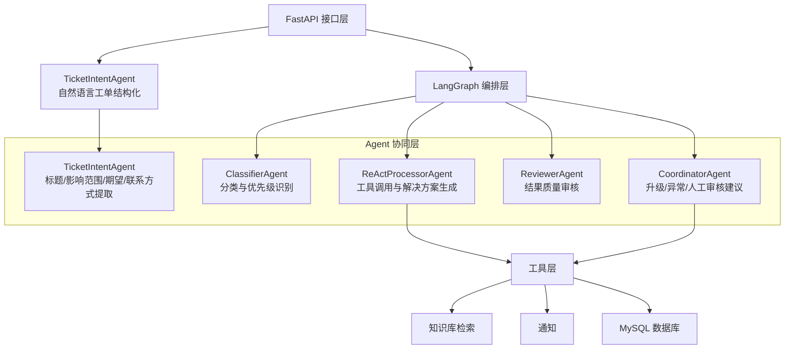
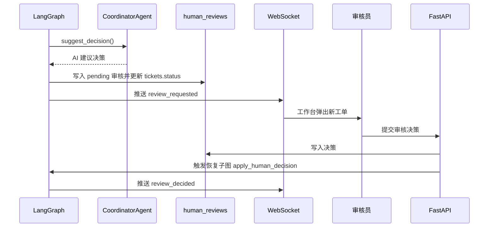

# 多智能体协同架构

> v2.2 修订：本文档已对齐企业内部服务台四分区架构。**文件名保留不改**（沿用历史引用），但本文档聚焦 **智能算法与关键技术**。第 1 节说明该分区与员工服务端、服务台处理端、系统运维管理端的协作定位；第 4 节工具层由内部 Qdrant 访问改为 HTTP 调用 rag-service。

## 1. 设计目标

> v2.2 模块归属：本文档对应四个架构分区中的**智能算法与关键技术**。该分区负责 5 个 Agent（Intent / Classifier / ReActProcessor / Reviewer / Coordinator）+ LangGraph 编排 + 工具层 + 决策追踪，与另外三个用户端的协作关系如下表。

### 1.1 多智能体协同架构自身的设计目标

多智能体协同架构的目标是将工单处理过程拆分为多个职责明确、可独立理解和测试的 Agent。每个 Agent 只负责流程中的一个环节，通过 FastAPI 入口和 LangGraph 状态机传递共享状态，最终形成自动处理、质量审核、人工复核和执行追踪的完整闭环。

### 1.2 智能算法与关键技术在四分区架构中的定位（v2.2 修订）

v2.2 主系统按“员工服务端 / 服务台处理端 / 系统运维管理端 / 智能算法与关键技术”四个架构分区组织，智能算法与关键技术作为后台处理引擎，与其它三个分区的协作关系如下：

| 协作对象 | 协作方式 | 文档链接 |
| --- | --- | --- |
| 员工服务端 | 接收员工服务端 `create_ticket` 接口转交的原始工单，由 TicketIntentAgent 完成结构化后回写工单字段；处理完成后通过 WebSocket 向员工服务端推送节点进度与结果 | [02_工单处理流程设计.md](./02_工单处理流程设计.md) |
| 服务台处理端 | 向 CoordinatorAgent 的 `suggest_decision` 提供 AI 建议，被采纳后写入人工审核表；处理失败时通过 `escalate` 节点转入服务台审核工作台 | [09_人工审核工作台设计.md](./09_人工审核工作台设计.md) |
| 系统运维管理端 | 决策点结构化埋点写入 `spans.metadata.decision`，供状态机画布和 Trace 决策树渲染；Prompt 模板从 `prompt_versions` 表加载；Token 用量回写到 trace | [13_开发人员工作台设计.md](./13_开发人员工作台设计.md) |

智能算法与关键技术本身不承担用户鉴权、知识维护 CRUD、Trace 可视化等职责，这些已被明确切分到对应分区。模块详细职责划分见 [02_系统功能与总体架构.md](../00_预设计/02_系统功能与总体架构.md)。

多智能体协同架构的目标是将工单处理过程拆分为多个职责明确、可独立理解和测试的 Agent。每个 Agent 只负责流程中的一个环节，通过 FastAPI 入口和 LangGraph 状态机传递共享状态，最终形成自动处理、质量审核、人工复核和执行追踪的完整闭环。

## 2. Agent 分层结构



## 3. 协同方式

系统采用“共享状态 + 条件路由”的协同方式：

- 工单入口先由 `TicketIntentAgent` 将用户原始描述格式化，提取标题、分类、优先级、影响范围、联系方式等字段，并写入初始工单。
- 共享状态由 `TicketState` 表示，包含工单 ID、内容、分类、优先级、处理结果、知识引用、审核评分、重试次数、状态、消息链、用户上下文、trace ID 和人工审核标记等字段。
- 每个节点读取当前状态，产出局部更新。
- LangGraph 将节点输出合并到全局状态中。
- 条件路由函数根据分类、优先级、审核评分和重试次数决定下一步。

这种方式避免 Agent 之间直接互相调用，降低耦合度，也方便追踪每个 Agent 的独立贡献。

## 4. 架构职责划分

| 层级 | 职责 | 主要文件 |
| --- | --- | --- |
| API 层 | 登录鉴权、接收请求、触发工作流、查询结果、推送状态 | `api/app.py`、`api/routes.py`、`api/auth_routes.py` |
| 编排层 | 定义状态节点、条件边和整体生命周期 | `workflow/graph.py` |
| Agent 层 | 执行分类、处理、审核和协调任务 | `agents/*.py` |
| 工具层 | 提供知识检索、数据库、通知、统计工具 | `tools/*.py`（其中 `tools/rag_client.py` 通过 HTTP 调用 rag-service，取代 v1.x 内部 `tools/knowledge_search.py` 的 Qdrant 直连） |
| 基础设施层 | 提供缓存、重试、降级、追踪、指标等能力 | `core/*.py` |
| 数据层 | 存储工单、用户、检查点、模式库、trace、span、人工审核 | `models/db.py`、`core/database.py` |

## 5. 关键设计点

### 5.1 Agent 注入

`build_ticket_graph()` 支持传入 Agent 实例。如果未传入 Agent，工作流可以退回到占位逻辑。这种设计便于测试，也使系统在 LLM 不可用时仍能演示基本流程。

`TicketIntentAgent` 不属于 LangGraph 内部节点，而是在创建工单接口中执行。这样可以在工作流启动前完成自然语言清洗和结构化，保证后续 `TicketState.content` 已经包含问题标题、紧急程度、影响范围、原始描述等信息。

### 5.2 降级与容错

Agent 内部结合重试和降级策略。意图理解和分类失败时可通过关键词规则兜底；知识库不可用时处理 Agent 仍可直接生成或返回基础处理结果；通知工具当前以模拟记录为主，不依赖真实外部渠道。工作流异常时优先转入 `error_fallback` 人工审核，若人工审核兜底也失败，才最终标记为 `failed`。

### 5.3 执行追踪

每个关键节点可以创建 span，记录输入、输出、耗时和状态。前端可通过 trace 接口查看执行树，使多 Agent 协作过程具备可解释性。

## 6. 本科毕设取舍

本项目没有采用复杂的全自治 Agent 群聊模式，也没有引入任务拍卖、长期规划或多 Agent 自我反思循环。原因是工单处理流程本身具有明确步骤，使用状态机编排更稳定、更容易测试，也更适合本科毕设按章节说明和答辩演示。

## 7. 人机协同维度（v1.0 新增）

系统在纯 Agent 协同之外，引入"人工审核员"作为人机协同参与者。原有 Agent 之间通过共享状态协同，而 Agent 与人通过持久化的 `human_reviews` 表、WebSocket 事件和恢复子图协同。详细设计见 [09_人工审核工作台设计.md](./09_人工审核工作台设计.md)。

### 7.1 协同方式



### 7.2 CoordinatorAgent 职责扩展

CoordinatorAgent 除了原有的 escalate 摘要、失败分析、报告生成外，新增 `suggest_decision` 方法，用于在工单挂起时生成辅助决策建议。建议与最终人工决策的对比构成 `ai_adoption_rate` 指标，是论文的重要评估数据。

### 7.3 与纯 Agent 协同的区别

| 维度 | Agent ↔ Agent | Agent ↔ 人 |
| --- | --- | --- |
| 通信方式 | 共享状态（TicketState） | 持久化表 + WebSocket + 恢复子图 |
| 同步性 | 同步函数调用 | 异步暂停 / 恢复 |
| 决策耗时 | 毫秒到秒级 | 分钟到小时级 |
| 错误恢复 | 重试 / 降级 | 等待 / 重新分配（展望） |
| 可解释性 | trace + span | trace 中新增 human_decision span |

## 8. 与 rag-service 的集成（v2.0 新增）

> v2.0 关键变化：RAG 调用从 v1.x 的内部 Qdrant 直连改为通过 `tools/rag_client.py` HTTP 调用独立项目 `rag-service`。

### 8.1 集成边界

| 维度 | 主系统侧（智能算法模块） | rag-service 侧 |
| --- | --- | --- |
| 角色 | 调用方：`ReActProcessorAgent` 在 `process` 节点构造查询、拼接上下文、生成方案 | 服务方：负责 PDF 解析、向量检索、BM25 检索、RRF 融合、Cross-Encoder 重排 |
| 调用入口 | `tools/rag_client.py`（待建） | rag-service HTTP API：`/retrieve` `/rerank` `/parse` `/ingest` |
| 数据存储 | 主系统 MySQL 只存工单/trace，不存向量 | Qdrant + rag-service 自带 SQLite 元数据 |
| 部署端口 | 8000 | 8001 |

### 8.2 调用与降级

`ReActProcessorAgent` 在 `process` 节点通过 `rag_client.py` 发起 HTTP 请求，单次超时 10 秒，网络错误重试 1 次。当 rag-service 不可达（连续失败、`/health` 返回 `degraded`、或 5 秒未响应）时，Agent 进入「无知识增强」分支，仅用工单内容生成解决方案，工单处理流程仍能完成。

降级判定与触发条件详见 [11_RAG服务独立项目设计.md](./11_RAG服务独立项目设计.md) 第 11 章与第 13 章，调用时序图见同一文档 13.2 节。

### 8.3 决策追踪埋点（与 13 章联动）

每次 rag 调用应写入独立的 `tool_call` span，`metadata` 中携带：

```json
{
  "rag_stats": {
    "hit_count": 5,
    "top_score": 0.91,
    "retrieval_mode": "hybrid",
    "rag_service_reachable": true
  }
}
```

该埋点定义属于开发人员模块的「决策追踪结构化」工作，本节仅声明契约，具体实现与 P0 修复清单见 [13_开发人员工作台设计.md](./13_开发人员工作台设计.md) 第 11 章。

## 9. 决策追踪结构化（v2.0 新增）

智能算法模块的关键节点（classify / route / process / review / retry_check / human_review_wait）应输出结构化决策点，五元组（trigger / options / selection / execution / reflection）写入 `spans.metadata.decision`。

**职责边界声明**：决策点的数据模型、五元组字段定义、前端 Trace 决策树渲染、以及 v1.1 P0 埋点 bug 的修复清单，统一由开发人员模块的设计文档承载，本文档不重复。详见 [13_开发人员工作台设计.md](./13_开发人员工作台设计.md) 第 4 章（决策点五元组）与第 11 章（v1.1 P0 问题修复清单）。

智能算法模块对应承担的代码改动：

| 决策点 | 责任 Agent / 节点 | 输出形式 |
| --- | --- | --- |
| classify 决策 | ClassifierAgent | 返回 all_options + confidence + reason，写入 `metadata.decision` |
| process 工具选择 | ReActProcessorAgent | tool_call span 携带 `metadata.rag_stats` |
| review 质量门 | ReviewerAgent | quality_gate 五元组写入 `metadata.decision` |
| escalation 决策 | CoordinatorAgent | 已实现，扩展为 escalation 五元组 |

## 10. 相关文档

- [02_工单处理流程设计.md](./02_工单处理流程设计.md) —— 状态流转与 RAG 调用策略（v2.0 修订）
- [03_Agent角色与职责设计.md](./03_Agent角色与职责设计.md) —— 5 个 Agent 的职责定义（v2.0 修订）
- [04_知识库与RAG设计.md](./04_知识库与RAG设计.md) —— 管理员模块的知识库 CRUD
- [09_人工审核工作台设计.md](./09_人工审核工作台设计.md) —— 管理员模块（escalation 协同）
- [11_RAG服务独立项目设计.md](./11_RAG服务独立项目设计.md) —— rag-service 独立项目设计（v2.0 新增）
- [12_Token成本控制台设计.md](./12_Token成本控制台设计.md) —— 开发人员模块（Token 子模块）
- [13_开发人员工作台设计.md](./13_开发人员工作台设计.md) —— 开发人员模块（决策追踪与 Trace 决策树）
- [02_系统功能与总体架构.md](../00_预设计/02_系统功能与总体架构.md) —— 4 大模块顶层架构
