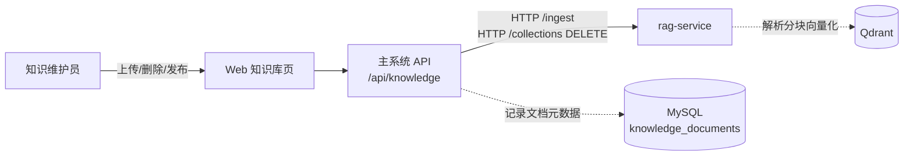
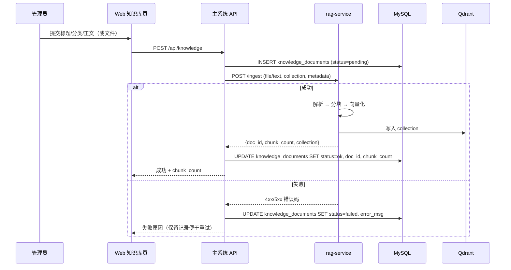

# 知识库与 RAG 设计

> 版本：v2.2
> 日期：2026-07-10
> 状态：v2.2 重新定位为服务台处理端的知识维护视角；RAG 算法细节由 rag-service 和智能算法与关键技术承载
> 所属分区：服务台处理端 / 知识维护模块（详见 [02_系统功能与总体架构.md](../00_预设计/02_系统功能与总体架构.md) 第 4.2 节）

## v2.0 范围声明

本文档聚焦**服务台处理端的知识维护视角**。RAG 算法、PDF 复杂解析、向量/BM25 混合检索、Cross-Encoder 重排等技术细节，迁移至独立文档 [11_RAG服务独立项目设计.md](./11_RAG服务独立项目设计.md)。本文档回答"服务台知识维护员如何上传、查看、删除和发布知识文档"，不回答"如何分块、如何检索"。

## 1. 设计目标

知识维护是**服务台处理端**的子功能，目标是让服务台知识维护员通过 Web 界面完成知识文档的录入、列表查看、删除、入库发布和更新。具体职责：

| 职责 | 说明 |
| --- | --- |
| 文档上传 | 知识维护员填写 `title` / `content` / `category`，或上传 PDF/Markdown/TXT 文件 |
| 文档列表 | 按 `category`、上传时间筛选与分页 |
| 文档删除 | 软删除（标记 `deleted_at`）或硬删除（按 collection 与 doc_id 调 rag-service `/collections/{name}/documents/{doc_id}` DELETE） |
| 触发向量化 | 上传成功后调用 rag-service `/ingest`，由 rag-service 完成解析→分块→向量化→写入 Qdrant |
| 结果反馈 | 把 rag-service 返回的 `chunk_count`、`collection`、失败原因回显给知识维护员 |

**不在服务台处理端职责范围内**（由 rag-service 承担，详见 [11](./11_RAG服务独立项目设计.md)）：

- PDF 版面分析、表格识别、公式还原、智能分块
- Embedding 生成、Qdrant 写入
- 向量/BM25/混合检索、Cross-Encoder 重排
- collection 与文档元数据的物理存储

主系统与 rag-service 通过 HTTP 解耦，主系统不直接访问 Qdrant。

## 2. 模块结构



知识库 CRUD 在主系统侧落库的元数据表 `knowledge_documents`（标题、分类、来源、`doc_id`、`collection`、上传人、`chunk_count`、`ingested_at`），物理向量数据存于 rag-service 的 Qdrant，二者通过 `doc_id` 关联。

## 3. 知识库上传流程



步骤要点：

1. **预校验**：标题与正文非空、`category` 在白名单内、文件大小/MIME 类型符合限制。
2. **先落元数据**：主系统先把文档元数据写入 `knowledge_documents` 表，`status=pending`，再调用 rag-service。这样即使 rag-service 不可达，主系统仍保留"待入库"记录，便于运维补传。
3. **以调用 rag-service `/ingest` 为终点**：主系统的上传流程到此结束，解析、分块、向量化全部由 rag-service 处理（详见 [11_RAG服务独立项目设计.md](./11_RAG服务独立项目设计.md) 第 5.2 节）。
4. **结果回写**：根据 rag-service 返回值更新 `status` 与 `chunk_count`，失败时记录 `error_msg` 供管理员查看。

## 4. 主系统调用 rag-service 的约定

知识库 CRUD 的"上传/删除"动作会调用 rag-service；而工单处理流程中 `ReActProcessorAgent` 的检索调用，是另一条链路（详见第 4.2 节）。两条链路共用同一个 HTTP 客户端 `tools/rag_client.py`（待建），但调用端点不同。

### 4.1 端点映射

| 主系统动作 | 主系统 API | rag-service 端点 | 方向 |
| --- | --- | --- | --- |
| 上传文档 | `POST /api/knowledge` | `POST /ingest` | 管理员模块 → rag-service |
| 删除文档 | `DELETE /api/knowledge/{doc_id}` | `DELETE /collections/{name}/documents/{doc_id}` | 管理员模块 → rag-service |
| 工单检索 | （由 ReActProcessorAgent 内部触发，不暴露 HTTP） | `POST /retrieve` + `POST /rerank` | 智能算法模块 → rag-service |

### 4.2 工单检索链路与降级

`ReActProcessorAgent` 在 `process` 节点通过 `tools/rag_client.py` 调用 rag-service `/retrieve` 与 `/rerank`，详细调用约定、超时、重试、降级链路见 [11_RAG服务独立项目设计.md](./11_RAG服务独立项目设计.md) 第 13 章。简要原则：

- 单次请求超时 10 秒，网络错误重试 1 次。
- rag-service 不可达时，`rag_client.py` 抛出 `RagServiceUnavailable`，Agent 捕获后走"无知识增强"分支，工单仍能完成（保留 v1.x 降级能力）。
- 连续 3 次失败后标记 rag-service 为不可用，5 分钟内直接走无 RAG 分支。

### 4.3 调试入口

开发期需要单独调试检索效果（不通过工单流程），由开发人员模块的"RAG 检索调试器"承担，详见 [13_开发人员工作台设计.md](./13_开发人员工作台设计.md) 第 6 章。

## 5. 可选依赖设计

知识库不是工单流程的强依赖。主系统启动时不再初始化 Qdrant（v2.0 起 Qdrant 由 rag-service 内部管理），仅初始化 `rag_client.py` 的 HTTP 连接池与 `RAG_SERVICE_URL` 配置项。若 rag-service 不可达：

- 管理员模块的上传/删除接口返回 503，前端给出明确提示。
- 工单处理流程走"无知识增强"分支，工单仍能完成。

这样设计的原因：

- 避免演示时因 rag-service 未启动导致整个系统不可用。
- 保证核心多 Agent 流程可以独立运行。
- 便于论文中说明系统的降级能力。

## 6. 知识数据示例

管理员上传一条 FAQ 后，主系统 `knowledge_documents` 表保留元数据：

```json
{
  "doc_id": "doc-7f3a9c20",
  "title": "登录失败处理手册",
  "category": "technical",
  "source": "manual_input",
  "collection": "knowledge_base",
  "chunk_count": 5,
  "status": "ok",
  "uploaded_by": "admin",
  "ingested_at": "2026-07-01T10:23:11"
}
```

正文原文（PDF/MD/TXT 解析后的纯文本）由 rag-service 在 Qdrant 中按 chunk 存储，主系统不保存原文。

## 7. 本科毕设范围

管理员模块只做知识库 CRUD，不做以下能力（这些是 rag-service 的内容或论文展望）：

| 不做项 | 归属 |
| --- | --- |
| 文档权限隔离 / 多租户 | 展望（毕设不做） |
| 多知识库版本管理 / 回滚 | rag-service 第 9 节（仅记录，不做 UI 回滚） |
| 混合检索 / 重排 | rag-service 第 7、8 节 |
| PDF 复杂解析 / 表格识别 | rag-service 第 6 节 |
| 自动知识过期 / 质量评分 | 展望（毕设不做） |
| 跨 collection 联合检索 | 展望（毕设不做） |

## 8. 相关文档

- [11_RAG服务独立项目设计.md](./11_RAG服务独立项目设计.md) —— RAG 算法、PDF 解析、检索/重排的技术细节
- [02_工单处理流程设计.md](./02_工单处理流程设计.md) —— ReActProcessorAgent 在 `process` 节点调用 rag-service
- [13_开发人员工作台设计.md](./13_开发人员工作台设计.md) —— RAG 检索调试器（开发人员视角）
- [12_Token成本控制台设计.md](./12_Token成本控制台设计.md) —— rag-service 的 HyDE LLM 调用纳入 token 统计
- [05_数据存储设计.md](./05_数据存储设计.md) —— `knowledge_documents` 元数据表
