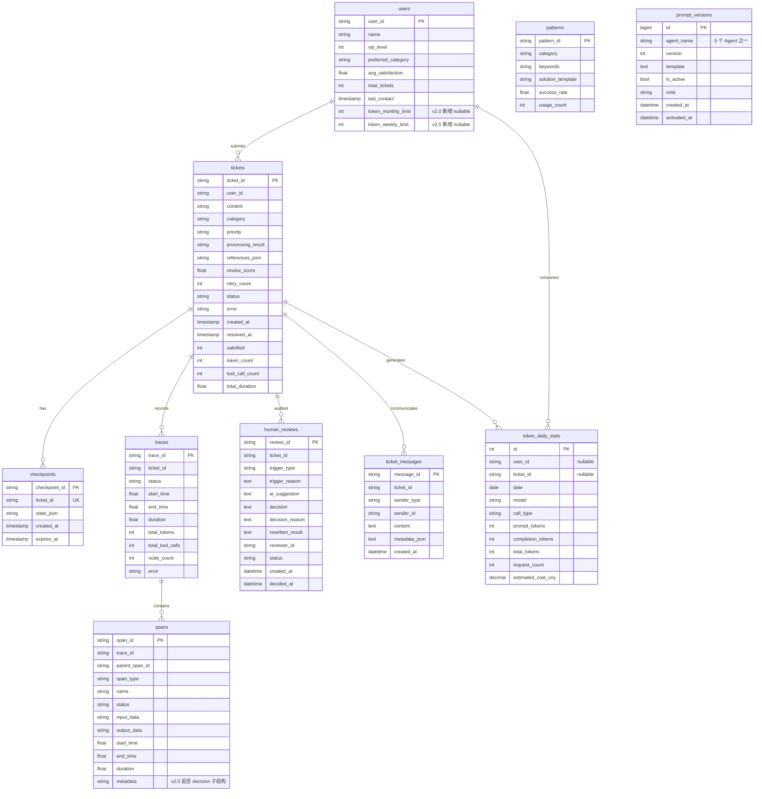

# 数据存储设计

> 版本：v2.0
> 日期：2026-07-01
> 状态：v2.0 新增 `prompt_versions` / `token_daily_stats` 两张表、`users` 配额字段、`spans.metadata.decision` 子结构说明
> 关联：[11_RAG服务独立项目设计.md](./11_RAG服务独立项目设计.md) · [12_Token成本控制台设计.md](./12_Token成本控制台设计.md) · [13_开发人员工作台设计.md](./13_开发人员工作台设计.md)

## v2.0 范围声明

本文档描述**主系统 `ai-agent-learning` 的数据存储设计**。v2.0 起，rag-service 拥有独立数据库（Qdrant + SQLite 元数据存储），不与主库共享（详见第 6 节）。本文档新增两张 v2.0 表：

- `prompt_versions`：开发人员模块的 Prompt 版本管理（详见 [13](./13_开发人员工作台设计.md) 第 5 章）
- `token_daily_stats`：Token 控制台的日聚合统计（详细 schema 见 [12](./12_Token成本控制台设计.md) 第 3 节）

## 1. 设计目标

数据存储模块需要支撑工单处理闭环、用户上下文、工作流检查点、执行追踪、人工审核、用户补充沟通和基础统计分析。当前系统使用 SQLAlchemy 2.0 async 作为统一数据访问层，主数据库为 MySQL。Pydantic 模型负责 API 入参和响应校验，ORM 模型负责实际表结构与持久化。

数据库相关代码集中在两个文件：

- `src/multi_agent_system/models/db.py`：SQLAlchemy ORM 表定义。
- `src/multi_agent_system/core/database.py`：异步数据库管理器、CRUD 方法、旧 SQL 兼容适配层。

## 2. 核心表结构



注：`tickets.status` 枚举值包含 `pending_human_review` 和 `waiting_user_input`。前者表示工单等待审核员决策，后者表示审核员已经请求用户补充信息，工作流暂停等待用户回复。

`spans.metadata`（ORM 中映射为 `metadata_`）从 v2.0 起承载三类子结构：
- `decision`：决策点五元组（trigger / options / selection / execution / reflection），见 [13](./13_开发人员工作台设计.md) 第 4 章
- `token_usage`：LLM 调用的 token 明细，见 [12](./12_Token成本控制台设计.md) 第 4.2 节
- `rag_stats`：RAG 检索的命中数与 top 分数，见 [11](./11_RAG服务独立项目设计.md) 第 13 章

## 3. 表说明

### 3.1 tickets

`tickets` 是系统核心业务表，用于保存工单内容、分类结果、优先级、处理结果、审核评分、重试次数和最终状态。

主要字段：

- `ticket_id`：工单唯一标识。
- `content`：用户提交的原始内容。
- `category`：分类结果。
- `priority`：优先级。
- `processing_result`：处理 Agent、人工改写或恢复流程生成的最终结果。
- `references_json`：处理过程引用的知识库片段列表，JSON 字符串形式保存。
- `review_score`：审核评分。
- `status`：当前状态。
- `status=waiting_user_input`：人工审核请求用户补充后进入该状态，只有此状态允许调用用户补充接口。
- `satisfied`：用户满意度反馈。
- `token_count`、`tool_call_count`、`total_duration`：用于效率统计和执行分析。

### 3.2 users

`users` 用于保存简单用户信息和历史偏好。当前仅作为扩展上下文使用，不实现复杂用户权限。

### 3.3 checkpoints

`checkpoints` 用于保存工作流中间状态，支持后续恢复能力。当前系统已有表结构和基础方法，恢复逻辑可作为后续扩展。

关键字段：

- `checkpoint_id`：检查点唯一标识。
- `ticket_id`：关联工单 ID，唯一约束。
- `state_json`：序列化后的工作流状态。
- `expires_at`：过期时间，系统可清理过期检查点。

### 3.4 patterns

`patterns` 用于保存模式匹配知识库或处理模板，支持按分类查找历史成功模式。

关键字段：

- `pattern_id`：模式唯一标识。
- `category`：适用分类。
- `keywords`：关键词集合。
- `solution_template`：处理模板。
- `success_rate`、`usage_count`：后续用于模式效果评估。

### 3.5 traces

`traces` 用于记录一次工单处理的整体执行情况，包括开始时间、结束时间、总耗时、节点数量、token 数量和错误信息。

### 3.6 spans

`spans` 用于记录 trace 下的节点或调用明细。通过 `parent_span_id` 可以构建执行树。

`spans.metadata` 在 ORM 中映射为 `metadata_` 属性，避免与 SQLAlchemy `Base.metadata` 冲突；对外通过字典仍返回 `metadata` 字段。

### 3.7 human_reviews

`human_reviews` 用于持久化人工审核记录。每次工单进入 `human_review_wait` 时插入一行 `pending` 记录，审核员提交决策后更新为 `decided`。详细字段说明见 [09_人工审核工作台设计.md](./09_人工审核工作台设计.md)。

主要字段：

- `review_id`：审核记录唯一标识，格式 `HR-<generated_id>`。
- `ticket_id`：关联工单 ID。
- `trigger_type`：触发类型，枚举值为 `escalate` / `review_failed` / `error_fallback` / `user_request`。
- `ai_suggestion`：CoordinatorAgent 生成的辅助决策建议 JSON 字符串。
- `decision`：审核员最终决策，枚举值为 `approve` / `reject` / `rewrite` / `reprocess` / `request_info`。
- `reviewer_id`：审核员标识。
- `status`：`pending` 或 `decided`。

### 3.8 ticket_messages

`ticket_messages` 用于持久化用户补充信息和审核员补充请求。它与工作流内部的 `TicketState.messages` 不同：`TicketState.messages` 主要用于节点调试和详情展示，`ticket_messages` 是业务沟通记录，会在用户补充恢复流程中被读取并拼接为 `conversation_context`。

主要字段：

- `message_id`：消息唯一标识，格式 `TM-<generated_id>`。
- `ticket_id`：关联工单 ID。
- `sender_type`：发送者类型，枚举值为 `user` / `reviewer` / `system` / `agent`。
- `sender_id`：用户或审核员标识，可为空。
- `content`：消息正文，不能为空。
- `metadata_json`：扩展元数据，例如 `{"source":"request_info","review_id":"HR-..."}`。
- `created_at`：创建时间。

典型写入链路：

1. 审核员在审核工作台点击“请求补充”，系统写入 `sender_type=reviewer` 消息。
2. 工单详情页进入 `waiting_user_input`，用户提交订单号、支付流水号等补充信息，系统写入 `sender_type=user` 消息。
3. `resume_from_user_input` 读取最近 20 条消息作为上下文，恢复 `process → review` 流程。

### 3.9 prompt_versions（v2.0 新增）

`prompt_versions` 用于 5 个 Agent（TicketIntentAgent / ClassifierAgent / ReActProcessorAgent / ReviewerAgent / CoordinatorAgent）的 Prompt 模板版本管理，是开发人员模块"Prompt 版本对比"子模块的数据基础，详细设计见 [13_开发人员工作台设计.md](./13_开发人员工作台设计.md) 第 5 章。

| 字段 | 类型 | 说明 |
| --- | --- | --- |
| `id` | BIGINT PK | 自增主键 |
| `agent_name` | VARCHAR(64) | Agent 名称，枚举 `ticket_intent` / `classifier` / `react_processor` / `reviewer` / `coordinator` |
| `version` | INT | 版本号，同一 `agent_name` 内自增 |
| `template` | TEXT | Prompt 模板原文 |
| `is_active` | BOOLEAN | 是否当前生效版本，同一 `agent_name` 最多一条 `true` |
| `note` | VARCHAR(500) | 版本说明（few-shot 改动、参数调整等） |
| `created_by` | VARCHAR(64) | 创建人 |
| `created_at` | DATETIME | 创建时间 |
| `activated_at` | DATETIME | 激活时间 |

约束与索引：

- 唯一约束 `uk_agent_version (agent_name, version)`：同一 Agent 不允许重复版本号
- 索引 `idx_agent_active (agent_name, is_active)`：Agent 启动时按 `WHERE agent_name=? AND is_active=true LIMIT 1` 加载

用途：Prompt 模板的版本管理、灰度切换、回滚。**不直接修改历史版本**——回滚通过"复制旧版本为新行并激活"实现，保证版本历史完整可追溯。Agent 启动时从 DB 加载激活版本，找不到时降级到源码默认模板。

### 3.10 token_daily_stats（v2.0 新增）

`token_daily_stats` 是 Token 控制台的数据基础，按 `(date, model, call_type, user_id)` 维度聚合每日 token 用量与估算成本，详细 schema 与 UPSERT 逻辑见 [12_Token成本控制台设计.md](./12_Token成本控制台设计.md) 第 3 节。

| 字段 | 类型 | 说明 |
| --- | --- | --- |
| `id` | INT PK | 自增主键 |
| `user_id` | VARCHAR(36), nullable | 用户 ID（系统/未登录调用时为 NULL） |
| `ticket_id` | VARCHAR(36), nullable | 关联工单（仅当次 trace） |
| `date` | DATE | 统计日期 |
| `model` | VARCHAR(100) | 如 `glm-4.6` / `glm-4.5-air` |
| `call_type` | VARCHAR(20) | 见 [12](./12_Token成本控制台设计.md) 第 7 节枚举（intent / classify / process / review / coordinator / rag） |
| `prompt_tokens` | INT | 输入 token 累计 |
| `completion_tokens` | INT | 输出 token 累计 |
| `total_tokens` | INT | 合计 token |
| `request_count` | INT | 调用次数 |
| `estimated_cost_cny` | NUMERIC(10,6) | 按 model 单价折算的人民币成本 |
| `created_at` / `updated_at` | DATETIME | 记录时间戳 |

约束与索引：

- 唯一约束 `uq_token_daily (user_id, date, model, call_type)`：UPSERT 累加的依据
- 索引 `idx_tds_user_date`、`idx_tds_date`、`idx_tds_call_type`：支撑日/周/月维度查询与按 `call_type` 分组

> 注意：与 farm-manager 源项目的差异——去掉 `farm_id`，新增 `user_id`（主系统无 farm 概念，改为按 user 维度统计），并新增 `ticket_id` 用于按工单回溯成本。详细适配说明见 [12](./12_Token成本控制台设计.md) 第 2、3 节。

## 4. 索引设计

当前数据库包含以下主要索引：

- `idx_tickets_user`：按用户查询工单。
- `idx_tickets_status`：按状态筛选工单。
- `idx_tickets_category`：按分类筛选工单。
- `idx_tickets_status_created`：按状态和创建时间筛选工单，替代 SQLite partial index，适配 MySQL 8。
- `idx_checkpoints_expires`：清理过期检查点。
- `idx_patterns_category_usage`：按分类和使用次数查找模式模板。
- `idx_traces_ticket`：按工单查询 trace。
- `idx_traces_status`：按执行状态筛选 trace。
- `idx_spans_trace`：按 trace 查询 span。
- `idx_spans_parent`：构建 span 树。
- `idx_spans_type`：按 span 类型统计节点、工具调用、人工决策等。
- `idx_hr_status`：按状态查询审核队列。
- `idx_hr_ticket`：按工单查询历史审核。
- `idx_hr_trigger`：按触发类型筛选审核。
- `idx_hr_reviewer`：按审核员统计工作量。
- `idx_tm_ticket_created`：按工单和创建时间查询沟通记录。
- `idx_tm_sender`：按发送者类型筛选沟通记录。

这些索引能满足列表筛选、详情查询、执行追踪和审核队列展示需求。

## 5. SQLAlchemy 迁移与兼容设计

当前代码已经从早期 SQLite 文档方案迁移到 SQLAlchemy 2.0 async + MySQL。为了降低迁移风险，`DatabaseManager` 做了三层兼容：

- 公共 CRUD 方法保持原调用方式，例如 `save_ticket()`、`list_tickets()`、`save_trace()`、`create_pending_review()`。
- 对 `trace.py`、`evaluation.py` 等旧模块仍可能使用的原始 SQL 提供 `_RawConnShim`，把 `?` 占位符转换为 SQLAlchemy 命名占位符。
- `_orm_to_dict()` 将 ORM 对象转换为原有字典形状，并把 `datetime` 序列化为字符串，避免前端和测试断裂。

这种设计使代码既能展示生产式数据库建模，又能保持毕业设计演示稳定。

## 6. 数据安全与配置约束

数据库连接串通过 `config.yaml` 或环境变量 `DATABASE_URL` 配置，文档和仓库不应提交真实密码、生产凭证或 `.env` 文件。前端设置页只展示是否配置密钥，不展示完整敏感值。

v2.0 起引入 rag-service 独立项目，其数据存储与主库物理隔离：

| 维度 | 主系统 ai-agent-learning | rag-service |
| --- | --- | --- |
| 业务数据库 | MySQL（工单、用户、trace、审核等） | 不使用 |
| 向量数据库 | 不使用 | Qdrant（独立部署，端口 6333） |
| 文档元数据 | MySQL `knowledge_documents`（仅元数据） | SQLite（doc_id / chunk_count / source / version 等，详见 [11](./11_RAG服务独立项目设计.md) 第 9 节） |
| 跨库访问 | 通过 HTTP 调用 rag-service，不直接连 Qdrant | 通过 HTTP 暴露能力，不读主库 |

这种隔离保证主库不被 RAG 内部状态污染，rag-service 也可独立部署给其他项目复用。

### 6.1 v2.0 增量迁移 SQL（生产 MySQL 手动执行）

`DatabaseManager.initialize()` 启动时已自动检测 `information_schema` 缺失列并 `ALTER TABLE`，
无需手动迁移；以下 SQL 仅作参考，或用于禁止自动迁移的环境：

```sql
-- users 表 v2.0 扩展：U-02/U-03/U-04 + fix-role-based-access
ALTER TABLE users
  ADD COLUMN username VARCHAR(32),
  ADD COLUMN password_hash VARCHAR(255),
  ADD COLUMN nickname VARCHAR(32),
  ADD COLUMN contact VARCHAR(128),
  ADD COLUMN preferred_categories TEXT,
  ADD COLUMN status VARCHAR(16) NOT NULL DEFAULT 'active',
  ADD COLUMN created_at DATETIME,
  ADD COLUMN role VARCHAR(16) NOT NULL DEFAULT 'user',
  ADD UNIQUE INDEX idx_users_username (username),
  ADD INDEX idx_users_role (role);
```

`role` 枚举值：`user`（默认）/ `reviewer` / `admin` / `developer`，决定 Sidebar 可见路由
与 API 权限（详见 [fix-role-based-access change](../../../openspec/changes/)）。

## 7. 相关文档

- [11_RAG服务独立项目设计.md](./11_RAG服务独立项目设计.md) —— rag-service 的 Qdrant + SQLite 元数据存储
- [12_Token成本控制台设计.md](./12_Token成本控制台设计.md) —— `token_daily_stats` 表的完整 schema 与 UPSERT 逻辑
- [13_开发人员工作台设计.md](./13_开发人员工作台设计.md) —— `prompt_versions` 表的使用方式与决策点子结构
- [09_人工审核工作台设计.md](./09_人工审核工作台设计.md) —— `human_reviews` 表的详细字段
- [06_可观测与执行追踪设计.md](./06_可观测与执行追踪设计.md) —— `traces` / `spans` 的数据契约
