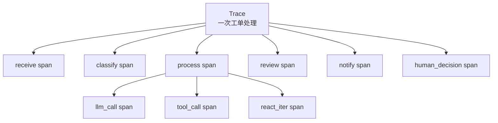

# 可观测与执行追踪设计

> 版本：v2.0
> 日期：2026-07-01
> 状态：v2.0 重新定位为"可观测能力总览"，开发者视角的详细工具迁移至 [13_开发人员工作台设计.md](./13_开发人员工作台设计.md)
> 关联：[12_Token成本控制台设计.md](./12_Token成本控制台设计.md) · [13_开发人员工作台设计.md](./13_开发人员工作台设计.md)

## v2.0 范围声明

本文档为**系统级可观测能力总览**，回答"系统能记录什么、为什么记录"。Trace 决策树、Prompt 调试、Token 控制台等**开发者视角的详细设计与调试方法**，迁移至 [13_开发人员工作台设计.md](./13_开发人员工作台设计.md)。本文档保留概念模型与基础接口说明，便于论文"系统设计"章节引用，不重复 13 的实现细节。

## 1. 设计目标

多 Agent 系统的执行过程比普通 CRUD 系统更复杂。为了便于调试、展示和论文分析，本项目设计了执行追踪能力，用于记录一次工单处理经过的节点、耗时、输入输出和执行状态。

可观测能力清单（"是什么 / 为什么"在本文档，"怎么调试"详见 [13](./13_开发人员工作台设计.md)）：

| 能力 | 用途 | 详细设计 |
| --- | --- | --- |
| Trace / Span 模型 | 记录工单处理的节点树与调用明细 | 本文第 2 节 |
| 追踪流程 | 何时创建 trace、何时写 span、何时收尾 | 本文第 3 节 |
| 接口支持 | 暴露 trace 查询 API | 本文第 4 节 |
| 实时监控（WebSocket） | 推送节点完成事件给前端 | 本文第 5 节 |
| Prometheus 指标 | HTTP / Agent / LLM 级别的指标采集 | 本文第 6 节 |
| 决策语义追踪 | `metadata.decision` 五元组结构化记录 | 本文第 7 节 |
| Trace 决策树（可视化调试） | 前端渲染决策树、定位 span | [13](./13_开发人员工作台设计.md) 第 4 章 |
| Prompt 版本对比 | Prompt 调优与回滚 | [13](./13_开发人员工作台设计.md) 第 5 章 |
| RAG 检索调试器 | 独立调试 rag-service 检索效果 | [13](./13_开发人员工作台设计.md) 第 6 章 |
| Token 成本控制台 | 系统级 token 用量与成本统计 | [12_Token成本控制台设计.md](./12_Token成本控制台设计.md) |

## 2. Trace 与 Span 模型

| 概念 | 含义 |
| --- | --- |
| Trace | 一次完整工单处理过程 |
| Span | Trace 中的一个节点或一次调用 |
| span_type | `node`、`react_iter`、`llm_call`、`tool_call`、`memory_call`、`human_decision` 等类型 |
| status | 执行成功、失败或降级 |
| duration | 节点耗时 |
| input_data/output_data | 输入输出摘要 |
| metadata | v2.0 起含 `decision` / `token_usage` / `rag_stats` 子结构 |

字段级 schema 与 `metadata.decision` 五元组定义见 [13_开发人员工作台设计.md](./13_开发人员工作台设计.md) 第 4 章、第 8.3 节。

## 3. 追踪流程

1. `receive` 节点开始时创建 trace。
2. 每个工作流节点创建一个 span。
3. 节点完成后写入输出、状态和耗时。
4. 前端通过 trace 接口查询执行树。
5. 统计页面可基于 trace 数据展示耗时和调用指标。

v2.0 新增的"决策点埋点修复清单"（7 个 P0/P1 问题及修复方案）详见 [13_开发人员工作台设计.md](./13_开发人员工作台设计.md) 第 11 章。

## 4. 接口支持

系统提供以下追踪相关接口（开发者视角的高级查询接口在 [13](./13_开发人员工作台设计.md) 第 9 章）：

- `GET /api/tickets/{ticket_id}/trace`：查询某个工单的完整执行树。
- `GET /api/traces`：查询 trace 列表。
- `GET /api/traces/{trace_id}/stats`：查询 trace 耗时统计。
- `GET /api/traces/{trace_id}/decisions`：查询 trace 内的关键决策点。

## 5. 实时监控

除了持久化 trace，系统还通过 WebSocket 推送节点完成事件。推送内容包括：

- 工单 ID。
- 当前状态。
- 节点名称。
- 中文消息。
- 分类、优先级、审核评分、重试次数等摘要数据。
- 最近完成 span 的摘要信息。

实时面板（`AgentMonitor.tsx`）与开发者工作台（`DevConsole`）的关系详见 [13_开发人员工作台设计.md](./13_开发人员工作台设计.md) 第 10.1 节。

## 6. 指标设计

系统基础设施中包含 Prometheus 指标采集能力，可记录：

- HTTP 请求数量和耗时。
- 当前活跃请求数。
- Agent 执行次数和耗时。
- LLM 调用情况。
- 缓存命中情况。

本科毕设中可将 Prometheus 和 Grafana 作为增强演示项，不作为核心必需项。

## 7. 决策语义追踪

除了节点耗时，系统还会在部分 span 的 `metadata.decision` 中记录结构化决策信息，并通过 `/api/traces/{trace_id}/decisions` 暴露给前端。

当前主要决策点包括：

- `classify`：记录分类候选项、最终分类、置信度和理由。
- `route`：记录路由分支（普通工单 / 投诉 / P0 / 高风险 / 字段缺失）。
- `process`：记录 ReAct 工具选择（thought / observation / tool selection）。
- `review`：记录审核分数、阈值、通过或重试判断。
- `retry_check`：记录当前重试次数、最大重试次数和是否转人工审核。
- `human_review_wait`：记录升级触发类型与人工决策（v1.0 已实现）。

决策数据结构采用五元组（trigger / options / selection / execution / reflection），完整 schema、决策点清单、前端组件复用方案详见 [13_开发人员工作台设计.md](./13_开发人员工作台设计.md) 第 4 章。决策数据作为 `spans.metadata.decision` 子结构落库，**零表结构变更**。

## 8. v2.0 新增表

v2.0 在数据存储层新增两张表，用于支撑开发人员模块的统计与分析能力：

| 表 | 用途 | 详细设计 |
| --- | --- | --- |
| `prompt_versions` | 5 个 Agent 的 Prompt 模板版本管理、灰度切换、回滚 | [05_数据存储设计.md](./05_数据存储设计.md) 第 3.9 节、[13](./13_开发人员工作台设计.md) 第 5 章 |
| `token_daily_stats` | Token 用量按日 + model + call_type + user_id 聚合，支撑 Token 控制台 | [05_数据存储设计.md](./05_数据存储设计.md) 第 3.10 节、[12](./12_Token成本控制台设计.md) |

这两张表与 `traces` / `spans` 的关系：`token_daily_stats` 从 `traces.total_tokens` 与 `spans.metadata.token_usage` 进一步聚合而来；`prompt_versions` 与 trace 无直接外键关联，但 Agent 启动时加载的 Prompt 版本号建议写入 `spans.metadata.prompt_version`，便于按版本回溯 Prompt 调优效果（毕设范围可作为展望项）。

## 9. 论文展示价值

执行追踪能支撑以下论文内容：

- 多智能体系统可解释性分析。
- 不同节点耗时对比。
- 审核失败和重试流程展示。
- Agent 与工具调用链路说明。
- 系统异常时的错误定位过程。
- **人机协同全过程展示**（v1.0 新增）：通过 `human_decision` span 完整记录"AI 链路 → 暂停 → 人工介入 → 恢复 → 后续 AI 链路"的过程。
- **决策可追溯性**（v2.0 新增）：决策点五元组支撑"系统为什么走这条路径"的论文分析。
- **成本可量化**（v2.0 新增）：Token 控制台提供真实成本数据，支撑成本评估章节。

### 9.1 human_decision span

工单进入 `human_review_wait` 时，CoordinatorAgent 调用 `suggest_decision` 创建一个 `pending` 状态的 span；审核员提交决策后，span 被更新为 `decided`，并写入 `output_data.decision`、`output_data.reviewer_id`、`output_data.ai_adopted` 等字段。

| 字段 | 说明 |
| --- | --- |
| span_type | `human_decision` |
| input_data | `trigger_type`、`trigger_reason`、`ai_suggestion` |
| output_data | `decision`、`decision_reason`、`reviewer_id`、`ai_adopted`（决策是否与 AI 建议一致） |
| duration | 从挂起到决策的耗时（秒级到分钟级） |
| metadata | 关联的 `review_id` |

`ai_adopted` 字段是计算 `ai_adoption_rate`（AI 建议采纳率）指标的基础，该指标是论文"人机协同效果评估"章节的核心数据。

## 10. 相关文档

- [13_开发人员工作台设计.md](./13_开发人员工作台设计.md) —— Trace 决策树、Prompt 版本对比、RAG 检索调试器、Token 控制台的详细设计
- [12_Token成本控制台设计.md](./12_Token成本控制台设计.md) —— 系统级 Token 用量统计与成本估算
- [05_数据存储设计.md](./05_数据存储设计.md) —— `traces` / `spans` / `prompt_versions` / `token_daily_stats` 表结构
- [11_RAG服务独立项目设计.md](./11_RAG服务独立项目设计.md) —— `spans.metadata.rag_stats` 的来源
- [09_人工审核工作台设计.md](./09_人工审核工作台设计.md) —— `human_decision` span 与 `human_reviews` 表
