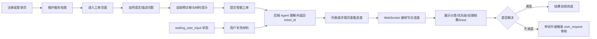
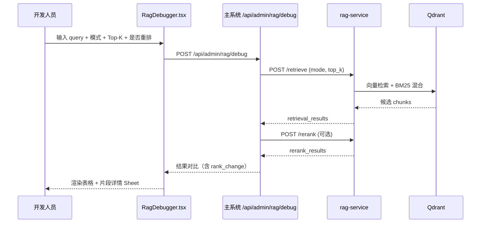

# 前端页面与交互设计

> 版本：v2.1
> 日期：2026-07-09
> 状态：页面清单对齐业务架构梳理，开发人员模块为 D-01 ~ D-06，Token 控制台仅做系统级成本统计
> 关联：[业务架构梳理](../00_预设计/04_业务架构梳理.md) · [系统模块架构清单](../assets/system-module-architecture-v2-ascii.md) · [13_开发人员工作台设计.md](./13_开发人员工作台设计.md) · [12_Token成本控制台设计.md](./12_Token成本控制台设计.md) · [00_预设计/02_系统功能与总体架构.md](../00_预设计/02_系统功能与总体架构.md)

## 1. 设计目标

前端作为系统演示和操作入口，需要让用户能够注册登录、维护服务档案、自助预诊断、提交工单、采集材料、查看处理进度、补充信息、验收处理结果、申诉升级、上传知识库内容、处理人工审核队列，并观察 Agent 执行状态。界面定位为轻量管理端，不做复杂客服坐席系统。

v2.1 起，前端对外按 5 个业务模块解释页面：工单提交与跟踪、工单受理与人工审核、知识库与规则维护、智能处理与协同编排、智能流程运维。实现上仍沿用用户、管理员、开发人员、智能算法 4 类导航分组，覆盖 [系统模块架构清单](../assets/system-module-architecture-v2-ascii.md) 中定义的 29 个功能。

页面整体仍保持轻量级——所有页面共享同一 React 应用（`web/src/`），通过侧边栏导航切换；不引入微前端或独立部署。

## 2. 页面结构（业务模块映射到 4 类实现导航）

### 2.1 用户模块页面（覆盖 U-01 ~ U-08）

| 页面 | 文件 | 覆盖功能 | 说明 |
| --- | --- | --- | --- |
| 注册 | `Register.tsx`（v2.0 新增） | U-01 | 自助注册服务账号，注册成功自动登录 |
| 登录 | `Login.tsx` | U-01 | 用户名密码登录，成功后进入系统 |
| 个人资料 | `Profile.tsx`（v2.0 新增） | U-01 | 用户服务档案管理（昵称 / 联系方式 / 偏好分类）+ 修改密码 |
| 工单列表 | `Tickets.tsx` | U-02 / U-03 / U-04 / U-05 | 工单列表与筛选；含自助预诊断、材料采集和 AI 创建工单入口（`AgentTicketComposer`） |
| 工单详情 | `TicketDetail.tsx` | U-05 / U-06 / U-07 / U-08 | 工单详情、进度、结果、trace；`waiting_user_input` 状态下显示补充输入框（U-06）；`completed` 状态下显示验收和申诉区（U-07 / U-08） |
| 知识库（用户可见） | `Knowledge.tsx` | （只读辅助） | 只读视图：用户可浏览公开知识条目，不能上传/编辑（写权限归管理员） |

#### 2.1.1 Register.tsx（U-01 服务账号注册，v2.0 新增）

页面布局（单卡片居中，宽度 480px）：

- 标题：「创建账户」
- 表单字段：用户名（必填，唯一性前端仅做格式校验）、密码（≥ 8 字符）、确认密码、昵称（可选）
- 提交按钮：调用 `POST /api/auth/register`
- 错误提示：用户名重复（409）、密码强度不足（422）等以行内错误形式展示
- 成功行为：注册成功自动登录 → 跳转 `Tickets.tsx`
- 底部链接：「已有账户？去登录」跳转 `Login.tsx`

#### 2.1.2 Profile.tsx（U-01 服务档案，v2.0 新增）

页面布局（双卡片纵向排列）：

**卡片 1：基本信息**

- 字段：昵称、联系方式（电话/邮箱）、偏好分类（多选 `technical` / `billing` / `complaint` / `inquiry`）
- 不可改字段（只读展示）：`user_id`、`username`、`vip_level`、`created_at`
- 保存按钮：调用 `PATCH /api/users/me`

**卡片 2：修改密码**

- 字段：旧密码、新密码、确认新密码
- 校验：新密码 ≥ 8、与旧密码不同、两次输入一致
- 提交：调用 `POST /api/users/me/password`；成功后 session 失效，跳转登录页
- 错误提示：旧密码错误返回 401（统一提示「凭证错误」）

### 2.2 管理员模块页面（覆盖 A-01 ~ A-07）

| 页面 | 文件 | 覆盖功能 | 说明 |
| --- | --- | --- | --- |
| 仪表盘 | `Dashboard.tsx` | A-05 | 处理统计、趋势和概览（含决策采纳率 `ai_adoption_rate`） |
| 审核工作台 | `ReviewWorkbench.tsx` | A-01 | 审核员处理待审核工单（双栏布局，详见第 2.7 节） |
| 知识库管理 | `Knowledge.tsx`（管理员视图） | A-02 / A-03 | 上传/删除/搜索文档（A-02）+ 版本历史与回滚（A-03） |
| 用户管理 | `UserManagement.tsx`（v2.0 新增） | A-04 | 用户列表、封禁/解封、角色状态维护 |
| 系统配置 | `SystemConfig.tsx`（v2.0 新增） | A-06 | 只读展示 LLM/Qdrant/rag-service/数据库配置摘要 |
| 操作日志 | `AuditLog.tsx`（v2.0 新增） | A-07 | 管理员写操作历史，按 admin/action/时间筛选 |
| 设置 | `Settings.tsx` | （辅助） | 系统配置摘要的旧入口，重定向到 `SystemConfig.tsx` |

#### 2.2.1 UserManagement.tsx（A-04 用户管理，v2.0 新增）

页面布局（表格为主）：

- 顶部筛选栏：状态（active/banned）、关键字（username/nickname）、VIP 等级
- 表格列：username、nickname、status、role、vip_level、created_at、最近工单数
- 操作列：
  - 封禁/解封按钮（切换 status，调用 `PATCH /api/admin/users/{user_id}`）
- 二次确认：所有写操作弹出确认对话框
- 数据源：`GET /api/admin/users`（分页）、`PATCH /api/admin/users/{user_id}`

#### 2.2.2 SystemConfig.tsx（A-06 系统配置查看，v2.0 新增）

页面布局（只读卡片网格）：

| 卡片 | 展示内容 |
| --- | --- |
| LLM 配置 | 模型名（如 `gpt-4o-mini`）、API base URL（脱敏）、temperature |
| 向量存储 | Qdrant URL、默认 collection、距离度量 |
| RAG 服务 | `RAG_SERVICE_URL`、默认检索模式、默认 top_k |
| 数据库 | host、port、database name、连接状态（不展示密码） |
| Prompt 版本 | 5 Agent 当前激活版本号（与 D-02 联动） |
| Token 统计 | 模型单价配置摘要、统计开关、最近一次聚合时间 |

页面顶部红色提示条：「只读视图，配置修改请联系开发人员通过环境变量调整」。

数据源：`GET /api/admin/config`。所有密钥/密码字段不展示（直接省略字段，不返回 `"***"`）。

#### 2.2.3 AuditLog.tsx（A-07 操作日志审计，v2.0 新增）

页面布局（表格为主）：

- 顶部筛选栏：`admin_id`、`action`（审核决策/封禁/解封/知识库删除/版本回滚/Prompt 激活）、`target_type`、时间区间
- 表格列：`created_at`、`admin_id`（含 nickname）、`action`、`target_type`、`target_id`、`detail`（JSON，可展开）、`ip`
- 操作：
  - 点击单行展开 `detail` JSON 树
  - 导出按钮：导出当前筛选结果为 CSV（毕设范围可选实现）
- 数据源：`GET /api/admin/audit-logs`（分页）
- 写权限：无（纯只读视图）

### 2.3 开发人员模块页面（覆盖 D-01 ~ D-06，v2.0 新增）

开发人员工作台是一个独立页面族，主页 `DevConsole.tsx` 提供左侧导航，切换 6 个子模块：

| 页面 | 文件 | 覆盖功能 | 说明 |
| --- | --- | --- | --- |
| DevConsole 主页 | `DevConsole.tsx` | （外壳） | 开发人员工作台外壳，左侧 6 项子模块导航，右侧渲染当前选中子页 |
| Trace 决策树 | `dev/SpanTreeView.tsx` | D-01 | 渲染工单处理的完整执行树，含 Agent 决策点五元组 |
| Prompt 版本对比 | `dev/PromptVersions.tsx` | D-02 | 管理 5 Agent 的 Prompt 模板版本，支持 diff、激活、回滚 |
| RAG 检索调试器 | `dev/RagDebugger.tsx` | D-03 | 输入查询，展示 rag-service 的检索/重排结果（vector / bm25 / hybrid） |
| Token 控制台 | `dev/TokenDashboard/` | D-04 | 日/周/月维度系统级 Token 用量统计、按 model + call_type 分组（复用 explore/farm-manager 架构，详见 [12](./12_Token成本控制台设计.md)） |
| Agent 调用统计 | `dev/AgentCallStats.tsx`（v2.0 新增） | D-05 | 5 Agent 的调用次数、平均耗时、成功率、错误率 |
| 服务健康检查 | `dev/ServiceHealth.tsx`（v2.0 新增） | D-06 | rag-service / Qdrant / LLM / Embedding 健康状态实时显示 |

#### 2.3.1 AgentCallStats.tsx（D-05，v2.0 新增）

页面布局（柱图 + 表格双视图）：

- 顶部筛选栏：时间区间（默认近 7 天）、Agent 选择（5 Agent 多选）
- 柱图：x 轴为 5 Agent，y 轴可切换 `call_count` / `avg_duration_ms` / `error_rate`
- 表格列：agent_name、call_count、avg_duration_ms、p95_duration_ms、success_rate（%）、error_rate（%）
- 行展开：按 `call_type` 二级下钻（如 `react_processor` → `process` / `process_retry`）
- 数据源：`GET /api/admin/stats/agents?start_date=...&end_date=...`
- 刷新策略：手动刷新按钮（不做自动刷新，避免干扰调试）

#### 2.3.2 ServiceHealth.tsx（D-06，v2.0 新增）

页面布局（4 卡片网格 + 顶部告警条）：

| 卡片 | 探测目标 | 展示 |
| --- | --- | --- |
| rag-service | `GET {RAG_SERVICE_URL}/health` | 状态徽章（ok 绿 / degraded 黄 / down 红）+ 延迟 ms |
| Qdrant | rag-service `/health` 的 `components.qdrant` | 状态徽章 + 延迟 ms |
| LLM | 单次极简 ping（`max_tokens=1`） | 状态徽章 + 延迟 ms |
| Embedding | 单句向量化请求 | 状态徽章 + 延迟 ms |

交互：

- 每 30 秒自动刷新（轮询 `GET /api/admin/health`）
- 任一组件 `down` 时，顶部展示红色告警 banner
- 鼠标悬停状态徽章展示最近一次探测时间戳

### 2.4 智能算法模块页面（覆盖 I-01 ~ I-08）

| 页面 | 文件 | 覆盖功能 | 说明 |
| --- | --- | --- | --- |
| Agent 实时监控 | `AgentMonitor.tsx` | I-01 ~ I-08 | 实时执行流（WebSocket 推送），演示用；与 DevConsole 离线调试定位互补 |

`AgentMonitor.tsx` 实时面板聚合展示 5 Agent（I-01 ~ I-05）+ LangGraph 编排（I-06）+ 工具层（I-07）+ 决策追踪（I-08）的执行情况，但页面本身是一个，因此智能算法模块在前端只有 1 个页面。

### 2.5 DevConsole 路由

| 路径 | 子模块 |
| --- | --- |
| `/dev` → `/dev/traces` | Trace 决策树（D-01） |
| `/dev/prompts` | Prompt 版本对比（D-02） |
| `/dev/rag` | RAG 检索调试器（D-03） |
| `/dev/tokens` | Token 成本控制台（D-04） |
| `/dev/agent-stats` | Agent 调用统计（D-05，v2.0 新增） |
| `/dev/health` | 服务健康检查（D-06，v2.0 新增） |

`AgentMonitor.tsx` 维持原路由（首页或 `/monitor`），作为实时监控面板，独立于 `/dev/*`。

### 2.6 自助预诊断与 AI 创建工单（U-02 / U-03 / U-04）

工单列表页提供 `AgentTicketComposer` 组件，用户不需要手工填写分类、优先级等传统表单，只需要输入自然语言描述。前端先展示自助预诊断摘要和材料清单提示，用户确认后提交。后端 `TicketIntentAgent`（I-01）会自动提取问题标题、分类、优先级、影响范围和联系方式。

页面交互特点：

- 支持填写 `user_id`，用于后续用户上下文扩展。
- 支持展示预诊断结果：建议分类、建议优先级、风险提示、材料清单。
- 支持按分类提示材料采集项：订单号、支付流水、错误截图、设备环境、影响范围等。
- 提供示例工单，便于课堂演示。
- 提交后调用 `POST /api/tickets`，成功后刷新列表。
- 通过徽章提示"Agent 将自动生成标题、分类、优先级、影响范围"。

### 2.7 审核工作台（A-01）

页面采用双栏布局：

- **左栏（30%）**：待审核队列。支持按 `trigger_type`、`category`、`priority` 筛选，按优先级 + 等待时长排序，每条显示工单摘要、触发类型徽章、优先级色块、AI 建议摘要。
- **右栏（70%）**：当前选中工单的审核面板。从上到下依次为：工单原文与元数据 → AI 处理结果展示 → 执行 trace 时间线 → AI 辅助决策建议卡（高亮显示置信度 > 0.7 的建议） → 审核员决策区（通过 / 改写 / 重处理 / 请求补充 / 驳回 五个按钮 + 改写文本框 + 必填理由框）。

关键交互：

| 交互 | 行为 |
| --- | --- |
| WebSocket `review_requested` | 队列顶部出现新条目，并显示 toast 提示 |
| WebSocket `review_decided` | 若为当前选中工单，刷新为已决策状态 |
| 点击"通过" | 弹出理由输入框 → POST decision=approve |
| 点击"改写" | 展开 rewritten_result 文本框 + 理由 → POST decision=rewrite |
| 点击"重处理" | 二次确认 → POST decision=reprocess |
| 点击"请求补充" | 必填补充说明 → POST decision=request_info，工单进入 `waiting_user_input` |
| 点击"驳回" | 二次确认 + 必填理由 → POST decision=reject |

所有审核决策写操作同步记录到 `AuditLog.tsx`（A-07）。

详细设计参见 [09_人工审核工作台设计.md](./09_人工审核工作台设计.md) 第 7 章。

## 3. 交互流程

### 3.1 用户服务请求主流程（覆盖 U-01 ~ U-08）



### 3.2 开发人员工作台交互（v2.0 新增）

#### 3.2.1 子模块导航与切换

DevConsole 主页采用"左侧导航 + 右侧内容"布局。左侧固定 6 个导航项（Trace 决策树 / Prompt 版本对比 / RAG 检索调试器 / Token 控制台 / Agent 调用统计 / 服务健康检查），点击切换时通过 React Router 改变 `/dev/*` 子路径，右侧 `<Outlet />` 渲染对应子页。

| 导航项 | 路由 | 数据来源 |
| --- | --- | --- |
| Trace 决策树（D-01） | `/dev/traces` | `GET /api/admin/traces/{ticket_id}` |
| Prompt 版本对比（D-02） | `/dev/prompts` | `GET/POST /api/admin/prompts/{agent_name}/versions` |
| RAG 检索调试器（D-03） | `/dev/rag` | `POST /api/admin/rag/debug`（透传 rag-service） |
| Token 控制台（D-04） | `/dev/tokens` | `GET /api/admin/stats/tokens` |
| Agent 调用统计（D-05） | `/dev/agent-stats` | `GET /api/admin/stats/agents` |
| 服务健康检查（D-06） | `/dev/health` | `GET /api/admin/health` |

子模块之间互相独立，但支持跨模块联动跳转（见 3.2.2 / 3.2.3）。

#### 3.2.2 SpanTreeView ↔ TokenDashboard 联动

Token 控制台的高耗 token trace 列表项可点击"查看 trace"链接，URL 携带 `?ticket_id=...&span_id=...`，跳转到 Trace 决策树页面，自动定位并展开目标 `llm_call` span 的 token 明细面板。

反向联动：Trace 决策树中 `llm_call` span 详情面板提供"在 Token 控制台查看此工单用量"链接，跳转到 Token 控制台并预填 `ticket_id` 筛选。

联动契约：
- Token 控制台 → Trace 决策树：URL query `?ticket_id=...&span_id=...`
- Trace 决策树 → Token 控制台：URL query `?ticket_id=...`

#### 3.2.3 RagDebugger ↔ rag-service 调用流程



主系统 `/api/admin/rag/debug` 接口**透传** rag-service，不在主系统侧做检索逻辑（检索全部由 rag-service 承担，详见 [11_RAG服务独立项目设计.md](./11_RAG服务独立项目设计.md)）。开发者通过这个面板判断"RAG 是否生效、命中多少、排序是否合理"。

#### 3.2.4 Prompt 版本对比交互

| 交互 | 行为 |
| --- | --- |
| 选 Agent 下拉 | 切换 5 个 Agent（Intent / Classifier / ReActProcessor / Reviewer / Coordinator） |
| 选两版本对比 | 右侧渲染 diff（react-diff-viewer-continued，split/unified 切换） |
| 点击"新建版本" | 从当前激活版本复制模板 → 编辑 → 保存为 v(n+1) |
| 点击"激活" | 二次确认 → POST `/activate`，事务内更新 is_active |
| 点击"回滚到 vX" | 复制 vX 为新行 → 自动激活，保留历史完整性 |

激活 / 回滚操作同步记录到 `AuditLog.tsx`（A-07）。

详细设计参见 [13_开发人员工作台设计.md](./13_开发人员工作台设计.md) 第 5 节。

## 4. 数据类型

前端类型定义位于 `web/src/types/index.ts`，按模块分组：

### 4.1 通用类型

- `AuthState`：登录状态
- `WSMessage`：WebSocket 消息
- `Analytics`：仪表盘统计数据

### 4.2 用户模块类型

- `User`：用户完整资料（v2.0 扩展）

  ```typescript
  interface User {
    user_id: number;
    username: string;
    nickname: string;
    contact: string;
    vip_level: number;
    status: 'active' | 'banned';
    preferred_categories: TicketCategory[];
    created_at: string;
  }
  ```

- `UserProfile`：用户可编辑服务档案（v2.0 新增，U-01）

  ```typescript
  interface UserProfile {
    nickname: string;
    contact: string;
    preferred_categories: TicketCategory[];
  }
  ```

- `Ticket`：工单详情
- `TicketStatus`：工单状态枚举（含 v1.3 新增的 `waiting_user_input`）
- `TicketCategory`：分类枚举（`technical` / `billing` / `complaint` / `inquiry`）
- `TicketPriority`：优先级枚举（`P0` / `P1` / `P2` / `P3`）
- `TicketMessage`：用户与审核员的补充沟通记录（v1.3 新增）
- `TicketFeedback`：结果验收与申诉反馈（v2.0 新增，U-07 / U-08）

  ```typescript
  interface TicketFeedback {
    ticket_id: number;
    user_id: number;
    rating: 'satisfied' | 'dissatisfied';
    comment: string;
    created_at: string;
  }
  ```

- `RegisterRequest`：注册请求（v2.0 新增，U-01）

  ```typescript
  interface RegisterRequest {
    username: string;
    password: string;
    nickname?: string;
  }
  ```

- `ChangePasswordRequest`：修改密码请求（v2.0 新增，U-01）

  ```typescript
  interface ChangePasswordRequest {
    old_password: string;
    new_password: string;
    confirm_password: string;
  }
  ```

### 4.3 管理员模块类型

- `ReviewQueueItem`、`ReviewDetail`、`ReviewDecisionRequest`：人工审核工作台相关类型
- `KnowledgeDoc`：知识库文档（含解析状态、chunk 数、来源）
- `KnowledgeVersion`：知识库文档版本（v2.0 新增，A-03）

  ```typescript
  interface KnowledgeVersion {
    doc_id: string;
    version: number;
    content_hash: string;
    chunk_count: number;
    operator: string;
    created_at: string;
  }
  ```

- `SystemConfig`：系统配置摘要（v2.0 新增，A-06）

  ```typescript
  interface SystemConfig {
    llm: { model: string; api_base: string; temperature: number };
    qdrant: { url: string; default_collection: string; distance: string };
    rag_service: { url: string; default_mode: 'vector' | 'bm25' | 'hybrid'; default_top_k: number };
    database: { host: string; port: number; database: string; status: 'connected' | 'down' };
    prompt_versions: Record<string, number>; // agent_name → active version
    token_stats: { enabled: boolean; pricing_profile: string; last_aggregated_at: string };
  }
  ```

- `AuditLogEntry`：操作日志条目（v2.0 新增，A-07）

  ```typescript
  interface AuditLogEntry {
    id: number;
    admin_id: number;
    admin_nickname: string;
    action: string; // 'review_decision' | 'user_ban' | 'user_unban' | 'knowledge_delete' | 'knowledge_rollback' | 'prompt_activate'
    target_type: string; // 'ticket' | 'user' | 'knowledge' | 'prompt'
    target_id: string;
    detail: Record<string, unknown>;
    ip: string;
    created_at: string;
  }
  ```

### 4.4 开发人员模块类型（v2.0 扩展）

- `Trace`、`Span`、`TraceDetail`：执行追踪相关类型（已存在，扩展字段）
- `TraceDecision`、`TraceDecisionsResponse`：决策追踪相关类型（已存在，扩展 reflection 字段位）
- `PromptVersion`：Prompt 模板版本（新增，D-02）

  ```typescript
  interface PromptVersion {
    id: number;
    agent_name: 'ticket_intent' | 'classifier' | 'react_processor' | 'reviewer' | 'coordinator';
    version: number;
    template: string;
    is_active: boolean;
    note: string;
    created_by: string;
    created_at: string;
  }
  ```

- `TokenStats`、`TokenDailyStats`、`TokenHourlyStats`：Token 控制台类型（新增，D-04，详见 [12](./12_Token成本控制台设计.md)）

  ```typescript
  interface TokenStats {
    date: string;
    model: string;
    call_type: 'intent' | 'classify' | 'process' | 'review' | 'coordinator' | 'rag';
    prompt_tokens: number;
    completion_tokens: number;
    total_tokens: number;
    request_count: number;
    estimated_cost_cny: number;
  }
  ```

- `RagDebugResult`：RAG 检索调试器响应类型（新增，D-03）

  ```typescript
  interface RagDebugResult {
    query: string;
    mode: 'vector' | 'bm25' | 'hybrid';
    retrieval_results: RagChunk[];
    rerank_results: (RagChunk & { rank_change: number })[];
    elapsed_ms: number;
  }

  interface RagChunk {
    chunk_id: string;
    score: number;
    payload: { doc_id: string; page?: number; chunk_idx: number; source: string; text: string };
  }
  ```

- `AgentCallStat`：Agent 调用统计（v2.0 新增，D-05）

  ```typescript
  interface AgentCallStat {
    agent_name: 'ticket_intent' | 'classifier' | 'react_processor' | 'reviewer' | 'coordinator';
    call_count: number;
    avg_duration_ms: number;
    p95_duration_ms: number;
    success_rate: number; // 0-1
    error_rate: number;   // 0-1
    breakdown_by_call_type?: Record<string, { call_count: number; error_rate: number }>;
  }
  ```

- `ServiceHealthStatus`：服务健康状态（v2.0 新增，D-06）

  ```typescript
  interface ServiceHealthStatus {
    rag_service: ComponentHealth;
    qdrant: ComponentHealth;
    llm: ComponentHealth;
    embedding: ComponentHealth;
    checked_at: string;
  }

  interface ComponentHealth {
    status: 'ok' | 'degraded' | 'down';
    latency_ms: number;
    detail?: string;
  }
  ```

### 4.5 智能算法模块类型

- 复用 `Trace` / `Span` / `TraceDecision`，`AgentMonitor.tsx` 实时面板读取同一套类型，但走 WebSocket 增量推送而非 HTTP 拉取。

## 5. 状态展示规则

| 状态 | 展示含义 |
| --- | --- |
| `received` | 工单已接收 |
| `classifying` | 正在智能分类 |
| `processing` | 正在处理 |
| `reviewing` | 正在审核处理结果 |
| `pending_human_review` | 等待人工审核 |
| `waiting_user_input` | 等待用户补充信息（v1.3 新增） |
| `completed` | 工单处理完成 |
| `failed` | 工单处理失败 |

## 6. 设计取舍

前端只实现基础登录、自助注册和个人资料维护，不实现完整账号体系、复杂权限、客服坐席分配和消息会话。页面重点服务于毕设演示：

- 能直观看到工单从预诊断、提交、处理到验收/申诉的变化（U-02 ~ U-08）。
- 能让用户自助注册与维护服务档案（U-01）。
- 能展示多 Agent 每个节点的执行结果（I-01 ~ I-08）。
- 能上传知识文档体现 RAG 能力（A-02 / A-03）。
- 能通过审核工作台展示人机协同闭环（A-01）。
- 能通过开发人员工作台展示 Trace 决策、Prompt 版本、RAG 调试、Token 成本、Agent 调用统计、服务健康（D-01 ~ D-06，v2.0 新增）。
- 能通过统计页展示系统运行效果与决策采纳率（A-05）。
- 能让管理员审计所有写操作（A-07）。

不做（超出毕设范围）：
- 跨 trace 决策聚合大盘（如"近 7 天 classify 决策准确率"）
- Prompt 在线编辑器（只支持粘贴模板文本）
- 实时流式 token 计费推送（前端定时刷新即可）
- 移动端原生 App
- 客服坐席分配、多人会签、SSO

## 7. 相关文档链接

- [00_预设计/04_业务架构梳理.md](../00_预设计/04_业务架构梳理.md) — v2.1 业务闭环和模块映射
- [assets/system-module-architecture-v2-ascii.md](../assets/system-module-architecture-v2-ascii.md) — 29 功能清单（v2.1 口径）
- [00_预设计/02_系统功能与总体架构.md](../00_预设计/02_系统功能与总体架构.md) — v2.1 业务模块与实现模块总体架构
- [02_产品需求/01_核心功能需求.md](../02_产品需求/01_核心功能需求.md) — 29 功能的验收标准
- [06_可观测与执行追踪设计.md](./06_可观测与执行追踪设计.md) — Trace/Span 基础数据契约
- [09_人工审核工作台设计.md](./09_人工审核工作台设计.md) — 审核工作台详细设计（A-01）
- [12_Token成本控制台设计.md](./12_Token成本控制台设计.md) — Token 控制台详细设计（D-04）
- [13_开发人员工作台设计.md](./13_开发人员工作台设计.md) — 开发人员工作台子模块详细设计（D-01 ~ D-06）
- [11_RAG服务独立项目设计.md](./11_RAG服务独立项目设计.md) — RAG 检索调试器透传的独立服务（支撑 I-07）
