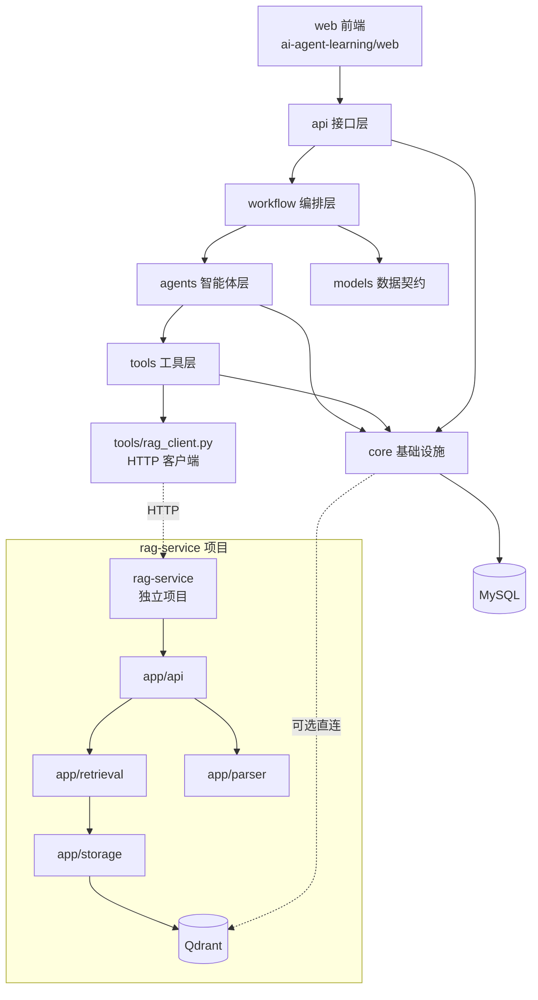

# 项目目录架构设计

> 版本：v2.0
> 日期：2026-07-01
> 状态：扩展为双项目协作（主系统 ai-agent-learning + 独立 rag-service），补充 tools/rag_client.py 等新增模块
> 关联：[11_RAG服务独立项目设计.md](./11_RAG服务独立项目设计.md) · [12_Token成本控制台设计.md](./12_Token成本控制台设计.md) · [13_开发人员工作台设计.md](./13_开发人员工作台设计.md)

## 1. 设计目标

本项目由早期 AI Agent 学习项目整理而来，历史代码中同时存在基础 Agent 示例、RAG 学习模块、多智能体工单系统、旧前端页面、实验计划和毕业设计文档。为了让项目更符合"基于多智能体协同的智能工单处理系统设计与实现"的毕业设计主题，需要对目录架构进行分层设计。

目录架构设计目标如下：

- 主业务代码聚焦智能工单处理系统。
- 历史学习产物保留但不混入主源码。
- 测试目录与主业务模块对应，便于回归验证。
- 文档目录能支撑论文、设计、接口、测试和项目管理。
- 部署脚本、数据、日志和临时产物边界清晰。

**v2.0 扩展目标**：从单项目扩展为**双项目协作**：

- **主系统 `ai-agent-learning`**：业务流程 + Agent 编排 + 4 大角色模块前端
- **独立 RAG 服务 `rag-service`**：PDF 复杂解析 + 检索/重排 + Qdrant 管理，可独立部署、对外复用

两个项目物理隔离（建议都放在 `/Users/ljn/Documents/demo/finished/` 下作为同级目录），通过 HTTP API 解耦协作。详细职责切分见 [11_RAG服务独立项目设计.md](./11_RAG服务独立项目设计.md)。

## 2. 当前目录问题

当前项目经过初步整理后，主要问题如下：

| 问题 | 表现 | 影响 |
| --- | --- | --- |
| 学习产物和毕设主线混杂 | 早期 `basic_agents`、examples、历史测试曾位于主目录 | 容易让论文主线发散 |
| RAG 模块定位不清 | `src/rag_systems/` 曾同时包含个人知识库、论文阅读助手、文档处理工作流等学习内容 | 已将历史学习内容归档或移除；v2.0 把 RAG 检索能力抽离为独立 rag-service |
| 文档来源较多 | `docs/project-guide.md`、`docs/design-spec/`、`docs/superpowers/`、`openspec/` 并存 | 后续维护容易不知道以哪个为准 |
| 测试目录存在历史分组 | `tests/test_multi_agent` 与 `tests/multi_agent_system` 曾同时覆盖工单系统 | 已合并到 `tests/multi_agent_system` |
| 运行产物目录需要约束 | `data/`、`logs/`、`web/dist/` 等可能包含生成内容 | 需要避免把运行产物纳入核心设计 |
| 主系统 RAG 调用方式落后（v2.0） | v1.x 直接在 `tools/knowledge_search.py` 内嵌 Qdrant 访问 | v2.0 改为通过 `tools/rag_client.py` 走 HTTP 调用独立 rag-service |

## 3. 目标目录结构

v2.0 起，建议在 `/Users/ljn/Documents/demo/finished/` 下保持以下双项目结构：

```text
finished/
├── ai-agent-learning/        # 主系统（本文档主体）
│   ├── README.md
│   ├── requirements.txt
│   ├── Dockerfile
│   ├── docker-compose.yml    # 编排主系统 + rag-service + MySQL + Qdrant
│   ├── src/
│   │   ├── multi_agent_system/
│   │   │   ├── api/
│   │   │   ├── agents/
│   │   │   ├── core/
│   │   │   ├── models/
│   │   │   ├── tools/
│   │   │   │   └── rag_client.py     # 主系统调用 rag-service 的 HTTP 客户端（待建）
│   │   │   ├── workflow/
│   │   │   └── config.py
│   ├── web/
│   │   ├── src/
│   │   ├── public/
│   │   └── package.json
│   ├── tests/
│   ├── docs/
│   ├── archive/
│   ├── scripts/
│   ├── data/
│   └── logs/
│
└── rag-service/              # 独立 RAG 服务（v2.0 新增，待建）
    ├── app/
    │   ├── api/              # FastAPI 路由
    │   ├── parser/           # 文档解析（从 NSQA 迁移）
    │   ├── retrieval/        # 向量检索 + BM25 + 混合 + 重排
    │   ├── storage/          # Qdrant collection 管理
    │   ├── evaluation/       # P2 评估接口
    │   ├── models/           # Pydantic schema
    │   └── core/             # 配置、日志、Qdrant 客户端
    ├── tests/
    ├── docs/
    ├── docker-compose.yml
    ├── Dockerfile
    └── requirements.txt
```

## 4. 顶层目录职责

| 目录 | 定位 | 是否属于毕设主线 | 维护规则 |
| --- | --- | --- | --- |
| `ai-agent-learning/src/` | 主系统 Python 后端与可复用能力源码 | 是 | 只放可运行源码，不放临时脚本 |
| `ai-agent-learning/src/multi_agent_system/` | 智能工单系统后端核心 | 是 | 后续开发优先落在这里 |
| `ai-agent-learning/web/` | React 前端管理端（4 大角色模块） | 是 | 面向工单系统演示，不扩展无关业务 |
| `ai-agent-learning/tests/` | 主项目自动化测试 | 是 | 与 `src/` 模块对应 |
| `ai-agent-learning/docs/design-spec/` | 毕设设计规范 | 是 | 作为系统设计文档主入口 |
| `ai-agent-learning/archive/learning/` | 历史学习产物归档 | 否 | 不作为主线继续开发 |
| `ai-agent-learning/scripts/` | 部署、初始化、辅助脚本 | 是 | 脚本应有明确用途 |
| `ai-agent-learning/data/` | 本地运行数据 | 否 | 不提交敏感或大体积运行数据 |
| `ai-agent-learning/logs/` | 本地运行日志 | 否 | 不作为源代码维护 |
| `ai-agent-learning/openspec/` | 历史变更方案 | 参考 | 可作为历史设计参考，不作为当前主文档 |
| **`rag-service/`（v2.0 新增）** | **独立 RAG 服务**：PDF 解析 + 检索/重排 + Qdrant 管理 | **是（独立论文章节）** | 独立 Git 仓库或独立目录；可独立部署、对外复用 |

## 5. rag-service 项目结构（v2.0 新增）

`rag-service` 是与主系统平级的独立项目，建议路径 `/Users/ljn/Documents/demo/finished/rag-service/`。完整结构如下：

```text
rag-service/
├── README.md
├── requirements.txt
├── Dockerfile
├── docker-compose.yml        # 编排 rag-service + Qdrant（可独立运行）
├── app/
│   ├── __init__.py
│   ├── main.py               # FastAPI 应用入口
│   ├── api/                  # FastAPI 路由
│   │   ├── __init__.py
│   │   ├── parse.py          # POST /parse        — 文档解析（仅返回结构化结果，不入库）
│   │   ├── ingest.py         # POST /ingest       — 解析 + 分块 + 向量化 + 写入 Qdrant
│   │   ├── retrieve.py       # POST /retrieve      — 向量 / BM25 / 混合检索
│   │   ├── rerank.py         # POST /rerank        — Cross-Encoder 重排
│   │   ├── health.py         # GET  /health        — 健康检查
│   │   └── admin.py          # collection CRUD、rebuild 等管理接口
│   ├── parser/               # PDF/MD/TXT 文档解析（从 NSQA 迁移）
│   │   ├── __init__.py
│   │   ├── pdf_parser.py     # 版面分析、表格识别
│   │   ├── markdown_parser.py
│   │   ├── text_parser.py
│   │   └── chunker.py        # 分块策略（语义切分、滑动窗口）
│   ├── retrieval/            # 检索 + 重排
│   │   ├── __init__.py
│   │   ├── vector.py         # 向量检索（Qdrant dense）
│   │   ├── bm25.py           # BM25 检索（Qdrant sparse）
│   │   ├── hybrid.py         # 混合检索（RRF / 加权融合）
│   │   └── reranker.py       # Cross-Encoder 重排（bge-reranker-v2）
│   ├── storage/              # Qdrant collection 管理
│   │   ├── __init__.py
│   │   ├── qdrant_client.py  # Qdrant 客户端封装
│   │   ├── collections.py    # collection 创建、配置、删除
│   │   └── metadata.py       # 文档元数据存储
│   ├── evaluation/           # P2 评估接口（recall@k、MRR 等）
│   │   ├── __init__.py
│   │   ├── dataset.py        # 评估数据集加载
│   │   └── metrics.py        # 指标计算
│   ├── models/               # Pydantic schema
│   │   ├── __init__.py
│   │   ├── chunk.py          # Chunk / RagChunk
│   │   ├── request.py        # RetrieveRequest / RerankRequest / IngestRequest
│   │   └── response.py       # RetrieveResponse / RerankResponse
│   └── core/                 # 配置、日志、Qdrant 客户端
│       ├── __init__.py
│       ├── config.py         # Settings（端口、Qdrant URL、模型路径）
│       ├── logging.py
│       └── exceptions.py     # RagServiceUnavailable / ParseError 等
├── tests/
│   ├── api/
│   ├── parser/
│   ├── retrieval/
│   └── evaluation/
├── docs/
│   ├── api-spec.yaml         # rag-service HTTP API 契约
│   └── architecture.md       # 架构说明（论文独立章节）
├── docker-compose.yml
├── Dockerfile
└── requirements.txt
```

详细架构与 API 契约见 [11_RAG服务独立项目设计.md](./11_RAG服务独立项目设计.md)。

## 6. 后端源码分层（主系统）

`src/multi_agent_system/` 是毕设后端主包，建议保持以下职责边界：

| 子目录 | 职责 | 可依赖 | 不应承担 |
| --- | --- | --- | --- |
| `api/` | FastAPI 应用、路由、WebSocket | `models`、`workflow`、`tools`、`core` | 复杂业务决策 |
| `agents/` | 分类、处理、审核、协调 Agent | `core`、`tools`、`models` | HTTP 请求处理 |
| `workflow/` | LangGraph 状态机、节点与路由 | `agents`、`models`、`core` | 前端展示逻辑 |
| `models/` | Pydantic 模型、枚举、数据契约 | 标准库、Pydantic | 数据库访问 |
| `tools/` | Agent 可调用工具，如知识库、通知、统计 | `core`、外部服务 SDK | 工作流编排 |
| `core/` | 数据库、缓存、重试、追踪、指标等基础设施 | 标准库、第三方库 | 具体业务页面逻辑 |

### 6.1 v2.0 新增/变更模块

| 模块 | 路径 | 状态 | 职责 |
| --- | --- | --- | --- |
| RAG HTTP 客户端 | `tools/rag_client.py` | 待建 | 封装对 rag-service `/retrieve` `/rerank` 的 HTTP 调用；失败抛 `RagServiceUnavailable`，由 Agent 走降级分支 |
| Token 统计 | `core/token_stats.py` | 待建 | Token 累加与按日聚合（UPSERT `token_daily_stats`）；从 `core/trace.py` 的 `_finalize_span` 触发，详见 [12](./12_Token成本控制台设计.md) 第 4.2 节 |
| 知识库工具重构 | `tools/knowledge_search.py` | 待重构 | v1.x 内嵌 Qdrant 访问 → v2.0 改为调用 `tools/rag_client.py` |
| Trace 增强 | `core/trace.py` | 待改造 | 接入 token 累加 + `metadata.decision` 决策点结构化（修复 v1.1 P0），详见 [13](./13_开发人员工作台设计.md) 第 11 节 |
| Admin Trace API | `api/admin_trace.py` | 待建 | 开发人员工作台 Trace 决策树后端（复用 explore/farm-manager 数据契约），详见 [13](./13_开发人员工作台设计.md) 第 9 节 |
| Admin Stats API | `api/admin_stats.py` | 待建 | Token 控制台 4 个统计路由，详见 [12](./12_Token成本控制台设计.md) 第 4.3 节 |
| Prompt 版本管理 | `api/admin_prompts.py` + `services/prompt_service.py` | 待建 | 5 个 Agent 的 Prompt 模板版本 CRUD + 激活 + 回滚，详见 [13](./13_开发人员工作台设计.md) 第 5 节 |
| RAG 调试透传 | `api/admin_rag.py` | 待建 | `/api/admin/rag/debug` 透传 rag-service，详见 [13](./13_开发人员工作台设计.md) 第 9 节 |

## 7. 前端源码分层

`web/src/` 是毕业设计前端主目录，建议保持以下结构：

| 子目录 | 职责 |
| --- | --- |
| `pages/` | 页面级功能（按 4 大模块组织，见 [07_前端页面与交互设计.md](./07_前端页面与交互设计.md) 第 2 节） |
| `pages/dev/`（v2.0 新增） | 开发人员工作台子页：`SpanTreeView.tsx` / `PromptVersions.tsx` / `RagDebugger.tsx` / `TokenDashboard/` |
| `components/layout/` | 页面布局、侧边栏、状态展示等结构组件 |
| `components/ui/` | 基础 UI 组件 |
| `components/trace/` | Trace 相关组件（复用 explore 架构）：`SpanDetailSheet` / `TraceGantt` / `DecisionTimeline` / `DecisionCard` |
| `hooks/` | API 请求、WebSocket 等复用逻辑 |
| `lib/` | API 客户端、工具函数 |
| `types/` | 与后端接口对齐的 TypeScript 类型 |

页面组件不直接承载复杂数据转换逻辑，复杂逻辑应下沉到 `hooks/` 或 `lib/`。

## 8. 测试目录设计

测试目录应围绕当前主线组织：

```text
tests/
├── api/                  # FastAPI 接口与健康检查
├── agents/               # Agent 集成和 ReAct Processor 测试
├── core/                 # 数据库、缓存、追踪、重试等基础设施
└── multi_agent_system/   # 工单系统工具与局部模块测试
```

后续整理建议：

- `tests/test_multi_agent/` 已合并到 `tests/multi_agent_system/`。
- `tests/rag_systems/` 已随内嵌 RAG 学习模块移除；RAG 能力测试迁移到独立 `rag-service` 项目维护。
- 历史基础 Agent、论文阅读助手和文档处理工作流测试已归档到 `archive/learning/tests/`。
- v2.0 新增模块测试：`tests/api/test_admin_trace.py` / `test_admin_stats.py` / `test_admin_prompts.py` / `test_admin_rag.py` / `tests/core/test_token_stats.py`（按需新增）。

## 9. 文档目录设计

文档优先级如下：

1. `docs/design-spec/`：当前毕业设计的主设计文档。
2. `README.md`：项目启动和整体说明。
3. `docs/project-guide.md`：代码阅读导览。
4. `docs/毕设论文要求/`：学校或导师给出的论文要求资料。
5. `docs/superpowers/`、`openspec/`：历史方案和实现计划，仅作参考。

后续新增正式设计内容时，应优先放入 `docs/design-spec/`，避免在多个目录散落重复说明。

## 10. 归档目录设计

`archive/learning/` 保存早期学习产物：

```text
archive/learning/
├── README.md
├── basic_agents/
├── examples/
├── logs/
├── rag_systems/
├── web_legacy/
└── tests/
```

归档规则：

- 可以保留历史代码，便于回看学习过程。
- 不作为毕业设计主线继续开发。
- 不允许主业务代码反向依赖归档代码。
- 归档测试可单独运行，但不纳入主回归测试路径。
- 归档示例产生的日志写入 `archive/learning/logs/`。

## 11. 依赖方向

v2.0 双项目架构下的依赖方向：



约束：

- `archive/` 不被 `src/` 依赖。
- `web/` 只通过 HTTP/WebSocket 与后端交互。
- `api/` 可以调度 workflow，但不直接实现 Agent 推理细节。
- `models/` 不依赖 `api/`、`agents/`、`workflow/`。
- `core/` 不依赖前端和 API 页面逻辑。
- **rag-service 是独立项目**：主系统 `tools/rag_client.py` 只通过 HTTP 调用 rag-service，不允许直接 import rag-service 的 Python 模块。
- rag-service 不依赖主系统的任何模块（完全解耦，便于对外复用）。

## 12. 双项目部署（v2.0 新增）

主系统的 `docker-compose.yml` 同时编排主系统 + rag-service + MySQL + Qdrant 四个服务，便于一键启动开发/演示环境：

```yaml
# ai-agent-learning/docker-compose.yml（示意）
version: '3.8'
services:
  mysql:
    image: mysql:8.0
    environment:
      MYSQL_ROOT_PASSWORD: ${MYSQL_ROOT_PASSWORD}
      MYSQL_DATABASE: ai_agent_learning
    ports: ["3306:3306"]
    volumes: ["mysql_data:/var/lib/mysql"]

  qdrant:
    image: qdrant/qdrant:latest
    ports: ["6333:6333", "6334:6334"]
    volumes: ["qdrant_data:/qdrant/storage"]

  rag-service:
    build: ../rag-service         # 引用同级 rag-service 目录
    ports: ["8001:8001"]
    environment:
      QDRANT_URL: http://qdrant:6333
    depends_on: [qdrant]

  ai-agent-learning:
    build: .
    ports: ["8000:8000"]
    environment:
      RAG_SERVICE_URL: http://rag-service:8001
      MYSQL_HOST: mysql
    depends_on: [mysql, rag-service]

volumes:
  mysql_data:
  qdrant_data:
```

部署说明：

- rag-service 通过 `build: ../rag-service` 引用同级独立项目目录（路径以实际部署位置为准）。
- 主系统通过环境变量 `RAG_SERVICE_URL` 配置 rag-service 地址，`tools/rag_client.py` 读取此变量。
- rag-service 失联时主系统走降级路径（详见 [11_RAG服务独立项目设计.md](./11_RAG服务独立项目设计.md)）。
- 生产部署可拆为两个独立 docker-compose（rag-service 独立部署、主系统独立部署），通过内网域名互通。

## 13. 后续整理路线

### 阶段一：已完成或正在完成

- 将基础 Agent 学习产物归档到 `archive/learning/`。
- 将 `src/basic_agents` 从主源码中移除。
- 将 RAG 复用能力迁移到独立 `rag-service` 项目。
- 建立 `docs/design-spec/` 文档体系。

### 阶段二：已完成或正在完成

- 已合并 `tests/test_multi_agent/` 到 `tests/multi_agent_system/`。
- 已将 `src/rag_systems/paper_reader_agent/` 归档到 `archive/learning/rag_systems/paper_reader_agent/`。
- 已将 `src/rag_systems/langgraph_workflow.py` 归档到 `archive/learning/rag_systems/langgraph_workflow.py`。
- 已移除 `src/rag_systems/personal_knowledge_base/` 和对应 `tests/rag_systems/` 历史学习模块。
- 已将 `src/multi_agent_system/web_legacy/` 归档到 `archive/learning/web_legacy/`。
- `web/dist/` 未被 Git 跟踪，且 `dist/` 已在 `.gitignore` 中忽略。

### 阶段三：v2.0 双项目拆分（进行中）

- 创建 `/Users/ljn/Documents/demo/finished/rag-service/` 独立项目骨架。
- 主系统新增 `tools/rag_client.py`、`core/token_stats.py`、`api/admin_*.py` 系列路由。
- `tools/knowledge_search.py` 重构为调用 `rag_client.py`，移除直接 Qdrant 访问。
- 双项目 docker-compose 联调通过。

### 阶段四：论文交付前整理

- README 聚焦毕设项目启动与演示。
- `docs/project-guide.md` 与 `docs/design-spec/` 保持一致。
- 删除无用运行日志和临时数据。
- 确认 `.env`、密钥和本地缓存不进入提交。

## 14. 验收标准

目录架构整理完成后，应满足以下标准：

- `src/` 中不再包含与工单系统无关的基础 Agent 学习示例。
- 主业务代码不依赖 `archive/`。
- `tests/` 中只保留主项目测试和当前仍需维护的 RAG 测试。
- `docs/design-spec/` 能解释系统设计、接口、测试和项目管理。
- 项目根目录不出现一次性临时脚本。
- 运行测试后不残留 `__pycache__`、`.pytest_cache` 等生成物。
- **v2.0 新增**：rag-service 与主系统物理隔离，主系统不直接 import rag-service 的 Python 模块，只通过 `tools/rag_client.py` HTTP 调用。

## 15. 相关文档链接

- [11_RAG服务独立项目设计.md](./11_RAG服务独立项目设计.md) — rag-service 详细设计与 API 契约
- [12_Token成本控制台设计.md](./12_Token成本控制台设计.md) — `core/token_stats.py` / `api/admin_stats.py` 的详细设计
- [13_开发人员工作台设计.md](./13_开发人员工作台设计.md) — `api/admin_trace.py` / `api/admin_prompts.py` / `api/admin_rag.py` 的详细设计
- [00_预设计/02_系统功能与总体架构.md](../00_预设计/02_系统功能与总体架构.md) — v2.0 4 大模块总体架构
