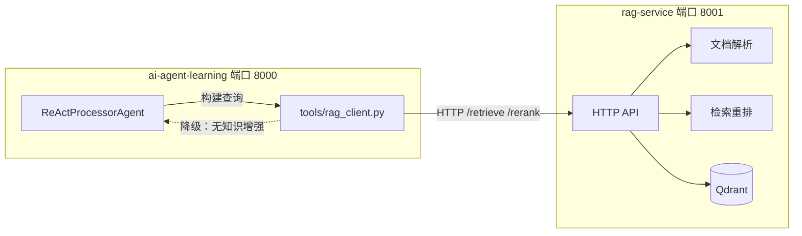
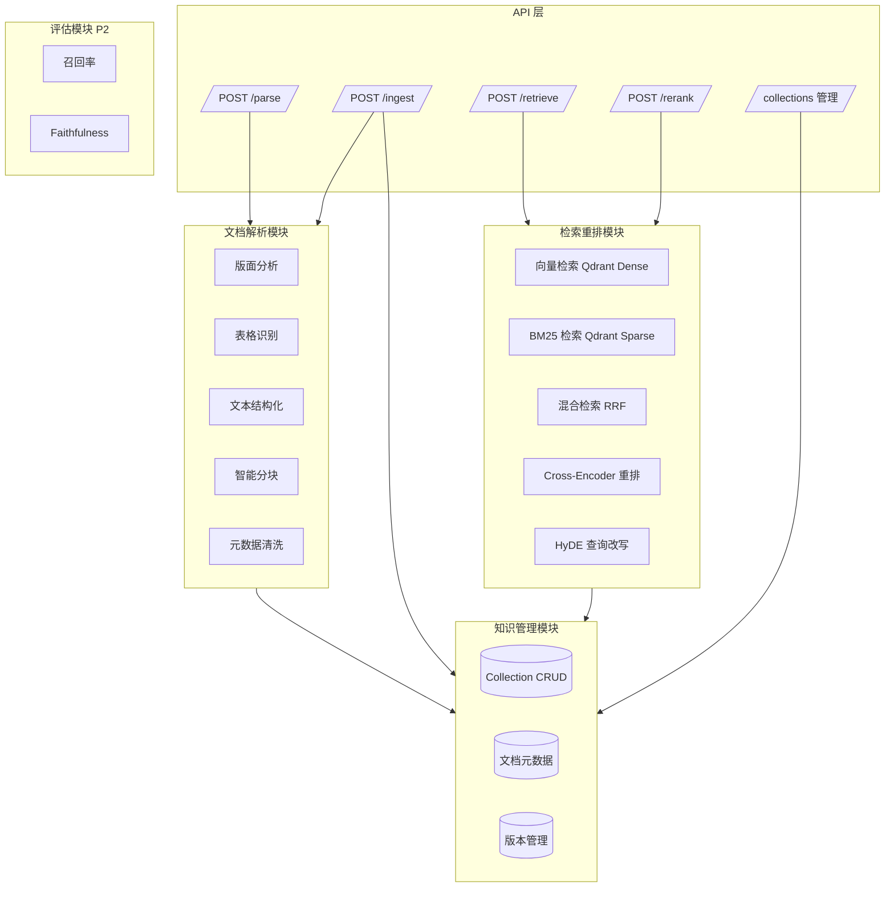
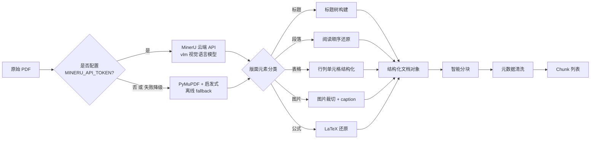
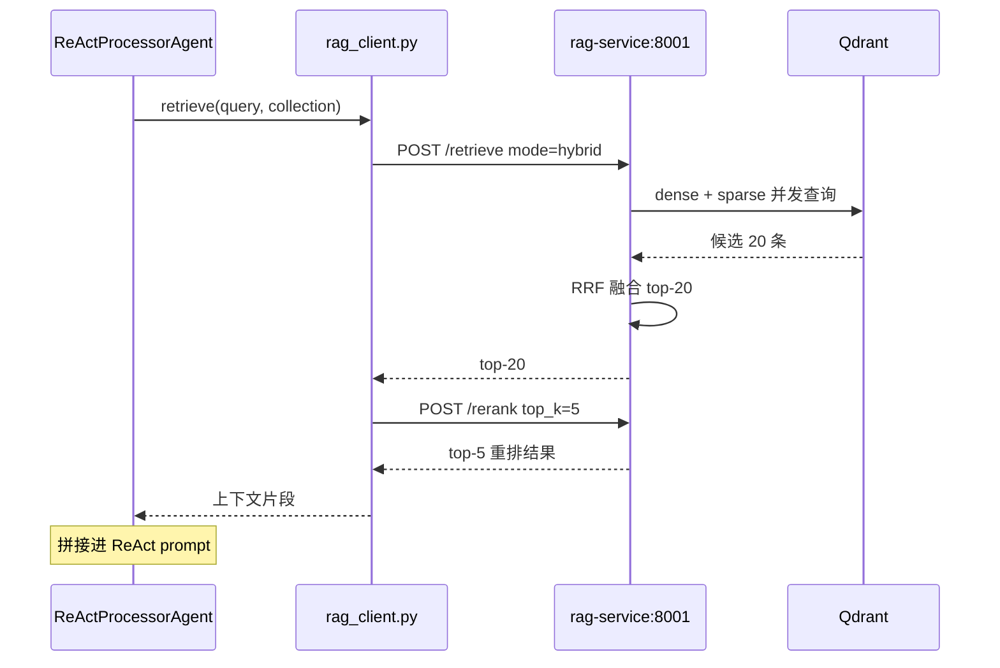

# RAG 服务独立项目设计

> 版本：v2.0
> 日期：2026-07-01
> 状态：新增（v2.0）
> 适用项目：`rag-service`（独立项目，待建）
> 关联主系统：`ai-agent-learning` 通过 `tools/rag_client.py`（待建）HTTP 调用

## 1. 设计目标

v1.x 阶段，RAG 能力内嵌于主系统 `src/rag_systems/personal_knowledge_base/`，仅实现了「固定窗口分块 + FAISS 余弦检索」的基础流程，论文价值有限。v2.0 将 RAG 能力抽离为独立项目 `rag-service`，目标如下：

| 目标 | 说明 |
| --- | --- |
| 论文独立成章 | RAG 是毕设核心技术之一，抽成独立项目后可承载更完整的算法论述（PDF 复杂解析、混合检索、重排、评估） |
| 对外可复用 | 作为通用 RAG 中台，对内服务主系统工单处理，对外可独立部署给 NSQA、farm-manager 等其他项目复用 |
| 算法独立演进 | RAG 算法迭代（更换 Embedding 模型、引入 RRF 融合、Cross-Encoder 重排）不影响主系统工单主链路 |
| 复用既有资产 | 从 NSQA 项目迁移 PDF 复杂数据处理架构；从主系统 `personal_knowledge_base/` 迁移分块与检索基础代码 |
| 工程边界清晰 | 主系统专注工单业务编排，rag-service 专注知识检索算法，符合单一职责原则 |

## 2. 项目定位与边界

### 2.1 rag-service 做什么

- 接收原始文档（PDF/Markdown/TXT），完成版面分析、表格识别、文本结构化、智能分块
- 对分块生成 Embedding 并写入 Qdrant collection
- 对外提供向量检索、BM25 关键词检索、混合检索（RRF 融合）
- 提供 Cross-Encoder 重排能力
- 提供 collection 与文档元数据 CRUD
- 提供独立的健康检查与降级能力

### 2.2 rag-service 不做什么

- 不直接对接任何业务 LLM 调用（生成回答由调用方完成，rag-service 只返回检索上下文）
- 不维护用户、权限、租户等业务概念（所有 collection 对调用方开放）
- 不做多租户隔离与计费（毕设范围内不引入）
- 不内嵌 LangGraph 编排（编排属于主系统 Agent 层）

### 2.3 与主系统的职责切分



## 3. 整体架构

rag-service 内部按职责切分为四大子模块：



模块解耦原则：解析、检索、存储、评估互不直接依赖，统一由 API 层编排。这样允许未来把某个模块替换为云服务（如 Qdrant Cloud）而不影响其他模块。

## 4. 项目目录结构

```text
rag-service/
├── README.md
├── pyproject.toml
├── Dockerfile
├── docker-compose.yml
├── .env.example
├── .gitignore
├── app/
│   ├── main.py                      # FastAPI 入口
│   ├── __init__.py
│   ├── api/                         # HTTP 路由层
│   │   ├── __init__.py
│   │   ├── parse.py                 # POST /parse
│   │   ├── ingest.py                # POST /ingest
│   │   ├── retrieve.py              # POST /retrieve
│   │   ├── rerank.py                # POST /rerank
│   │   ├── collections.py           # collection / document CRUD
│   │   └── health.py                # GET /health
│   ├── parser/                      # 文档解析模块
│   │   ├── __init__.py
│   │   ├── base.py                  # 解析器抽象基类 + 工厂
│   │   ├── pdf_parser.py            # PDF 复杂解析（NSQA 迁移）
│   │   ├── markdown_parser.py
│   │   ├── text_parser.py
│   │   ├── cleaner.py               # 元数据清洗
│   │   ├── layout/
│   │   │   ├── __init__.py
│   │   │   └── analyzer.py          # 版面分析（启发式）
│   │   ├── table/
│   │   │   ├── __init__.py
│   │   │   └── extractor.py         # 表格识别（PyMuPDF find_tables）
│   │   └── chunker/
│   │       ├── __init__.py          # 策略选择器
│   │       ├── structure_aware.py   # 按标题层级
│   │       ├── semantic.py          # 句子相似度边界
│   │       └── fixed.py             # 固定窗口 + 重叠
│   ├── retrieval/                   # 检索重排模块
│   │   ├── __init__.py
│   │   ├── embedder.py              # BAAI/bge-large-zh-v1.5（懒加载）
│   │   ├── dense_searcher.py        # 向量检索
│   │   ├── sparse_searcher.py       # BM25 检索（Qdrant sparse + jieba）
│   │   ├── hybrid_searcher.py       # RRF 融合
│   │   ├── reranker.py              # BAAI/bge-reranker-v2-m3（懒加载）
│   │   └── hyde.py                  # HyDE 查询改写
│   ├── storage/                     # 存储与知识管理
│   │   ├── __init__.py
│   │   ├── qdrant_client.py         # Qdrant 连接封装
│   │   ├── collection_manager.py    # collection + dense/sparse 向量配置
│   │   ├── metadata_store.py        # SQLite 元数据
│   │   └── version_manager.py       # 版本记录
│   ├── services/                    # 编排层（薄）
│   │   ├── __init__.py
│   │   ├── parse_service.py         # parse → chunk → clean
│   │   ├── ingest_service.py        # + embed → Qdrant/SQLite
│   │   ├── retrieve_service.py      # 三 mode + 降级
│   │   ├── rerank_service.py        # + 模型不可用降级
│   │   ├── collection_service.py    # collection CRUD
│   │   └── health_service.py        # 三组件状态聚合
│   ├── models/                      # Pydantic 数据模型
│   │   ├── __init__.py
│   │   ├── chunk.py                 # Chunk + ChunkMetadata
│   │   ├── query.py                 # RetrieveRequest/Result/RerankRequest/Result
│   │   └── document.py              # DocumentRecord + DocumentVersion
│   └── core/                        # 公共能力
│       ├── __init__.py
│       ├── config.py                # Settings（pydantic-settings）
│       ├── logging.py               # loguru 统一格式
│       ├── exceptions.py            # RagServiceError 基类 + 子类
│       ├── metrics.py               # 进程内 Counter/Histogram
│       └── response.py              # ApiResponse 统一响应模型
├── tests/
│   ├── conftest.py
│   ├── api/                         # 5 个 API 端到端测试
│   ├── parser/                      # chunker / pdf / layout / table
│   ├── retrieval/                   # dense / sparse / hybrid / reranker / hyde
│   ├── storage/                     # qdrant_client / metadata_store
│   ├── services/                    # parse / ingest / collection service
│   └── integration/                 # 端到端 / 降级 / 契约
├── docs/
│   ├── api.md                       # API 契约详细文档
│   ├── deployment.md                # 部署与联调
│   └── architecture.md              # 架构与扩展点
└── fixtures/                        # 测试 fixture 文件（PDF/MD/TXT）
```

> 2026-07-02 回写：与初版设计的差异
> - 新增 `app/services/` 编排层，让 API 层只做协议转换，业务逻辑下沉
> - 新增 `app/core/response.py` 统一 ApiResponse 模型
> - 新增 `tests/integration/`、`tests/services/` 测试目录
> - 评估模块 `app/evaluation/` 暂未创建（P2 范围，未启动）

目录约定与主系统保持一致：分层架构 `models → storage → retrieval/parser → services → api`；配置统一放 `core/config.py`；测试镜像源码结构。

## 5. 核心 API 契约

所有接口走 JSON，文件上传接口走 multipart。返回体统一结构 `{ "code": "OK" | "FAILED", "message": str, "data": any }`。

**认证**：除 `/health`（运维健康检查公开）外，所有接口要求 `X-API-Key` header。生产部署（rag.lllcnm.cn）由 API Key 中间件统一拦截，缺失或不匹配返回 `401 Unauthorized`。本地开发模式可关闭中间件。

| 接口 | 认证 |
| --- | --- |
| `POST /parse` | X-API-Key 必填 |
| `POST /ingest` | X-API-Key 必填 |
| `POST /retrieve` | X-API-Key 必填 |
| `POST /rerank` | X-API-Key 必填 |
| `GET /collections/{name}/documents` | X-API-Key 必填 |
| `GET /health` | 无需认证（运维探活公开） |

### 5.1 POST /parse

仅解析与分块，不写入向量库。用于调用方预览分块效果，或调试分块策略。

| 字段 | 方向 | 类型 | 必填 | 说明 |
| --- | --- | --- | --- | --- |
| `file` / `text` | 请求 | file / string | 二选一 | 原始文档（PDF 上传文件；TXT/MD 可直接传文本） |
| `strategy` | 请求 | string | 否 | `semantic` \| `fixed` \| `structure_aware`，默认 `structure_aware` |
| `chunk_size` | 请求 | int | 否 | 仅 `fixed` 策略生效，默认 500 |
| `chunk_overlap` | 请求 | int | 否 | 默认 50 |
| `data.doc_id` | 响应 | string | - | 文档内容指纹（MD5 前 8 位） |
| `data.chunks` | 响应 | array | - | 分块列表，每项含 `content` `chunk_index` `metadata.page` `metadata.category` |
| `data.layout_summary` | 响应 | object | - | 版面分析摘要（标题数、段落数、表格数、图片数） |

错误码：`400 UNSUPPORTED_FORMAT` / `422 PARSE_FAILED` / `507 MODEL_UNAVAILABLE`（OCR/版面模型加载失败）。

### 5.2 POST /ingest

完整链路：解析 → 分块 → 向量化 → 写入 Qdrant。

| 字段 | 方向 | 类型 | 必填 | 说明 |
| --- | --- | --- | --- | --- |
| `file` / `text` | 请求 | file / string | 二选一 | 原始文档 |
| `collection` | 请求 | string | 是 | 目标 collection 名 |
| `strategy` | 请求 | string | 否 | 同 `/parse` |
| `metadata.source` | 请求 | string | 否 | 文档来源标识 |
| `metadata.category` | 请求 | string | 否 | 业务类别（如 `technical`/`policy`） |
| `data.doc_id` | 响应 | string | - | 文档 ID |
| `data.chunk_count` | 响应 | int | - | 写入分块数 |
| `data.collection` | 响应 | string | - | 实际写入的 collection |

错误码：`404 COLLECTION_NOT_FOUND` / `422 INGEST_FAILED` / `503 QDRANT_UNAVAILABLE`。

### 5.3 POST /retrieve

| 字段 | 方向 | 类型 | 必填 | 说明 |
| --- | --- | --- | --- | --- |
| `query` | 请求 | string | 是 | 查询语句 |
| `collection` | 请求 | string | 是 | 目标 collection |
| `mode` | 请求 | string | 否 | `vector` \| `bm25` \| `hybrid`，默认 `hybrid` |
| `top_k` | 请求 | int | 否 | 默认 10 |
| `filters` | 请求 | object | 否 | 元数据过滤（如 `{"category": "technical"}`） |
| `use_hyde` | 请求 | bool | 否 | 是否启用 HyDE 查询改写，默认 false |
| `data.results` | 响应 | array | - | 每项含 `content` `score` `doc_id` `chunk_index` `metadata` |
| `data.debug.query_vector_dim` | 响应 | int | 否 | 调试模式时返回 |

错误码：`400 INVALID_MODE` / `503 QDRANT_UNAVAILABLE`。

### 5.4 POST /rerank

| 字段 | 方向 | 类型 | 必填 | 说明 |
| --- | --- | --- | --- | --- |
| `query` | 请求 | string | 是 | 原始查询 |
| `documents` | 请求 | array | 是 | 待重排文档列表 |
| `top_k` | 请求 | int | 否 | 默认 5 |
| `model` | 请求 | string | 否 | 默认 `BAAI/bge-reranker-v2-m3` |
| `data.results` | 响应 | array | - | 重排后的文档，按相关性降序 |

错误码：`507 RERANKER_MODEL_UNAVAILABLE`。

### 5.5 GET /collections/{name}/documents

| 字段 | 方向 | 类型 | 必填 | 说明 |
| --- | --- | --- | --- | --- |
| `name` | 请求 path | string | 是 | collection 名 |
| `page` / `page_size` | 请求 query | int | 否 | 分页 |
| `data.total` | 响应 | int | - | 文档总数 |
| `data.documents` | 响应 | array | - | 每项含 `doc_id` `chunk_count` `metadata` `ingested_at` |

### 5.6 GET /health

返回 `{ "status": "ok" | "degraded", "components": { "qdrant": "ok", "embedder": "ok", "reranker": "ok" } }`。任一关键组件不可用则 `status=degraded`。

## 6. PDF 复杂文档解析架构

PDF 解析是 rag-service 的论文核心创新点。本节方案先迁移 NSQA 项目中已验证的 PDF 复杂数据处理架构，再按毕设需要做收敛。**具体实现细节（模型权重、版面分析网络结构、表格识别算法）从 NSQA 项目代码迁移**，本文档只描述能力契约与模块边界。

### 6.1 解析流水线

rag-service v0.2 引入双轨架构（借鉴 airQA 项目）：



**MinerU 路径**（推荐，论文核心）：调用 https://mineru.net/api/v4，返回 content_list_v2 JSON（含 50+ BlockType 与 bbox/text_level），由 rag-service 的 `app/parser/mineru/` 模块转 Chunk。MinerU 的 vlm 模型在复杂版面（双栏、跨页表格、LaTeX 公式）上效果显著优于启发式。

**PyMuPDF 路径**（降级）：基于 PyMuPDF 内置 block 检测 + 自研启发式（字号/位置/编号推断），无网络依赖，毕设答辩现场若无外网可走此路径。

### 6.2 版面分析

输入 PDF 每一页，输出页面元素的 bounding box 与类别。类别集合：`title` / `paragraph` / `table` / `figure` / `formula` / `header` / `footer` / `list_item`。能力对标 MinerU / LayoutLMv3 / PaddleOCR PP-Structure 的组合。

- 页眉页脚剔除：基于位置阈值（顶部/底部 5% 高度）+ 文本重复模式
- 多栏布局：版面分析网络输出 column 信息，再按列还原阅读顺序
- 标题层级：根据字号、缩进、是否带编号（如 `1.2.3`）推断层级，构建 TOC

### 6.3 表格识别

| 子能力 | 说明 |
| --- | --- |
| 表格定位 | 版面分析输出 `table` 区域 |
| 结构识别 | 识别行/列/合并单元格，输出 HTML 或 Markdown 表格 |
| 文本回填 | 单元格 OCR 文本回填到对应单元格 |
| 跨页处理 | 跨页表格做拼接，保留表头 |

复杂表格（合并单元格、嵌套表头）的识别准确率直接影响后续检索质量，是 NSQA 迁移代码中最有价值的部分。

### 6.4 文本结构化

- **段落合并**：版面分析输出的 `paragraph` 碎片按位置与字号合并
- **阅读顺序还原**：按列 → 段落 → 行号排序，避免双栏文档错乱
- **公式还原**：检测公式区域后调用 LaTeX OCR，输出文本形式（如 `$E=mc^2$`），便于向量化
- **图片处理**：图片本身不入向量库，但 `caption` 与图周围的引用文本作为独立 chunk
- **公式文本化**（v0.2，借鉴 airQA multiview_classifier）：LaTeX 命令转 Unicode 符号（`\alpha`→α、`x^2`→x²），同时保留原始 LaTeX，让 BM25/sparse 检索能命中公式内容
- **语义锚点**（v0.2，借鉴 airQA data_cleaning `_establish_semantic_anchors`）：为公式 / 表格 / 图按空间距离绑定"最近标题"到 `heading_path`，避免按时间顺序累积错绑上一节标题；同页加权 0.5、跨页 1.5，向上方优先

### 6.5 智能分块策略

| 策略 | 适用场景 | 实现要点 |
| --- | --- | --- |
| `structure_aware`（默认） | PDF / 复杂文档 | 按标题层级切分，同一二级标题下的段落聚为一块，最大不超过 800 字 |
| `semantic` | 长文 Markdown / TXT | 基于句子 Embedding 相似度做语义边界检测（NSQA 已实现，迁移即可） |
| `fixed` | 简单 TXT | 固定窗口 + 重叠，复用主系统 `document_processor.py` 现有实现 |

策略选择规则：调用方在 `/parse` 与 `/ingest` 显式指定；未指定时按文档类型自动选择（PDF → `structure_aware`，MD → `semantic`，TXT → `fixed`）。

### 6.6 元数据清洗

每个 chunk 至少携带：`source` / `page` / `category`（段落/表格/标题等）/ `heading_path`（如 `["第3章", "3.2 部署"]`）/ `doc_id` / `chunk_index`。

清洗规则：去除断行符、统一空白字符、剔除 OCR 噪声字符（如 `□`、孤立单字符行）、长度低于阈值的 chunk 合并到相邻 chunk。

## 7. 检索策略

### 7.1 向量检索（Dense）

- 实现：Qdrant dense 向量索引，余弦距离
- Embedding 模型：默认 `BAAI/bge-large-zh-v1.5`（中文场景），可配置切换
- 适用场景：语义相似、查询与文档表达不一致时表现好
- 调参建议：`top_k` 取 10（重排前召回），`score_threshold` 默认 0.3，低于阈值的过滤

### 7.2 BM25 关键词检索（Sparse）

- 实现：Qdrant sparse 向量索引（内置 BM25 score）；备选 `rank_bm25`
- 适用场景：专有名词、产品型号、错误码等需要精确字面匹配的查询
- 调参建议：中文需先分词（jieba），`k1=1.5` `b=0.75` 为常用初值

### 7.3 混合检索（Hybrid）

- 实现：Reciprocal Rank Fusion（RRF），公式 `score = Σ w_i / (k + rank_i)`，`k=60`，权重默认向量 0.7 + BM25 0.3
- 适用场景：默认推荐模式，兼顾语义召回与关键词命中
- 调参建议：长查询（>15 字）调高向量权重到 0.8；短查询或带错误码时调高 BM25 到 0.5

### 7.4 查询改写（HyDE）

- 实现：调用一次 LLM 生成「假设答案文档」，用假设答案的 Embedding 去检索，而非原始 query
- 适用场景：query 过短或抽象（如「登录问题怎么处理」），直接 Embedding 命中差
- 调参建议：默认关闭，由调用方按工单类别决定是否启用；启用时增加约 1 次 LLM 调用延迟

## 8. 重排策略

| 维度 | Bi-Encoder | Cross-Encoder（选用） |
| --- | --- | --- |
| 计算方式 | query 与 doc 各自编码再算相似度 | query 与 doc 拼接后输入 Transformer |
| 速度 | 快（适合召回） | 慢（仅适合精排，对 top-20 重排） |
| 精度 | 一般 | 高 |
| 角色 | 召回阶段 | 重排阶段 |

选用 Cross-Encoder `BAAI/bge-reranker-v2-m3`：

- 中英双语支持，毕设语料混合场景适配好
- 与 Embedding 模型同系列，tokenizer 与向量维度对齐方便
- 显存占用约 2GB，单卡 4G 或 CPU 推理可接受

重排流程：`/retrieve` 召回 top-20 → 调用 `/rerank` → 取 top-5 作为最终上下文。

## 9. 知识管理

| 能力 | 说明 |
| --- | --- |
| Collection CRUD | `POST /collections` 创建（指定向量维度、距离度量）；`DELETE /collections/{name}` 删除 |
| 文档元数据 | 每个文档记录 `doc_id` `source` `category` `chunk_count` `ingested_at` `content_hash` |
| 增量更新 | 同 `doc_id` 重新 ingest 时按 `content_hash` 判断是否变化，未变化则跳过；变化则删除旧 chunk 再写入 |
| 版本管理 | 每次 ingest 写入一条 `document_version` 记录，支持回滚到上一版本（毕设范围内仅记录，不做可视化回滚 UI） |

元数据存储：主系统 MySQL 不复用，rag-service 自带 SQLite（`storage/metadata_store.py`）存元数据与版本，避免主系统数据库被 RAG 内部状态污染。

## 10. 评估接口（P2 可选）

毕设范围内仅实现接口与最小评估脚本，不做线上评估平台。

| 指标 | 含义 | 评估方式 |
| --- | --- | --- |
| Recall@k | 召回率，top-k 中包含标注答案的比例 | 准备标注测试集，跑 `/retrieve` 比对 |
| Context Precision | 检索上下文精度的标准实现，top-k 中相关 chunk 的占比 |
| Faithfulness | 生成回答对检索上下文的忠实度 | 用 LLM-as-judge 评估 |
| Answer Relevance | 回答与问题的相关性 | 用 LLM-as-judge 评估 |

评估接口：`POST /evaluation/run`，入参 `dataset_path` `metrics`，返回 `run_id`；`GET /evaluation/{run_id}` 查询结果。

## 11. 降级与容错

rag-service 自身的降级链路：

```mermaid
flowchart TB
    Req[请求到达] --> Check{组件健康检查}
    Check -->|Qdrant 不可用| D1[返回 503 + 主系统走无 RAG 分支]
    Check -->|Embedder 不可用| D2[vector 模式 → 自动切 bm25<br/>hybrid 模式 → 退化为 bm25]
    Check -->|Cross-Encoder 加载失败| D3[/rerank 降级为按原始 score 排序<br/>返回 warning 标记]
    Check -->|PDF 版面模型加载失败| D4[/parse 与 /ingest 退化为 fixed 分块<br/>返回 warning 标记]
    Check -->|全部正常| OK[正常处理]
```

降级原则：宁可返回次优结果（带 warning），也不要直接 500，让主系统能继续工作。

## 12. 部署与运维

### 12.1 docker-compose

```yaml
# rag-service/docker-compose.yml（示意）
services:
  rag-service:
    build: .
    ports:
      - "8001:8001"
    environment:
      - QDRANT_URL=http://qdrant:6333
      - EMBEDDING_MODEL=BAAI/bge-large-zh-v1.5
      - RERANKER_MODEL=BAAI/bge-reranker-v2-m3
    depends_on:
      - qdrant

  qdrant:
    image: qdrant/qdrant:latest
    ports:
      - "6333:6333"
    volumes:
      - qdrant_data:/qdrant/storage

volumes:
  qdrant_data:
```

### 12.2 配置项

| 配置 | 默认值 | 说明 |
| --- | --- | --- |
| `PORT` | 8001 | rag-service 监听端口 |
| `QDRANT_URL` | http://localhost:6333 | Qdrant 地址 |
| `EMBEDDING_MODEL` | BAAI/bge-large-zh-v1.5 | Embedding 模型 |
| `RERANKER_MODEL` | BAAI/bge-reranker-v2-m3 | Cross-Encoder 模型 |
| `DEFAULT_CHUNK_SIZE` | 500 | fixed 分块默认大小 |
| `DEFAULT_TOP_K` | 10 | 召回默认数量 |
| `RRF_K` | 60 | RRF 常数 |
| `RRF_VECTOR_WEIGHT` | 0.7 | 向量检索权重 |
| `RRF_SPARSE_WEIGHT` | 0.3 | BM25 权重 |
| `HTTP_TIMEOUT` | 10 | 客户端调用超时（秒） |

### 12.3 资源占用

- Qdrant：内存占用与 collection 规模相关，毕设 demo 数据（万级 chunk）约 500MB
- Cross-Encoder：加载到内存约 2GB，CPU 推理单次重排（20 文档）约 800ms
- 总体可单机部署，最低 4 核 8G

## 13. 与主系统的集成

主系统侧通过 `src/multi_agent_system/tools/rag_client.py` 调用 rag-service。

### 13.0 API Key 认证

主系统调用 rag-service 时通过 `X-API-Key` header 携带 API Key：

- **配置入口**：`Settings.rag_service_api_key`（`src/multi_agent_system/config.py`）
- **加载优先级**：环境变量 `RAG_SERVICE_API_KEY` > `config.yaml` 中 `rag_service_api_key` > 默认空字符串
- **行为**：RagClient 在 `__init__` 读取该值并缓存到 `self._api_key`，非空时所有 `/retrieve` `/rerank` `/health` 请求自动带 `X-API-Key` header；为空时不带（兼容本地开发无鉴权部署）
- **脱敏**：A-06 系统配置查看（`/api/admin/config`）只返回 `api_key_configured: bool`，绝不返回原值
- **禁止 hardcode**：生产 Key 不写入代码、测试或 git tracked 配置文件；仅通过环境变量或 `config.yaml`（已 gitignore）注入
- **/health 例外**：rag-service 部署时 `/health` 公开（运维健康检查需要），但 RagClient 调 health 时也带 Key 以保持一致性（带 Key 调公开端点不影响结果）

### 13.1 调用约定

| 决策点 | 实现 |
| --- | --- |
| 超时 | 单次请求 10 秒 |
| 重试 | 网络错误重试 1 次，间隔 500ms；5xx 不重试 |
| 降级 | 超时或重试失败后，ReActProcessorAgent 走「无知识增强」分支，仅用工单内容生成方案 |
| 缓存 | 同一 query 5 分钟内复用检索结果（可选，毕设范围默认关闭） |

### 13.2 调用时序



### 13.3 降级触发条件

| 触发条件 | 主系统行为 |
| --- | --- |
| rag-service 5 秒未响应 | 记 warning 日志，走无 RAG 分支 |
| `/health` 返回 `degraded` | Agent 跳过 `/rerank`，只用 `/retrieve` 结果 |
| rag-service 连续 3 次失败 | 标记为不可用，后续 5 分钟不再调用，直接走无 RAG 分支 |

## 14. 本科毕设取舍

### 14.1 已纳入范围

- PDF 复杂解析（版面 + 表格 + 公式），从 NSQA 迁移
- 混合检索（向量 + BM25 + RRF）
- Cross-Encoder 重排
- Collection 与文档元数据 CRUD
- 与主系统的降级集成

### 14.2 暂未纳入（展望）

- 评估平台完整化（仅留接口与最小脚本）
- 多租户与权限隔离
- 知识图谱融合（已与导师澄清 KG 暂搁置）
- 自动知识过期与质量评分
- 自训练 / 微调 Embedding 与重排模型
- 分布式部署与读写分离

## 15. 相关文档

- [04_知识库与RAG设计.md](./04_知识库与RAG设计.md) — 管理员模块的知识库 CRUD（前端入口）
- [02_工单处理流程设计.md](./02_工单处理流程设计.md) — ReActProcessorAgent 在 `process` 节点调用 rag-service
- [13_开发人员工作台设计.md](./13_开发人员工作台设计.md) — RAG 检索调试器（开发人员模块）
- [12_Token成本控制台设计.md](./12_Token成本控制台设计.md) — rag-service 的 LLM 调用（HyDE）纳入 token 统计
- [03_技术选型与可行性.md](../00_预设计/03_技术选型与可行性.md) — Qdrant / FastAPI 选型依据
- [02_毕设范围控制.md](../06_项目管理/02_毕设范围控制.md) — 毕设边界声明
