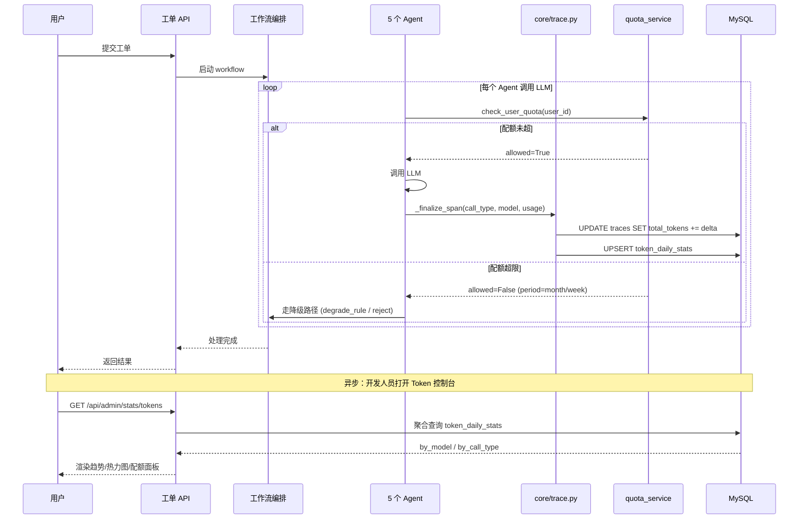

# Token 成本控制台设计

> 版本：v2.0
> 日期：2026-07-01（**2026-07-05 修订**：去除按用户配额，改为系统级总统计）
> 状态：**部分废弃** — 第 3/4/6 节关于 per-user 配额、users.token_*_limit 字段、超限降级、quota_service 的设计已移除。保留第 1/2/5/7 节作为系统级总统计的参考。
> 所属模块：开发人员模块（详见 [13_开发人员工作台设计.md](./13_开发人员工作台设计.md)）

> **2026-07-05 修订说明**：本系统定位为**服务性工单系统**（用户免费提交、系统统一承担 LLM 成本），不按用户分摊 token 用量、不设 per-user 配额。已落地的简化版实现：
> - 后端：[`api/admin_stats.py`](../../../src/multi_agent_system/api/admin_stats.py) 的 `/tokens` `/tokens/daily` `/tokens/hourly` 三个只读接口，全部去除 `user_id` 参数
> - 前端：[`web/src/pages/dev/TokenDashboard/`](../../../web/src/pages/dev/TokenDashboard/) 去除用户筛选 UI、配额卡，统计维度仅保留 model + call_type + 日期
> - 已删除：`/admin/stats/quota/{user_id}` 路由、`getUserQuota` API、`UserQuotaResponse` 类型、`_get_period_range` / `_get_quota_limits` / `_lookup_per_user_quota` 辅助函数
> - D-07 配额管理功能整个移除（开发人员模块从 7 个功能降为 6 个）
>
> 下文第 3/4/6 节中提及的 per-user 配额、quota_service、users 表 token_*_limit 字段、超限降级链路等设计**均未实施**，仅作为历史方案留存参考。

## 1. 设计目标

Token 成本控制台是 v2.0「开发人员模块」的核心子模块，三个目标互不重叠：

| 目标 | 说明 |
| --- | --- |
| 论文成本数据 | 答辩要求"答辩时给出真实成本数字"。本控制台按日/周/月、按 `call_type`/`model` 沉淀 token 用量与折算成本（人民币），论文成本章节直接取数 |
| 防止 demo 烧爆 | 每用户默认月配额 + 周配额；超限走降级路径（规则兜底 + Qdrant 检索关闭），保证答辩演示不会因 LLM 失控刷爆 key |
| 修复 v1.1 P0 bug | 现状 `traces.total_tokens` 永远为 0（详见 `core/trace.py:141,166`），`add_token_usage` 已有占位实现但未在调用链中触发。本设计在 `core/trace.py` 的 span 收尾路径上接入累加，闭环修复 |

附加约束：本控制台是**离线聚合 + 定时统计**，不做实时流式计费，不做多模型单位成本对比，不做付费套餐——这些超出毕设范围（详见第 9 节）。

## 2. 复用清单

源项目：`/Users/ljn/Documents/demo/explore/`（farm-manager）

| 源文件 | 行数 | 复用方式 | 适配点 |
| --- | --- | --- | --- |
| `backend/app/models/token_stats.py` | 43 | 直接复用 ORM 模型结构 | 去掉 `farm_id` 外键；唯一约束改为 `user_id + date + model + call_type` |
| `backend/app/services/quota_service.py` | 155 | 复用核心逻辑（`get_month_range` / `get_week_range` / `check_user_quota`） | 删 `check_quota(farm_id)`；改为按 `user_id` 直接检查；`Session` 改为 `AsyncSession` |
| `backend/app/infra/trace_dao.py:60-109` | 50 | 复用 UPSERT 累加逻辑 | 迁到主系统 `core/trace.py` 的 `_finalize_span`；UPSERT 用 MySQL `ON DUPLICATE KEY UPDATE` |
| `backend/app/api/admin_stats.py` | 222 | 复用 4 个路由的查询结构 | 路由前缀 `/admin/stats` → `/api/admin/stats`；删 `farm_id` 过滤；`call_type` 枚举对齐主系统 |
| `admin-web/src/pages/TokenDashboard/index.tsx` | 948 | 直接拷贝 | API 路径前缀对齐主系统 |
| `admin-web/src/pages/TokenDashboard/dashboard-ui.tsx` | 子组件 | 直接拷贝 | 无适配 |
| `admin-web/src/pages/TokenDashboard/dashboard-shared.ts` | 共享样式常量 | 直接拷贝 | 无适配 |

> 关键判断：farm-manager 的 948 行前端代码**几乎可整体迁移**，因为查询契约一致；后端需要按主系统的 `AsyncSession` + MySQL 重写一次 UPSERT。

## 3. 数据库设计

### 3.1 新增表 `token_daily_stats`

```python
# src/multi_agent_system/models/token_stats.py
from datetime import date, datetime
from sqlalchemy import (
    Column, Date, DateTime, Integer, Numeric, String, UniqueConstraint, Index,
)
from .db import Base


class TokenDailyStats(Base):
    """按日汇总的 Token 用量统计（按 user_id + date + model + call_type 唯一）。"""

    __tablename__ = "token_daily_stats"
    __table_args__ = (
        UniqueConstraint(
            "user_id", "date", "model", "call_type",
            name="uq_token_daily",
        ),
        Index("idx_tds_user_date", "user_id", "date"),
        Index("idx_tds_date", "date"),
        Index("idx_tds_call_type", "call_type"),
    )

    id = Column(Integer, primary_key=True, autoincrement=True)
    user_id = Column(String(36), nullable=True, index=True)  # nullable：系统/未登录调用
    date = Column(Date, nullable=False)
    model = Column(String(100), nullable=False)               # 如 glm-4.6 / glm-4.5-air
    call_type = Column(String(20), nullable=False)            # 见第 7 节枚举
    ticket_id = Column(String(36), nullable=True, index=True) # 关联工单（仅当次 trace）
    prompt_tokens = Column(Integer, default=0)
    completion_tokens = Column(Integer, default=0)
    total_tokens = Column(Integer, default=0)
    request_count = Column(Integer, default=0)
    estimated_cost_cny = Column(Numeric(10, 6), default=0.0)  # 按 model 单价折算
    created_at = Column(DateTime, default=datetime.utcnow)
    updated_at = Column(DateTime, default=datetime.utcnow, onupdate=datetime.utcnow)
```

> 与 farm-manager 的差异：
> 1. **去掉 `farm_id`**，主系统无 farm 概念。
> 2. **新增 `ticket_id`**：主系统以工单为追踪主轴，便于按工单回溯成本。
> 3. **`user_id` 改为 nullable**：CoordinatorAgent 等系统级调用不归属任何用户，但仍需计费。

### 3.2 `users` 表新增字段

主系统现有 `users` 表（见 [05_数据存储设计.md](./05_数据存储设计.md)）缺少配额字段，需 `ALTER TABLE` 追加：

```sql
ALTER TABLE users
    ADD COLUMN token_monthly_limit INT NULL COMMENT 'per-user 月配额覆写（NULL 走默认）',
    ADD COLUMN token_weekly_limit  INT NULL COMMENT 'per-user 周配额覆写（NULL 走默认）';
```

两个字段均允许 `NULL`，表示走系统默认配额（配置在 `config.yaml` 的 `token_quota` 段）。只有当某用户需要差异化配额时才写入具体值。

### 3.3 ER 图

```mermaid
erDiagram
    users ||--o{ tickets : submits
    users ||--o{ token_daily_stats : consumes
    tickets ||--o{ traces : records
    tickets ||--o{ token_daily_stats : generates
    traces ||--o{ spans : contains

    users {
        string user_id PK
        string name
        int token_monthly_limit "新增"
        int token_weekly_limit "新增"
    }

    token_daily_stats {
        int id PK
        string user_id "可空"
        string ticket_id "可空"
        date date
        string model
        string call_type
        int prompt_tokens
        int completion_tokens
        int total_tokens
        int request_count
        decimal estimated_cost_cny
    }

    traces {
        string trace_id PK
        string ticket_id
        int total_tokens "v1.1 P0 修复后才有真实值"
    }
```



`token_daily_stats` 是**统计聚合表**，从 `traces.total_tokens` 进一步按日 + 模型 + call_type 维度汇总；`traces` 仍是单次工单执行的原始记录。

## 4. 后端实现

### 4.1 配额服务 `services/quota_service.py`

复用 farm-manager 的 `quota_service.py`，主要适配：

| 原版 | 适配版 |
| --- | --- |
| `check_quota(farm_id) -> bool` | 删除 |
| `check_user_quota(user_id, db: Session)` | 改为 `async def check_user_quota(user_id, db: AsyncSession)` |
| `get_period_usage` 用同步 query | 改为 `select(func.coalesce(func.sum(...)))` + `await db.execute(...)` |
| 配额默认值从 `settings.token_quota` | 同样从 `config.yaml` 的 `token_quota.{monthly_limit, weekly_limit, over_quota_action}` |

核心保留：`get_month_range` / `get_week_range` / `QuotaCheckResult` 数据类、per-user 覆写优先级逻辑。

### 4.2 `core/trace.py` 修复点（v1.1 P0 bug 闭环）

现状（`src/multi_agent_system/core/trace.py`）：

- 第 141 行：trace 初始化 `"total_tokens": 0`
- 第 221-227 行：`add_token_usage(trace_id, delta)` 已实现 `UPDATE traces SET total_tokens = total_tokens + ?`，但**无任何代码调用它**

修复方案：在 span 收尾路径 `_finalize_span`（每次 LLM 调用结束）追加两步：

```python
# core/trace.py 伪代码（节选自 _finalize_span 收尾段）
async def _finalize_span(self, span: Span, llm_result: dict) -> None:
    ...
    # 1. 修复 P0：累加 trace.total_tokens
    usage = llm_result.get("usage") or llm_result.get("usage_metadata") or {}
    prompt_tokens = int(usage.get("prompt_tokens", 0))
    completion_tokens = int(usage.get("completion_tokens", 0))
    delta = prompt_tokens + completion_tokens
    if delta > 0:
        await self.add_token_usage(span.trace_id, delta)  # 已有方法

    # 2. 写入聚合表 token_daily_stats（新增）
    await self._accumulate_token_daily_stats(
        user_id=span.context.get("user_id"),
        ticket_id=span.context.get("ticket_id"),
        model=span.attrs.get("model", "unknown"),
        call_type=span.attrs.get("call_type", "process"),
        prompt_tokens=prompt_tokens,
        completion_tokens=completion_tokens,
    )
```

`_accumulate_token_daily_stats` 内部用 MySQL UPSERT：

```sql
INSERT INTO token_daily_stats
    (user_id, date, model, call_type, ticket_id,
     prompt_tokens, completion_tokens, total_tokens, request_count)
VALUES (?, ?, ?, ?, ?, ?, ?, ?, 1)
ON DUPLICATE KEY UPDATE
    prompt_tokens     = prompt_tokens     + VALUES(prompt_tokens),
    completion_tokens = completion_tokens + VALUES(completion_tokens),
    total_tokens      = total_tokens      + VALUES(total_tokens),
    request_count     = request_count     + 1;
```

> 关键约束：每个 Agent 在调用 LLM 前必须把 `call_type` 写入 `span.attrs`，否则会被默认归为 `process`，污染统计。

### 4.3 API 路由 `api/admin_stats.py`

复用 farm-manager 的 4 个路由，统一前缀 `/api/admin/stats`：

| 路由 | 用途 | 关键查询 |
| --- | --- | --- |
| `GET /api/admin/stats/tokens` | 近 N 天用量汇总（按 model × call_type 分组） | 直接聚合 `token_daily_stats` |
| `GET /api/admin/stats/tokens/daily` | 指定日期明细 | `WHERE date = ?` |
| `GET /api/admin/stats/tokens/hourly` | 按小时热力图 | 从 `spans.metadata_` 取真实 LLM 调用，按 `start_time` 的小时分桶 |
| `GET /api/admin/stats/quota/{user_id}` | 查询某用户配额状态 | 调用 `check_user_quota` 返回 `{monthly_usage, monthly_limit, monthly_remaining, weekly_*, reset_at}` |

所有路由统一 `Depends(require_admin)`（管理员鉴权，详见 [09_人工审核工作台设计.md](./09_人工审核工作台设计.md) 的鉴权设计）。

`hourly` 路由数据源说明：farm-manager 原版从 `TraceRecord`（即 spans）的 `token_usage` 字段取数。主系统对齐：`spans.metadata_` 中 LLM span 必须写入 `usage`（与第 4.2 节修复同步），hourly 接口按 `span_type='llm_call'` 过滤后聚合。

## 5. 前端实现

### 5.1 页面文件

直接拷贝 farm-manager 的 3 个文件到主系统前端：

```
web/src/pages/TokenDashboard/
├── index.tsx           # 主页面（948 行，含筛选/趋势/热力图/模型用量/配额面板）
├── dashboard-ui.tsx    # 子组件（ChartCard / HeatmapSection / ModelUsageRows / TrendChart）
└── dashboard-shared.ts # 颜色常量、HOURS_24、panelStyle、数字格式化函数
```

### 5.2 API 路径改名

| farm-manager（相对路径） | 主系统（绝对路径） |
| --- | --- |
| `./api/admin` 的 `getTokenSummary()` | `GET /api/admin/stats/tokens` |
| `getDailyTokenStats()` | `GET /api/admin/stats/tokens/daily` |
| `getHourlyTokenStats()` | `GET /api/admin/stats/tokens/hourly` |
| `usersApi.getQuota(id)` | `GET /api/admin/stats/quota/{user_id}` |

实现方式：在 `web/src/api/admin.ts` 新增 4 个调用函数，签名与 farm-manager 保持一致，仅修改 baseURL。`TokenDashboard/index.tsx` 中的 import 路径不需要改。

### 5.3 与现有 `AgentMonitor.tsx` 的关系

| 维度 | `AgentMonitor.tsx`（已存在） | `TokenDashboard/`（本设计新增） |
| --- | --- | --- |
| 关注点 | 决策语义、Trace 树、节点耗时 | 成本数字、配额状态、模型分布 |
| 数据源 | `traces` + `spans`（实时） | `token_daily_stats`（聚合） |
| 入口 | 开发人员工作台 Tab 1 | 开发人员工作台 Tab 4（详见 [13_开发人员工作台设计.md](./13_开发人员工作台设计.md)） |

两者独立页，通过工作台顶部 Tab 切换。共享的数据只有 `traces.total_tokens`（P0 修复后），但读取链路不同——AgentMonitor 直接读 trace 实例，TokenDashboard 读聚合表。

## 6. 配额与降级

### 6.1 配额检查时机

复用 farm-manager 的设计：在**每次 LLM 调用前**调用 `check_user_quota(user_id, db)`。位置建议放在 5 个 Agent 共享的 LLM 客户端封装（`core/cached_client.py` 或 `core/model_router.py`）的入口拦截。

### 6.2 per-user 配额覆写

优先级：`users.token_monthly_limit` > `config.token_quota.monthly_limit`。逻辑见 `quota_service.get_user_quota_limits`，复用即可。

### 6.3 超限降级策略

`config.yaml` 的 `token_quota.over_quota_action` 控制行为，主系统支持三种：

| 取值 | 行为 |
| --- | --- |
| `reject`（默认） | 直接返回 429，工作流中止，写入 `human_reviews.trigger_type='error_fallback'` |
| `degrade_rule` | 跳过 LLM，走规则兜底（ClassifierAgent 退化为关键词匹配，ReActProcessorAgent 退化为模板） |
| `degrade_rag` | 关闭 RAG 检索（Qdrant 调用），仅用 LLM 自有知识，token 消耗减半 |

毕设默认采用 `degrade_rule`，保证 demo 不中断且能演示降级链路（论文可单独成节）。

## 7. call_type 枚举设计

主系统专用，覆盖 5 Agent + RAG：

| call_type | 含义 | 来源 Agent | 典型 model |
| --- | --- | --- | --- |
| `intent` | 工单意图理解 | TicketIntentAgent | glm-4.5-air |
| `classify` | 分类与风险识别 | ClassifierAgent | glm-4.5-air |
| `process` | ReAct 处理 | ReActProcessorAgent | glm-4.6 |
| `review` | 质量审核 | ReviewerAgent | glm-4.5-air |
| `coordinator` | 协调与辅助决策 | CoordinatorAgent | glm-4.5-air |
| `rag` | RAG 检索调用 | rag-service 调用入口 | embedding-3 + glm-4.5-air（rerank 后总结） |

> 与 farm-manager 的 `agent_tool / chat` 等枚举完全不同，不可混用。Agent 写入 `span.attrs["call_type"]` 时必须严格用上述 6 个值之一，否则 `_finalize_span` 会按默认 `process` 归类，导致 ReActProcessor 的成本被高估。

## 8. 时序图



## 9. 毕设取舍

### 做

- 日/周/月统计 + 配额管理 + 超限降级 + 按 `call_type` 分组
- 论文所需成本数据（折算人民币、模型分布、热力图）
- 修复 v1.1 P0 bug（`traces.total_tokens` 永远为 0）
- per-user 配额覆写（演示差异化策略）

### 不做

| 不做项 | 原因 |
| --- | --- |
| 实时流式 token 计数 | LangGraph span 异步收尾已足够，流式属于生产特性 |
| 跨项目聚合（farm-manager + 主系统） | 双项目独立部署，库不同，毕设无需跨库 |
| 付费套餐 / 计费 | 主系统无支付，配额即可 |
| 多模型单位成本对比页面 | 仅在 `estimated_cost_cny` 字段沉淀单价，前端不展示对比 |
| 实时告警 / webhook | 由前端刷新按钮覆盖，不做推送 |

## 10. 相关文档链接

- [05_数据存储设计.md](./05_数据存储设计.md) — `users` / `tickets` / `traces` / `spans` 主表
- [06_可观测与执行追踪设计.md](./06_可观测与执行追踪设计.md) — trace/span 数据契约
- [10_Agent监控与决策追踪设计.md](./10_Agent监控与决策追踪设计.md) — 已整合至 [13_开发人员工作台设计.md](./13_开发人员工作台设计.md)
- [13_开发人员工作台设计.md](./13_开发人员工作台设计.md) — Token 控制台作为 Tab 4 嵌入
- [09_人工审核工作台设计.md](./09_人工审核工作台设计.md) — 鉴权 `require_admin` 来源、配额超限 `error_fallback` 触发审核
- [11_RAG服务独立项目设计.md](./11_RAG服务独立项目设计.md) — `call_type=rag` 的上游来源
