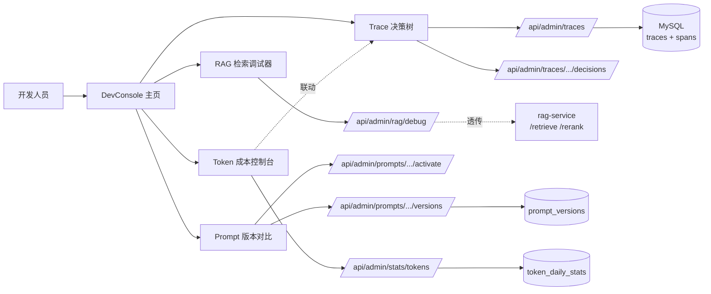
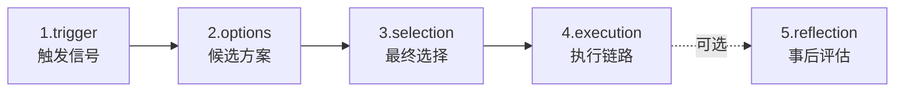
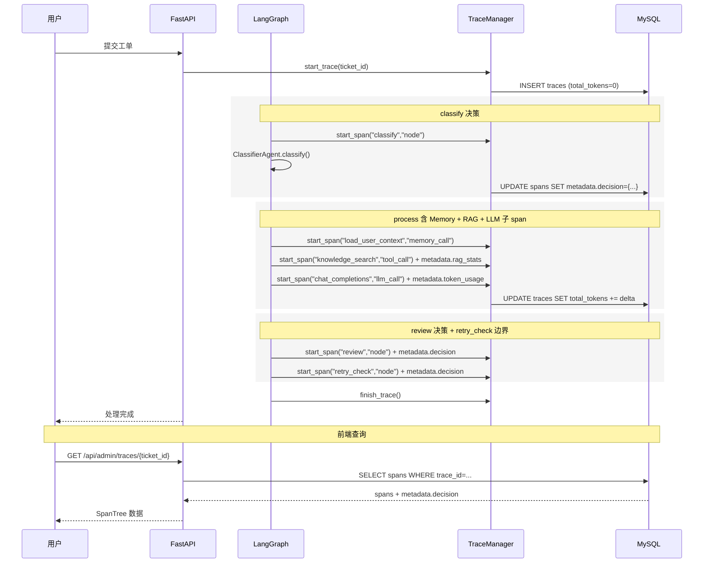
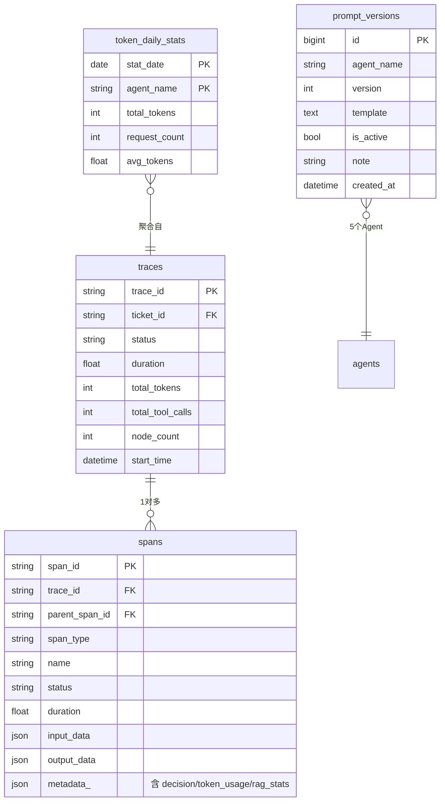

# 开发人员工作台设计

> 版本：v2.0
> 日期：2026-07-01
> 状态：新增章节，整合 10_Agent 监控与决策追踪设计（已合并入本文件）
> 关联：[12_Token成本控制台设计.md](./12_Token成本控制台设计.md) · [11_RAG服务独立项目设计.md](./11_RAG服务独立项目设计.md)
> 复用来源：`explore/backend/app/api/admin_trace.py` · `explore/admin-web/src/pages/TokenDashboard/`

## 1. 设计目标

开发人员模块是 v2.0 答辩反馈"按角色分层"驱动新增的三大角色模块之一。面向**系统开发/调试/运维**场景，回答四类问题：

| 问题 | 子模块 |
| --- | --- |
| 这条工单 AI 是怎么决策的？为什么走这条路？ | Trace 决策树 |
| 这次升级改了 Prompt 后效果是更好还是更坏？ | Prompt 版本对比 |
| RAG 检索结果命中了几条？得分多少？排序合理吗？ | RAG 检索调试器 |
| 这次处理烧了多少 token？哪些节点最贵？ | Token 成本控制台 |

四个子模块各自的职责边界：

| 子模块 | 数据来源 | 操作语义 |
| --- | --- | --- |
| Trace 决策树 | `traces` + `spans` 表 | 只读 + 决策点结构化渲染 |
| Prompt 版本对比 | 新增 `prompt_versions` 表 | 读写（版本管理、灰度切换、回滚） |
| RAG 检索调试器 | rag-service `/retrieve` `/rerank` | 透传调用 |
| Token 成本控制台 | `traces.total_tokens` + `spans.metadata.token_usage` | 只读聚合（详见 [12](./12_Token成本控制台设计.md)） |

## 2. 复用清单（v2.0 从 explore/ 迁移）

主系统从 `explore/farm-manager` 复用以下资产。复用策略是**复用数据契约与架构思路，不复用 UI 实现**——farm-manager 前端是 AntD，本系统是 React + shadcn/ui（见 [04_相关规范/02_前端编码规范.md](../04_相关规范/02_前端编码规范.md)），UI 重写。

| 资产 | 来源 | 复用方式 |
| --- | --- | --- |
| Trace 时间线查询 API | `explore/backend/app/api/admin_trace.py` | 数据契约复用，按主系统的 trace/span 模型重写（主系统 trace 模型见 [06_可观测与执行追踪设计.md](./06_可观测与执行追踪设计.md)） |
| Token Dashboard 架构 | `explore/admin-web/src/pages/TokenDashboard/` | 架构复用（daily/hourly/heatmap/trend），UI 用 shadcn/ui + Recharts 重写（详见 [12](./12_Token成本控制台设计.md)） |
| 决策点结构化抽象 | v1.1 设计（已合并入本文件第 4 章） | 直接复用，作为 Trace 决策树的核心数据模型 |
| 现有 trace 组件 | `web/src/components/trace/` | 已实现的 `SpanDetailSheet` `TraceGantt` `DecisionTimeline` `DecisionCard` 直接复用，仅扩展字段 |

## 3. 子模块总览



## 4. 子模块 1：Trace 决策树

### 4.1 决策点五元组

一次完整的处理决策留下五元组记录（毕设范围 reflection 字段可省）：



| 字段 | 类型 | 必填 | 含义 |
| --- | --- | --- | --- |
| `trigger` | object | 是 | 触发决策的输入信号（工单内容摘要、评分、retry_count 等） |
| `options` | array | 是 | 候选方案列表，每项 `{value, score, reason}` |
| `selection` | object | 是 | `{value, confidence, reason}` —— 选了什么、置信度、为什么 |
| `execution` | ref | 是 | 指向后续 `span_id` 或 `downstream_node` |
| `reflection` | object | 否 | 事后评估（毕设范围不实现，预留字段） |

**核心设计**：决策数据作为 `spans.metadata.decision` 子结构落库（`SpanORM.metadata_` 字段已支持 JSON），**零表结构变更**。

```json
{
  "decision_type": "routing",
  "trigger": { "ticket_id": "TK-20260701-001", "content_preview": "登录后无法看到订单..." },
  "options": [
    {"value": "technical", "score": 0.82, "reason": "包含登录异常关键词"},
    {"value": "billing", "score": 0.15, "reason": "提及订单"},
    {"value": "complaint", "score": 0.03, "reason": "无情绪化表达"}
  ],
  "selection": { "value": "technical", "confidence": 0.82, "reason": "技术问题信号最强" },
  "execution": { "downstream_node": "route" }
}
```

### 4.2 决策点清单

| 节点 | decision_type | trigger 关键字段 | options 来源 | selection 依据 |
| --- | --- | --- | --- | --- |
| `classify` | routing | content_preview | ClassifierAgent 输出 | 最高 score 的 category |
| `route` | branching | category / priority / escalate_flag | workflow 路由表 | 分支匹配 |
| `process` (ReAct) | tool_selection | thought / observation | ToolRegistry 候选 | LLM 选择 |
| `review` | quality_gate | review_score / threshold | {pass, retry} | 阈值判断 |
| `retry_check` | boundary | retry_count / max_retry | {retry, escalate} | 边界条件 |
| `human_review_wait` | escalation | trigger_type / trigger_reason | {approve, reject, rewrite, reprocess} | 人工决策（v1.0 已实现） |

### 4.3 前端组件（复用 + 扩展）

| 组件 | 来源 | 本期改动 |
| --- | --- | --- |
| `SpanTree` (`TraceGantt`) | 已实现 | 支持 `metadata.decision` 高亮节点 |
| `SpanDetailSheet` | 已实现 | 自动渲染 `metadata.decision` / `metadata.token_usage` / `metadata.rag_stats` |
| `DecisionTimeline` | 已实现 | 嵌入 Trace 决策树右侧，垂直展示所有决策点 |
| `DecisionCard` | 已实现 | 单个决策点卡片，含候选数、置信度色阶 |

视觉规范（决策类型徽章颜色）：
- routing 蓝、branching 紫、quality_gate 青、boundary 橙、tool_selection 灰、escalation 红
- 置信度色阶：< 0.5 红、[0.5, 0.7) 橙、[0.7, 0.9) 黄、≥ 0.9 绿

### 4.4 工单处理 trace 时序图



## 5. 子模块 2：Prompt 版本对比

### 5.1 设计动机

5 个 Agent（Intent / Classifier / ReActProcessor / Reviewer / Coordinator）的 Prompt 模板当前是硬编码在源码中（`src/multi_agent_system/agents/*.py`），调优 Prompt 需要改代码重启。本模块把 Prompt 抽到数据库做版本管理，支持 diff、灰度切换、回滚。

### 5.2 前端布局

```
┌─────────────────────────────────────────────────────────┐
│ Agent: [ClassifierAgent ▼]   [新建版本] [激活] [回滚]    │
├──────────────┬──────────────────────────────────────────┤
│ 版本列表     │ Diff 视图（react-diff-viewer）           │
│ v3 ★active   │                                          │
│ v2 (2026-06) │  - 旧：You are a classifier...           │
│ v1 (2026-06) │  + 新：You are an expert classifier...    │
│              │                                          │
│ 选中: v3↔v2  │ 备注：增加 few-shot 示例                  │
└──────────────┴──────────────────────────────────────────┘
```

| 区域 | 组件 | 说明 |
| --- | --- | --- |
| 左侧版本列表 | `PromptVersionList` | 按 `created_at` 倒序，激活版本带 ★ 标记 |
| 右侧 diff 视图 | `react-diff-viewer-continued` | 选中两版本对比，支持 split/unified 切换 |
| 操作区 | 顶部按钮 | 新建版本（从当前激活版本复制）、激活、回滚 |

### 5.3 灰度切换与回滚

- **激活**：更新 `prompt_versions.is_active = true`，同 agent_name 下其他版本设为 false（事务）
- **回滚**：不直接修改历史版本，而是**复制目标旧版本为新行**（version 自增、`note` 标注"rollback to vX"），再激活新行 —— 保证版本历史完整可追溯
- **加载**：Agent 启动时 `SELECT template FROM prompt_versions WHERE agent_name=? AND is_active=true LIMIT 1`，找不到则降级到源码默认模板

### 5.4 与现有 Agent 的集成点

| Agent | 当前 Prompt 位置 | 改造后 |
| --- | --- | --- |
| TicketIntentAgent | `agents/ticket_intent.py` 硬编码 | 启动时从 DB 加载 |
| ClassifierAgent | `agents/classifier.py` 硬编码 | 启动时从 DB 加载 |
| ReActProcessorAgent | `agents/react_processor.py` 硬编码 | 启动时从 DB 加载 |
| ReviewerAgent | `agents/reviewer.py` 硬编码 | 启动时从 DB 加载 |
| CoordinatorAgent | `agents/coordinator.py` 硬编码 | 启动时从 DB 加载 |

Agent 加载时通过 `PromptManager.get_active(agent_name)` 读取，找不到记录时降级到源码常量（保证首次部署无 DB 数据也能跑）。

## 6. 子模块 3：RAG 检索调试器

### 6.1 设计动机

[04_知识库与RAG设计.md](./04_知识库与RAG设计.md) 描述了 RAG 在主流程中的角色，但开发期需要独立调试工具：输入一个查询，看 rag-service 实际检索到什么、重排后排序如何变化、命中片段的原文与得分。这是开发人员判断"RAG 是否生效"的关键工具。

### 6.2 前端布局

```
┌─────────────────────────────────────────────────────────┐
│ 查询: [____________________]  模式: [vector|bm25|hybrid] │
│ Top-K: [10]  重排: [☑]  集合: [knowledge_base ▼]         │
│ [检索]                                                   │
├─────────────────────────────────────────────────────────┤
│ 结果对比表                                               │
│ Rank │ 片段ID │ 原始分 │ 重排分 │ 变化 │ metadata       │
│ 1    │ ch-01  │ 0.82   │ 0.91   │ ↑2   │ {doc:"..."}    │
│ 2    │ ch-02  │ 0.78   │ 0.85   │ ↑3   │ {doc:"..."}    │
│ ...                                                      │
├─────────────────────────────────────────────────────────┤
│ [展开片段详情 Sheet]                                     │
│ 原文: ...                                                │
│ score: 0.91  model: bge-reranker-v2                     │
│ metadata: {doc_id, page, chunk_idx, source}             │
└─────────────────────────────────────────────────────────┘
```

| 区域 | 组件 | 说明 |
| --- | --- | --- |
| 查询表单 | `RagDebugForm` | 输入查询、选检索模式、Top-K、是否重排 |
| 结果对比表 | `RagResultTable` | 重排前后并排展示，标出排名变化（↑↓） |
| 片段详情 | `ChunkDetailSheet` | 展开看原文、score、metadata |

### 6.3 三种检索模式

| 模式 | rag-service 端点 | 用途 |
| --- | --- | --- |
| vector | `/retrieve?mode=vector` | 纯向量检索（Qdrant） |
| bm25 | `/retrieve?mode=bm25` | 纯关键词检索（Qdrant sparse） |
| hybrid | `/retrieve?mode=hybrid` | 向量 + BM25 加权融合（默认） |

主系统 `/api/admin/rag/debug` 接口透传到 rag-service，**不在主系统侧做检索逻辑**（检索全部由 rag-service 承担，详见 [11_RAG服务独立项目设计.md](./11_RAG服务独立项目设计.md)）。

## 7. 子模块 4：Token 成本控制台

详细设计见 [12_Token成本控制台设计.md](./12_Token成本控制台设计.md)。本节只说明它在开发人员工作台中的位置与联动。

| 维度 | 决策 |
| --- | --- |
| 路由位置 | DevConsole 左侧导航的第 4 项，独立页（非 Dashboard 子页） |
| 数据来源 | 复用 `traces.total_tokens` + `spans.metadata.token_usage` 聚合 |
| 与 Trace 决策树联动 | Token 控制台点击某条 trace → 跳转 Trace 决策树 → 展开 `llm_call` span 看 token 明细 |

联动实现：Token 控制台的高耗 token trace 列表项加 "查看 trace" 链接，URL 携带 `?ticket_id=...&span_id=...`，Trace 决策树页面读取 query 参数自动定位到该 span。

## 8. 数据库新增

### 8.1 `prompt_versions` 表

```sql
CREATE TABLE prompt_versions (
  id            BIGINT AUTO_INCREMENT PRIMARY KEY,
  agent_name    VARCHAR(64)  NOT NULL COMMENT 'Agent 名称：ticket_intent/classifier/react_processor/reviewer/coordinator',
  version       INT          NOT NULL COMMENT '版本号，同一 agent_name 内自增',
  template      TEXT         NOT NULL COMMENT 'Prompt 模板原文',
  is_active     BOOLEAN      NOT NULL DEFAULT FALSE COMMENT '是否当前生效版本',
  note          VARCHAR(500) NULL COMMENT '版本说明（few-shot 改动、参数调整等）',
  created_by    VARCHAR(64)  NULL COMMENT '创建人',
  created_at    DATETIME     NOT NULL DEFAULT CURRENT_TIMESTAMP,
  UNIQUE KEY uk_agent_version (agent_name, version),
  INDEX idx_agent_active (agent_name, is_active)
) ENGINE=InnoDB DEFAULT CHARSET=utf8mb4 COMMENT='Prompt 模板版本管理';
```

约束（业务层保证）：
- 同一 `agent_name` 最多一条 `is_active=true`
- 激活操作在事务中完成（先 set false 再 set true）

### 8.2 `token_daily_stats` 表

详见 [12_Token成本控制台设计.md](./12_Token成本控制台设计.md)，本文件引用不重复。

### 8.3 `spans.metadata.decision` 子结构 schema

`spans.metadata_` 是 JSON 字段（已有），其中 `decision` 子结构遵循 4.1 节五元组：

```json
{
  "decision": {
    "decision_type": "routing|branching|tool_selection|quality_gate|boundary|escalation",
    "trigger": { "...": "..." },
    "options": [{"value":"...", "score":0.0, "reason":"..."}],
    "selection": {"value":"...", "confidence":0.0, "reason":"..."},
    "execution": {"downstream_node": "..."}
  },
  "token_usage": { "prompt_tokens": 0, "completion_tokens": 0, "total_tokens": 0, "model": "..." },
  "rag_stats": { "hit_count": 0, "top_score": 0.0, "mode": "vector|bm25|hybrid" }
}
```

## 9. 后端 API

所有 `/api/admin/*` 接口需要 admin 鉴权（与 [09_人工审核工作台设计.md](./09_人工审核工作台设计.md) 同套鉴权）。

| 方法 | 路径 | 用途 | 子模块 |
| --- | --- | --- | --- |
| GET | `/api/admin/traces/{ticket_id}` | 获取工单完整 trace（spans 树） | Trace 决策树 |
| GET | `/api/admin/traces/{ticket_id}/spans/{span_id}` | 获取 span 详情（含 metadata.decision） | Trace 决策树 |
| GET | `/api/admin/traces/{ticket_id}/decisions` | 列出该 trace 所有决策点（从 spans.metadata.decision 抽取） | Trace 决策树 |
| GET | `/api/admin/prompts/{agent_name}/versions` | Prompt 版本列表 | Prompt 版本对比 |
| POST | `/api/admin/prompts/{agent_name}/versions` | 新建版本（请求体：template, note） | Prompt 版本对比 |
| POST | `/api/admin/prompts/{agent_name}/versions/{version}/activate` | 激活版本 | Prompt 版本对比 |
| POST | `/api/admin/rag/debug` | RAG 检索调试（透传 rag-service，请求体：query, mode, top_k, rerank, collection） | RAG 检索调试器 |
| GET | `/api/admin/stats/tokens` | Token 统计（详见 [12](./12_Token成本控制台设计.md)） | Token 控制台 |

### 9.1 GET `/api/admin/traces/{ticket_id}/decisions` 响应

```json
{
  "trace_id": "trace-...",
  "ticket_id": "TK-...",
  "decision_count": 3,
  "decisions": [
    {
      "span_id": "span-...",
      "span_name": "classify",
      "decision_type": "routing",
      "selection_value": "technical",
      "confidence": 0.82,
      "options_count": 3,
      "timestamp": "2026-07-01T10:00:01"
    }
  ]
}
```

### 9.2 POST `/api/admin/rag/debug` 请求/响应

请求：
```json
{ "query": "登录失败如何排查", "mode": "hybrid", "top_k": 10, "rerank": true, "collection": "knowledge_base" }
```

响应（透传 rag-service 结果 + 排名变化计算）：
```json
{
  "query": "登录失败如何排查",
  "mode": "hybrid",
  "retrieval_results": [{"chunk_id":"ch-01","score":0.82,"payload":{...}}, ...],
  "rerank_results":   [{"chunk_id":"ch-01","score":0.91,"rank_change":2}, ...],
  "elapsed_ms": 245
}
```

## 10. 前端页面结构

```
web/src/pages/
├── DevConsole.tsx                  # 开发人员工作台主页（左侧导航 4 项）
├── dev/
│   ├── SpanTreeView.tsx            # Trace 决策树（复用 components/trace/）
│   ├── PromptVersions.tsx          # Prompt 版本对比
│   ├── RagDebugger.tsx             # RAG 检索调试器
│   └── TokenDashboard/             # 复用 explore 架构，shadcn 重写（详见 12）
└── AgentMonitor.tsx                # 现有：实时监控（保留，定位不同）
```

### 10.1 与现有 `AgentMonitor.tsx` 的关系

| 维度 | AgentMonitor | DevConsole |
| --- | --- | --- |
| 定位 | 实时执行流（WebSocket 推送） | 离线调试与分析 |
| 数据源 | 实时 spans 流 | 历史 trace + Prompt + RAG |
| 受众 | 演示用（答辩现场展示） | 开发调试用（论文分析） |

**结论：保留两者**。AgentMonitor 作为首页实时面板，DevConsole 作为独立开发工作台。

### 10.2 DevConsole 路由

| 路径 | 子模块 |
| --- | --- |
| `/dev` → `/dev/traces` | Trace 决策树 |
| `/dev/prompts` | Prompt 版本对比 |
| `/dev/rag` | RAG 检索调试器 |
| `/dev/tokens` | Token 成本控制台 |

## 11. 决策点埋点修复清单（v1.1 P0 问题）

> 本表整合自原 `10_Agent监控与决策追踪设计.md`，作为本文件的子任务清单。

| # | 问题 | 位置 | 修复方案 | 工时 | 优先级 |
| --- | --- | --- | --- | --- | --- |
| 1 | `traces.total_tokens` 永远为 0 | `core/trace.py:139` 初始化为 0 后无任何位置回写 | `llm_call` span 完成时调用 `TraceManager.add_token_usage(trace_id, delta)`（已在 trace.py 实现 `add_token_usage` 方法，待在 `cached_client.py` 调用） | 0.5 天 | P0 |
| 2 | Memory 加载未埋点 | `workflow/graph.py:193-195` 的 `_memory_manager.load_user_context` 在 receive span 内但无独立子 span | 用 `start_span("load_user_context", "memory_call")` 包裹 | 0.5 天 | P0 |
| 3 | RAG 检索被通用 tool_call 吞掉 | `tools/knowledge_search.py` 无 hit_count/top_score 结构化记录 | 在 tool_call span 的 metadata 加 `rag_stats={hit_count, top_score, mode}` | 0.5 天 | P0 |
| 4 | 条件路由决策点不入 trace | `graph.py:retry_check` / `should_review` 是 LangGraph 条件边函数，未包 span | 用 `start_span("retry_check","node")` 包裹 + metadata.decision | 0.5 天 | P0 |
| 5 | classify 决策丢字段 | `graph.py:225` 附近 span 只存 `{category, priority}`，丢弃 ClassifierAgent 的 reason | ClassifierAgent 返回 all_options + confidence + reason，写入 metadata.decision | 1 天 | P1 |
| 6 | review 决策未结构化 | `graph.py:review` span 只存 review_score | 写入 metadata.decision（quality_gate 五元组） | 0.5 天 | P1 |
| 7 | 前端 DecisionTimeline 字段扩展 | `web/src/components/trace/` | 已实现，扩展 reflection 字段位 | 0.5 天 | P1 |
| | **合计** | | | **约 4 天** | |

## 12. ER 图



## 13. 毕设取舍

**做（v2.0 范围内）：**
- Trace 决策树：5 个决策点埋点 + 前端渲染（复用现有组件）
- Prompt 版本管理：5 个 Agent 的版本管理 + diff + 激活 + 回滚
- RAG 检索调试器：透传 rag-service 的检索/重排结果展示
- Token 成本控制台：详见 [12](./12_Token成本控制台设计.md)
- 7 个 P0/P1 埋点修复

**不做（超出毕设范围）：**
- 跨 trace 决策聚合大盘（如"近 7 天 classify 决策准确率"）
- Prompt 自动 A/B 测试（需要流量分流与统计显著性判断，超出毕设）
- RAG 评估指标（recall@k、MRR 等，留作 rag-service 论文章节）
- Reflection 反思 Agent（v1.1 已明确不做）
- Prompt 在线编辑器（只支持粘贴模板文本，不做代码高亮）

## 14. 相关文档

- [01_多智能体协同架构.md](./01_多智能体协同架构.md) —— 智能算法模块整体架构
- [03_Agent角色与职责设计.md](./03_Agent角色与职责设计.md) —— 5 个 Agent 的职责定义
- [04_知识库与RAG设计.md](./04_知识库与RAG设计.md) —— RAG 在主流程中的角色
- [05_数据存储设计.md](./05_数据存储设计.md) —— 数据库总设计
- [06_可观测与执行追踪设计.md](./06_可观测与执行追踪设计.md) —— Trace/Span 基础模型
- [09_人工审核工作台设计.md](./09_人工审核工作台设计.md) —— escalation 决策点（已实现）
- [10_Agent监控与决策追踪设计.md](./10_Agent监控与决策追踪设计.md) —— 已整合入本文件（v1.1 → v2.0）
- [11_RAG服务独立项目设计.md](./11_RAG服务独立项目设计.md) —— RAG 检索调试器透传目标
- [12_Token成本控制台设计.md](./12_Token成本控制台设计.md) —— Token 子模块详细设计
