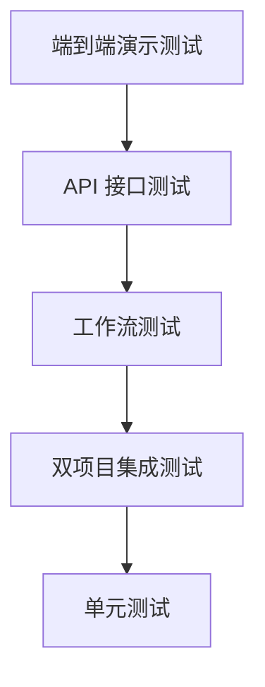

# 测试策略

> 版本：v2.0
> 日期：2026-07-01
> 状态：扩展为双项目测试策略，覆盖 rag-service 独立项目、RAG Client 降级、Token 配额、决策点埋点修复、Prompt 版本管理
> 适用项目：`ai-agent-learning`（主系统）+ `rag-service`（独立 RAG 服务）

## v2.0 声明

v2.0 起，本系统演化为**双项目 + 4 大模块架构**，测试策略随之扩展：

- **双项目**：主系统与 `rag-service` 各自独立测试，再做集成测试
- **4 大模块**：用户模块 / 管理员模块 / 开发人员模块 / 智能算法模块，每个模块有专属测试范围
- **v1.1 P0 修复验证**：5 个决策点埋点 bug（详见 [13_开发人员工作台设计.md](../01_正式设计/13_开发人员工作台设计.md) 第 11 章）必须回归通过
- **v2.0 新增能力**：RAG Client 降级、Token 配额、Prompt 版本管理、rag-service 独立项目

测试编号规范详见第 12 章。

## 1. 测试目标

测试目标是验证智能工单系统的核心闭环能够稳定运行，并确保多 Agent 工作流、API 接口、数据存储和前端依赖的数据结构保持一致。

v2.0 追加三项验证目标：

- 主系统与 `rag-service` 的集成链路在 rag-service 不可达时能正确降级，主流程不中断
- 5 个决策点 P0 埋点修复后能正确写入 `spans.metadata.decision` 五元组，`traces.total_tokens` 不再恒为 0
- Token 配额超限、Prompt 版本激活/回滚等管理员/开发人员操作行为符合契约

## 2. 测试分层

| 层级 | 测试内容 |
| --- | --- |
| 单元测试 | 工具函数、缓存、重试、数据库、模型路由、rag-service 解析/检索/重排 |
| 双项目集成测试 | 主系统 ↔ rag-service 的调用链、降级、超时、配额 |
| 工作流测试 | 意图理解、分类路由、处理、审核、重试、人工审核挂起与恢复、决策点埋点 |
| API 测试 | 鉴权、工单 CRUD、知识库、统计、trace、reviews、Prompt 版本、Token 控制台 |
| 端到端演示 | 前端提交工单并观察实时状态 |

## 3. 测试范围（按 4 大模块组织）

### 3.1 用户模块测试

| 测试对象 | 关键场景 |
| --- | --- |
| 工单提交 | 自然语言长描述、TicketIntentAgent 字段提取、空内容校验 |
| 工单查询 | 已存在详情、不存在返回 404、列表分页过滤 |
| 消息补充（v1.3） | `waiting_user_input` 下提交补充消息；非该状态返回 409；空白消息返回 422 |
| 满意度反馈 | completed 工单 satisfied=false 触发 user_request 审核；satisfied=true 仅记录 |

### 3.2 管理员模块测试

| 测试对象 | 关键场景 |
| --- | --- |
| 审核工作台 | 4 种触发场景（escalate/review_failed/error_fallback/user_request）、5 种决策路由、队列筛选排序、统计 ai_adoption_rate |
| 知识库 CRUD | 标题/正文缺失返回 400；Qdrant 不可用降级；批量上传幂等 |
| 用户管理 | 列表、角色切换、禁用启用 |

### 3.3 开发人员模块测试（v2.0 新增）

| 测试对象 | 关键场景 |
| --- | --- |
| Trace 决策树 | 5 个决策点五元组结构化渲染、`/decisions` 接口、token 明细联动 |
| Prompt 版本对比 | 创建/激活/回滚/diff、唯一约束、加载降级到源码默认 |
| RAG 检索调试器 | 三种检索模式透传、重排前后排名变化展示 |
| Token 成本控制台 | 日/周/月聚合、热力图、per-user 配额覆写、超限降级 |

详细测试策略见第 7-11 章。

### 3.4 智能算法模块测试

| 测试对象 | 关键场景 |
| --- | --- |
| 5 个 Agent | Intent/Classifier/ReActProcessor/Reviewer/Coordinator 各自职责正确性、LLM 失败降级 |
| LangGraph 工作流 | 路由分支、重试边界、条件函数决策入 trace |
| 决策追踪 | 5 个 P0 埋点修复后写入 `metadata.decision` 五元组（详见第 9 章） |

### 3.5 rag-service 独立项目测试（v2.0 新增）

| 测试对象 | 关键场景 |
| --- | --- |
| PDF 复杂解析 | 版面分析、表格识别、公式还原、智能分块三策略 |
| 检索 | vector / bm25 / hybrid 三种模式 + RRF 融合正确性 |
| 重排 | Cross-Encoder 接入、top-k 顺序变化 |
| 入库 | 重复入库幂等、元数据完整性、collection CRUD |
| 降级 | Qdrant / Embedder / Reranker 各自不可达时的退化路径 |

详细测试策略见第 6 章和第 7 章。

## 4. 工作流测试重点

工作流是系统核心，应重点覆盖：

- 投诉类工单进入升级处理。
- P0 工单进入升级处理。
- 技术和账务工单进入处理与审核。
- 审核通过后完成。
- 审核失败后重试。
- 超过重试上限后进入人工审核。
- 审核员提交决策后按 approve/rewrite/reprocess/reject/request_info 恢复流程。

## 5. Agent 测试重点

Agent 测试不应强依赖真实 LLM 服务，可以通过 mock 或占位逻辑测试：

- 分类 Agent 返回合法分类和优先级，并保留 reason/confidence 字段（v1.1 P1 修复验证）。
- 意图 Agent 能从自然语言中提取结构化字段。
- LLM 调用失败时分类降级可用。
- 处理 Agent 返回非空处理结果。
- 审核 Agent 返回 0 到 1 之间的评分，并写入 `quality_gate` 决策五元组。
- 协调 Agent 能处理升级和失败场景。

## 6. rag-service 单元测试策略

rag-service 作为独立项目，需建立独立的 `rag-service/tests/` 测试套件。测试不依赖真实 Qdrant / 真实模型权重，所有外部依赖通过 mock 注入。

### 6.1 文档解析测试

| 编号 | 测试对象 | 预期结果 |
| --- | --- | --- |
| TC-RAG-PARSE-001 | PDF 上传走 `structure_aware` 策略 | 返回 chunks 列表，每项含 `page` `category` `heading_path` 元数据 |
| TC-RAG-PARSE-002 | PDF 版面分析含表格 | 表格识别为 HTML/Markdown 结构，单元格文本回填正确 |
| TC-RAG-PARSE-003 | PDF 含双栏布局 | 阅读顺序按列还原，不出现跨栏错乱 |
| TC-RAG-PARSE-004 | Markdown 文档走 `semantic` 策略 | 语义边界切分，分块不跨标题层级 |
| TC-RAG-PARSE-005 | TXT 文档走 `fixed` 策略 | 固定窗口分块，重叠区长度等于 `chunk_overlap` |
| TC-RAG-PARSE-006 | OCR/版面模型加载失败（mock 507） | `/parse` 降级为 fixed 分块，返回 warning 标记 |
| TC-RAG-PARSE-007 | 元数据清洗 | 断行符、孤立单字符行被剔除，短 chunk 合并到相邻块 |

### 6.2 检索测试

| 编号 | 测试对象 | 预期结果 |
| --- | --- | --- |
| TC-RAG-RET-001 | `mode=vector` 纯向量检索 | 返回按余弦距离降序的 top-k，score < 阈值的过滤 |
| TC-RAG-RET-002 | `mode=bm25` 关键词检索 | 中文先 jieba 分词，错误码/产品型号精确命中 |
| TC-RAG-RET-003 | `mode=hybrid` 混合检索 | RRF 融合后排序与单模式不同，公式 `score = Σ w_i / (k + rank_i)` 计算正确 |
| TC-RAG-RET-004 | RRF 权重配置 | 默认 vector 0.7 + bm25 0.3；长查询自动调权重后排序变化 |
| TC-RAG-RET-005 | `use_hyde=true` 查询改写 | 多一次 LLM 调用，假设答案 Embedding 用于检索，结果召回率提升 |
| TC-RAG-RET-006 | `filters` 元数据过滤 | 仅返回匹配 `category` 等过滤条件的 chunk |
| TC-RAG-RET-007 | Embedder 不可用（mock） | vector 模式自动切 bm25；hybrid 退化为 bm25，返回 warning |
| TC-RAG-RET-008 | Qdrant 不可用（mock 503） | 返回 503 + 错误码 `QDRANT_UNAVAILABLE`，主系统走无 RAG 分支 |

### 6.3 重排测试

| 编号 | 测试对象 | 预期结果 |
| --- | --- | --- |
| TC-RAG-RERANK-001 | Cross-Encoder 接入 | 输入 query + top-20 文档，返回按相关性降序的 top-5 |
| TC-RAG-RERANK-002 | 重排前后顺序变化 | 至少有 1 条文档排名变化，主系统调试器能展示 ↑↓ 标记 |
| TC-RAG-RERANK-003 | 模型不可用（mock 507） | 降级为按原始 score 排序，返回 warning 标记 |
| TC-RAG-RERANK-004 | 指定 `model=BAAI/bge-reranker-v2-m3` | 实际加载该模型；非法 model 返回 507 |

### 6.4 入库测试

| 编号 | 测试对象 | 预期结果 |
| --- | --- | --- |
| TC-RAG-INGEST-001 | 完整链路：解析→分块→向量化→写 Qdrant | 返回 `doc_id` `chunk_count` `collection` |
| TC-RAG-INGEST-002 | 同一文档重复入库（content_hash 相同） | 跳过写入，返回原 `doc_id`，幂等 |
| TC-RAG-INGEST-003 | 同一 doc_id 内容变化（content_hash 不同） | 删除旧 chunk 再写入新 chunk，`document_version` 表新增一条记录 |
| TC-RAG-INGEST-004 | 元数据完整性 | 每个 chunk 携带 `source`/`page`/`category`/`heading_path`/`doc_id`/`chunk_index` |
| TC-RAG-INGEST-005 | 不存在的 collection | 返回 404 + `COLLECTION_NOT_FOUND` |

## 7. 主系统与 rag-service 集成测试策略

主系统通过 `src/multi_agent_system/tools/rag_client.py` 调用 rag-service，集成测试聚焦于**降级、超时、配额**三类异常场景，确保主流程不因 rag-service 问题中断。

### 7.1 正常调用链

| 编号 | 场景 | 预期结果 |
| --- | --- | --- |
| TC-CLIENT-001 | 提交工单 → process → rag_client → rag-service → 生成解决方案 | 处理结果含 `references_json`，trace 中 `knowledge_search` span 含 `rag_stats` |
| TC-CLIENT-002 | `/health` 检查返回 status=ok | rag_client 正常调用 `/retrieve` + `/rerank` |
| TC-CLIENT-003 | rag-service 返回 warning（Embedder 退化） | 主系统记录 warning 日志，仍使用退化后的结果 |

### 7.2 降级测试

| 编号 | 场景 | 预期结果 |
| --- | --- | --- |
| TC-CLIENT-101 | mock rag-service 返回 503 | 主流程仍能完成，`references_json` 为空，trace 含 warning |
| TC-CLIENT-102 | mock rag-service `/health` 返回 degraded | ReActProcessorAgent 跳过 `/rerank`，仅用 `/retrieve` 结果 |
| TC-CLIENT-103 | mock rag-service 连续 3 次失败 | 标记为不可用，后续 5 分钟不再调用，直接走无 RAG 分支 |
| TC-CLIENT-104 | Qdrant 不可用导致 rag-service 返回 503 | 主系统走无知识增强分支，工单状态正常推进 |

### 7.3 超时测试

| 编号 | 场景 | 预期结果 |
| --- | --- | --- |
| TC-CLIENT-201 | mock rag-service 延迟 > 10 秒 | 主流程触发超时降级，工单不阻塞 |
| TC-CLIENT-202 | mock rag-service 延迟 300ms（接近超时阈值） | 正常返回结果，不触发降级 |
| TC-CLIENT-203 | 网络错误（mock connection refused） | 重试 1 次后降级，间隔 500ms |

### 7.4 配额测试

| 编号 | 场景 | 预期结果 |
| --- | --- | --- |
| TC-CLIENT-301 | mock 用户月配额已达上限 | LLM 调用走降级路径（`degrade_rule` 默认），工单仍完成 |
| TC-CLIENT-302 | mock 用户周配额已达上限 | 同上，按 `over_quota_action` 配置走对应分支 |
| TC-CLIENT-303 | `over_quota_action=reject` | 工作流中止，写入 `human_reviews.trigger_type='error_fallback'` |
| TC-CLIENT-304 | `over_quota_action=degrade_rag` | 关闭 RAG 检索，仅用 LLM 自有知识，token 消耗减半 |

## 8. 决策点埋点测试（v1.1 P0 修复验证）

> 修复清单详见 [13_开发人员工作台设计.md](../01_正式设计/13_开发人员工作台设计.md) 第 11 章。

5 个 P0/P1 埋点修复后，必须通过下列测试用例验证修复有效。所有断言基于 `spans.metadata_` JSON 字段的实际写入。

| 编号 | 修复项 | 测试断言 |
| --- | --- | --- |
| TC-TRACE-001 | `traces.total_tokens` 累加（修复 `core/trace.py:139`） | LLM 调用结束后 `traces.total_tokens > 0`，且等于所有 `llm_call` span 的 token_usage 之和 |
| TC-TRACE-002 | Memory 加载有独立 span | trace 中存在 `span_type=memory_call` 的 `load_user_context` span，parent 为 process span |
| TC-TRACE-003 | RAG 检索 span 含 hit_count、top_score | `knowledge_search` span 的 `metadata_.rag_stats` 含 `hit_count` `top_score` `mode` 三字段 |
| TC-TRACE-004 | 条件路由有 decision 子结构 | `retry_check` span 与 `should_review` 路径下的 span 含 `metadata_.decision`，类型为 `boundary` 或 `quality_gate` |
| TC-TRACE-005 | classify span 含 reason 字段 | `classify` span 的 `metadata_.decision.options[*].reason` 非空，`selection.confidence` 在 [0,1] 区间 |
| TC-TRACE-006 | review span 结构化为 quality_gate 五元组 | review span `metadata_.decision.decision_type=quality_gate`，含 trigger(score/threshold) / options(pass,retry) / selection |
| TC-TRACE-007 | GET `/api/admin/traces/{ticket_id}/decisions` | 返回的 `decisions` 数组覆盖 classify / route / review / retry_check 等所有决策点 |
| TC-TRACE-008 | UPSERT `token_daily_stats` 正确累加 | 同一 (user_id, date, model, call_type) 多次写入，`request_count` 自增，token 字段累加 |

## 9. Prompt 版本管理测试

> 设计详见 [13_开发人员工作台设计.md](../01_正式设计/13_开发人员工作台设计.md) 第 5 章。

| 编号 | 场景 | 预期结果 |
| --- | --- | --- |
| TC-PROMPT-001 | 创建新版本 | `prompt_versions` 新增一行，`is_active=false`，version 自增 |
| TC-PROMPT-002 | 激活版本（事务） | 目标版本 `is_active=true`，同 agent_name 其他版本 `is_active=false` |
| TC-PROMPT-003 | 回滚到旧版本 | 复制旧版本 template 为新行（version 自增，note 标注 "rollback to vX"），新行被激活，旧版本历史不变 |
| TC-PROMPT-004 | 唯一约束 | 同 agent_name + version 冲突时返回 409 / 422，不写入 |
| TC-PROMPT-005 | Agent 加载激活版本 | `PromptManager.get_active(agent_name)` 返回 DB 中 `is_active=true` 的 template |
| TC-PROMPT-006 | DB 中无激活版本时降级 | 找不到记录时降级到源码常量默认模板，Agent 仍可启动 |
| TC-PROMPT-007 | diff 视图 | `react-diff-viewer` 正确展示两个版本的差异，支持 split/unified 切换 |
| TC-PROMPT-008 | 鉴权 | 非 admin 访问 `/api/admin/prompts/*` 返回 401 |

## 10. Token 控制台测试

> 设计详见 [12_Token成本控制台设计.md](../01_正式设计/12_Token成本控制台设计.md)。

### 10.1 累加与统计

| 编号 | 场景 | 预期结果 |
| --- | --- | --- |
| TC-TOKEN-001 | UPSERT 累加正确性 | 同一 (user_id, date, model, call_type) 多次 LLM 调用后，行内 `total_tokens` 等于所有调用之和 |
| TC-TOKEN-002 | `traces.total_tokens` 聚合一致 | `GET /api/admin/stats/tokens` 的总量 ≈ `traces` 表所有 trace 的 `total_tokens` 之和（按时间窗口过滤） |
| TC-TOKEN-003 | 按小时热力图 | `GET /api/admin/stats/tokens/hourly` 从 `spans.metadata_.token_usage` 取数，按 `start_time` 小时分桶 |
| TC-TOKEN-004 | 按 call_type 分组 | 6 种 call_type（intent/classify/process/review/coordinator/rag）各自归集，无默认 `process` 污染 |
| TC-TOKEN-005 | user_id 为 null（系统调用） | CoordinatorAgent 系统级调用仍计费，`user_id=null` 行参与聚合 |

### 10.2 配额

| 编号 | 场景 | 预期结果 |
| --- | --- | --- |
| TC-TOKEN-101 | 月配额检查 | `check_user_quota` 返回 `{monthly_usage, monthly_limit, monthly_remaining, reset_at}` |
| TC-TOKEN-102 | 周配额检查 | 同上，period=week |
| TC-TOKEN-103 | per-user 覆写 | `users.token_monthly_limit` 非空时优先于 `config.token_quota.monthly_limit` |
| TC-TOKEN-104 | per-user 为 NULL | 走系统默认配额 |
| TC-TOKEN-105 | 超限降级 `degrade_rule` | ClassifierAgent 退化为关键词匹配，ReActProcessorAgent 退化为模板，工单完成 |
| TC-TOKEN-106 | 超限降级 `reject` | 返回 429，工作流中止，写入 `error_fallback` 审核 |

## 11. API 测试重点（v2.0 扩展）

v1.x 原有 API 测试重点保留，v2.0 追加：

- `GET /api/admin/traces/{ticket_id}/decisions` 返回所有决策点（决策五元组）。
- `GET /api/admin/traces/{ticket_id}/spans/{span_id}` 返回 span 详情含 `metadata.decision`。
- `POST /api/admin/prompts/{agent_name}/versions` 新建版本；`/activate` 激活。
- `POST /api/admin/rag/debug` 透传 rag-service，返回 retrieval_results + rerank_results + 排名变化。
- `GET /api/admin/stats/tokens` 系列返回日/小时/配额数据。
- `GET /api/admin/stats/quota/{user_id}` 返回配额状态。

v1.x 原有 API 测试重点：

- 创建工单接口返回 `ticket_id`。
- 未登录访问业务接口返回 401，登录后可访问。
- 查询不存在工单返回 404。
- 列表接口支持分页和过滤。
- 知识库上传缺少标题或正文时返回 400。
- 统计接口返回基础统计字段。
- trace 不存在时返回 404。
- reviews 队列、详情、决策和统计接口符合契约。

## 12. v2.0 测试用例编号规范

为支持双项目 + 多模块，新增以下编号前缀，与 [02_核心测试用例.md](./02_核心测试用例.md) 现有编号风格一致：

| 前缀 | 范围 | 所属文档 |
| --- | --- | --- |
| TC-001 ~ TC-808 | 主系统 v1.x 核心用例（工单/分类/审核/知识库/WebSocket/Trace/统计/补充信息） | 02_核心测试用例.md |
| TC-RAG-* | rag-service 独立项目（解析/检索/重排/入库） | 本文档第 6 章 |
| TC-CLIENT-* | 主系统与 rag-service 集成（降级/超时/配额） | 本文档第 7 章 |
| TC-TRACE-* | 决策点埋点 P0/P1 修复验证 | 本文档第 8 章 |
| TC-PROMPT-* | Prompt 版本管理（创建/激活/回滚/diff） | 本文档第 9 章 |
| TC-TOKEN-* | Token 控制台（累加/配额/降级） | 本文档第 10 章 |

约定：

- 编号格式 `TC-<前缀>-<三位序号>`，三位序号在各自前缀内独立递增
- 同一功能在不同章节不重复编号
- 后续新增用例优先填充现有空号，再追加新号

## 13. 演示测试

答辩或验收前建议准备以下演示数据：

- 技术类："无法登录系统，点击登录按钮后报错 500。"
- 账务类："我的账单重复扣费，请帮我核实。"
- 投诉类："我要投诉，上次问题一直没有解决。"
- P0 类："后台核心业务完全不可用，全部用户无法访问。"

通过这些样例可以覆盖主要路由路径。

v2.0 答辩演示追加：

- rag-service 启停演示降级链路（手动 stop rag-service → 提交工单 → 主流程仍完成）
- 开发人员工作台 Trace 决策树展示 5 个决策点
- Token 控制台展示当日用量与配额状态
- Prompt 版本对比与回滚演示

## 14. 相关文档

- [02_核心测试用例.md](./02_核心测试用例.md) —— v1.x 核心测试用例（TC-001 ~ TC-808）
- [11_RAG服务独立项目设计.md](../01_正式设计/11_RAG服务独立项目设计.md) —— rag-service 独立项目设计（第 6 章 TC-RAG-* 测试依据）
- [12_Token成本控制台设计.md](../01_正式设计/12_Token成本控制台设计.md) —— Token 控制台设计（第 10 章 TC-TOKEN-* 测试依据）
- [13_开发人员工作台设计.md](../01_正式设计/13_开发人员工作台设计.md) —— 开发人员工作台设计（第 8 章 TC-TRACE-* / 第 9 章 TC-PROMPT-* 测试依据，含 v1.1 P0 修复清单）
- [06_可观测与执行追踪设计.md](../01_正式设计/06_可观测与执行追踪设计.md) —— Trace/Span 基础数据契约
- [09_人工审核工作台设计.md](../01_正式设计/09_人工审核工作台设计.md) —— 管理员模块审核工作台设计（鉴权与 error_fallback 来源）
