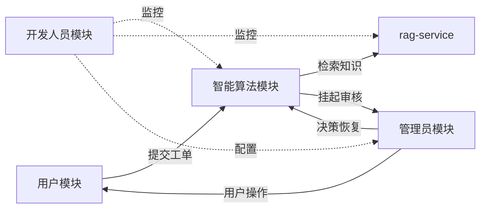

# 系统模块架构图 v2.0（ASCII 存档）

> 版本：v2.0
> 日期：2026-07-01
> 总功能数：30（用户模块 8 + 管理员模块 7 + 开发人员模块 7 + 智能算法模块 8）

```
┌──────────────────────────────────────────────────────────────────────────────┐
│                    基于多智能体的智能工单处理系统                                │
└──────────────────────────────────────────────────────────────────────────────┘
                                       │
       ┌───────────────────┬───────────┴───────────┬───────────────────┐
       ▼                   ▼                       ▼                   ▼
┌──────────────┐    ┌──────────────┐       ┌──────────────┐    ┌──────────────┐
│  用户模块(8)  │    │ 管理员模块(7) │       │开发人员模块(7)│    │智能算法模块(8)│
└──────────────┘    └──────────────┘       └──────────────┘    └──────────────┘
       │                   │                       │                   │
       ├─ 登录账户          ├─ 人工审核工作台       ├─ Trace 决策树 ◀──├─ TicketIntentAgent
       ├─ 用户注册          ├─ 知识库管理           │  (复用 admin_trace)├─ ClassifierAgent
       ├─ 用户信息管理      ├─ 知识库版本回滚       ├─ Prompt 版本对比  ├─ ReActProcessorAgent
       ├─ 修改密码          ├─ 用户管理             ├─ RAG 检索调试器   ├─ ReviewerAgent
       ├─ 工单提交          ├─ 决策采纳率统计       ├─ Token 成本控制台 ├─ CoordinatorAgent
       ├─ 工单查询与详情    ├─ 系统配置查看         │  (复用 explore/)  ├─ LangGraph 编排
       ├─ 消息补充          └─ 操作日志审计         ├─ Agent 调用统计   ├─ 工具层 (RAG Client)
       └─ 满意度反馈                                  ├─ 服务健康检查    └─ 决策追踪
                                                     └─ 配额管理

                                         ↕ HTTP API
                              ┌──────────────────────────┐
                              │   rag-service（独立项目） │
                              │   PDF解析 + 检索 + 重排   │
                              └──────────────────────────┘
```

## 功能编号清单（论文引用用）

### 用户模块（U-01 ~ U-08）

| 编号 | 功能 | 说明 |
|---|---|---|
| U-01 | 登录账户 | 账号密码登录、session cookie、退出、当前会话查询 |
| U-02 | 用户注册 | 自助注册账户，初始 vip_level=0 |
| U-03 | 用户信息管理 | 查看与修改昵称、联系方式、偏好分类 |
| U-04 | 修改密码 | 二次确认旧密码后更新 |
| U-05 | 工单提交 | 自然语言描述，TicketIntentAgent 自动结构化 |
| U-06 | 工单查询与详情 | 列表筛选（状态/分类/优先级）+ 详情查看 |
| U-07 | 消息补充 | waiting_user_input 状态补充订单号、支付流水等 |
| U-08 | 满意度反馈 | 工单完成后满意/不满意评分 + 文字评价 |

### 管理员模块（A-01 ~ A-07）

| 编号 | 功能 | 说明 |
|---|---|---|
| A-01 | 人工审核工作台 | 双栏布局、AI 辅助决策、5 种决策（approve/rewrite/reprocess/reject/request_info） |
| A-02 | 知识库管理 | 文档 CRUD、上传触发 rag-service /ingest |
| A-03 | 知识库版本回滚 | 按版本回滚到历史文档 |
| A-04 | 用户管理 | 查看/封禁/解封用户、调整 Token 配额 |
| A-05 | 决策采纳率统计 | ai_adoption_rate 指标，AI 建议被审核员采纳的比例 |
| A-06 | 系统配置查看 | 只读展示当前 LLM/Qdrant/rag-service 配置摘要 |
| A-07 | 操作日志审计 | 管理员操作历史（审核决策、用户封禁、配额调整等） |

### 开发人员模块（D-01 ~ D-07）

| 编号 | 功能 | 说明 |
|---|---|---|
| D-01 | Trace 决策树 | 按工单查看完整执行树、决策点五元组（trigger/options/selection/execution/reflection） |
| D-02 | Prompt 版本对比 | 5 Agent 的 Prompt 模板版本管理、diff、激活、回滚 |
| D-03 | RAG 检索调试器 | 三种模式（vector/bm25/hybrid）+ 重排前后 top-k 对比 |
| D-04 | Token 成本控制台 | 日/周/月统计、按 model + call_type 分组、配额管理（复用 explore/） |
| D-05 | Agent 调用统计 | 5 Agent 的调用次数、平均耗时、成功率、错误率 |
| D-06 | 服务健康检查 | rag-service / Qdrant / LLM / Embedding 健康状态实时显示 |
| D-07 | 配额管理 | per-user 配额覆写、超限降级策略配置 |

### 智能算法模块（I-01 ~ I-08）

| 编号 | 功能 | 说明 |
|---|---|---|
| I-01 | TicketIntentAgent | 自然语言工单结构化（标题、分类、优先级、影响范围、联系方式） |
| I-02 | ClassifierAgent | 分类（technical/billing/complaint/inquiry）+ 优先级（P0-P3）+ 风险识别 |
| I-03 | ReActProcessorAgent | ReAct 推理、工具调用、解决方案生成、RAG 调用与降级 |
| I-04 | ReviewerAgent | 处理结果质量评分（0-1），低于阈值触发重试 |
| I-05 | CoordinatorAgent | 升级摘要、失败分析、报告生成、辅助决策建议 |
| I-06 | LangGraph 编排 | 状态机定义、节点函数、条件路由、人工恢复子图 |
| I-07 | 工具层 | RAG Client（HTTP 调 rag-service）+ 通知 + 统计 + DB 工具 |
| I-08 | 决策追踪 | trace/span 结构化、决策点五元组、token 统计累加 |

## 模块间协作关系



## 与外部系统的关系

| 外部系统 | 关系 | 说明 |
|---|---|---|
| MySQL | 主数据存储 | 工单、用户、trace、prompt_versions、token_daily_stats 等 |
| Qdrant | 向量存储 | 由 rag-service 独立管理，主系统不直接访问 |
| LLM（OpenAI 兼容） | 模型调用 | 5 Agent + rag-service 的 HyDE/Cross-Encoder |
| Embedding 服务 | 向量化 | 仅 rag-service 调用 |
| Cross-Encoder（BAAI/bge-reranker-v2-m3） | 重排 | 仅 rag-service 调用 |
