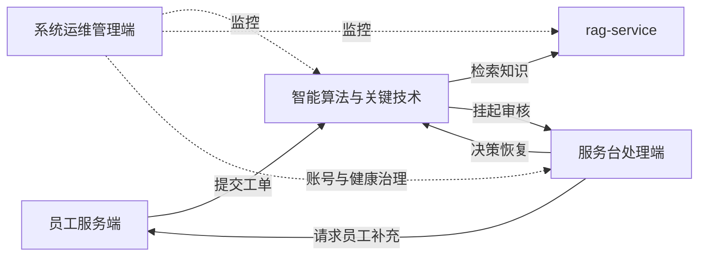

# 系统模块架构图 v2.2（ASCII 存档）

> 版本：v2.2
> 日期：2026-07-10（老师反馈后定稿：业务场景收敛为企业内部服务台工单处理）
> 总功能数：29（员工服务端 8 + 服务台处理端 7 + 系统运维管理端 6 + 智能算法与关键技术 8）

```
┌──────────────────────────────────────────────────────────────────────────────┐
│              基于知识增强智能体协同的工单处理系统                                  │
└──────────────────────────────────────────────────────────────────────────────┘
                                       │
       ┌───────────────────┬───────────┴───────────┬───────────────────┐
       ▼                   ▼                       ▼                   ▼
┌──────────────┐    ┌──────────────┐       ┌──────────────┐    ┌──────────────┐
│ 员工服务端(8) │    │服务台处理端(7)│       │系统运维端(6) │    │智能关键技术(8)│
└──────────────┘    └──────────────┘       └──────────────┘    └──────────────┘
       │                   │                       │                   │
       ├─ 员工档案模块            ├─ 工单受理模块         ├─ 账号管理模块     ├─ 工单理解分类算法
       ├─ 工单提报模块            ├─ 人工审核模块         ├─ 流程监控模块     ├─ 知识检索增强算法
       ├─ 进度协同模块            ├─ 知识维护模块         ├─ 策略调试模块     ├─ 智能体协同算法
       └─ 验收反馈模块            └─ 运营分析模块         └─ 系统健康模块     └─ 流程编排策略

                                         ↕ HTTP API
                              ┌──────────────────────────┐
                              │   rag-service（独立项目） │
                              │   PDF解析 + 检索 + 重排   │
                              └──────────────────────────┘
```

## 功能编号清单（论文引用用）

### 员工服务端（U-01 ~ U-08）

| 编号 | 功能 | 说明 |
|---|---|---|
| U-01 | 员工档案模块 | 登录注册、会话保护、联系方式、部门岗位和服务身份上下文 |
| U-02 | 自助预诊断 | 提单前提示问题类型、紧急程度、风险和材料清单 |
| U-03 | 智能提单 | 自然语言描述，TicketIntentAgent 自动结构化并创建工单 |
| U-04 | 材料采集 | 按类型采集订单号、系统入口、错误截图、环境和影响范围 |
| U-05 | 进度协同 | 列表筛选、详情查看、处理时间线和 WebSocket 节点进度 |
| U-06 | 员工补充与双向沟通 | waiting_user_input 状态补充关键资料，推动流程恢复 |
| U-07 | 处理结果验收 | 查看方案、依据和审核结果，确认问题是否解决 |
| U-08 | 申诉升级与历史复盘 | 不满意触发人工复核，查看历史工单和相似处理经验 |

### 服务台处理端 / 系统运维管理端（A-01 ~ A-07）

| 编号 | 功能 | 说明 |
|---|---|---|
| A-01 | 人工审核工作台 | 双栏布局、AI 辅助决策、5 种决策（approve/rewrite/reprocess/reject/request_info） |
| A-02 | 知识维护 | 文档 CRUD、上传触发 rag-service /ingest |
| A-03 | 知识库版本回滚 | 按版本回滚到历史文档 |
| A-04 | 账号管理 | 账号列表查询、角色状态维护、封禁/解封处理（归属系统运维管理端） |
| A-05 | 决策采纳率统计 | ai_adoption_rate 指标，AI 建议被审核员采纳的比例 |
| A-06 | 系统配置查看 | 只读展示当前 LLM/Qdrant/rag-service 配置摘要 |
| A-07 | 操作日志审计 | 管理员操作历史（审核决策、账号封禁、知识库变更等） |

### 系统运维管理端（D-01 ~ D-06）

| 编号 | 功能 | 说明 |
|---|---|---|
| D-01 | Trace 决策树 | 按工单查看完整执行树、决策点五元组（trigger/options/selection/execution/reflection） |
| D-02 | Prompt 版本对比 | 5 Agent 的 Prompt 模板版本管理、diff、激活、回滚 |
| D-03 | RAG 检索调试器 | 三种模式（vector/bm25/hybrid）+ 重排前后 top-k 对比 |
| D-04 | Token 成本控制台 | 系统级总统计：按 model + call_type + 日期分桶，不按用户分摊/计费 |
| D-05 | Agent 调用统计 | 5 Agent 的调用次数、平均耗时、成功率、错误率 |
| D-06 | 服务健康检查 | rag-service / Qdrant / LLM / Embedding 健康状态实时显示 |

### 智能算法与关键技术（I-01 ~ I-08）

| 编号 | 功能 | 说明 |
|---|---|---|
| I-01 | TicketIntentAgent | 自然语言工单结构化（标题、分类、优先级、影响范围、联系方式） |
| I-02 | ClassifierAgent | 分类（technical/billing/complaint/inquiry）+ 优先级（P0-P3）+ 风险识别 |
| I-03 | ReActProcessorAgent | ReAct 推理、工具调用、解决方案生成、RAG 调用与降级 |
| I-04 | ReviewerAgent | 处理结果质量评分（0-1），低于阈值触发重试 |
| I-05 | CoordinatorAgent | 升级摘要、失败分析、报告生成、辅助决策建议 |
| I-06 | LangGraph 编排 | 状态机定义、节点函数、条件路由、人工恢复子图 |
| I-07 | 工具层 | RAG Client（HTTP 调 rag-service）+ 通知 + 统计 + DB 工具 |
| I-08 | 决策追踪 | trace/span 结构化、决策点五元组、token 统计累加 |

## 模块间协作关系



## 与外部系统的关系

| 外部系统 | 关系 | 说明 |
|---|---|---|
| MySQL | 主数据存储 | 工单、用户、trace、prompt_versions、token_daily_stats 等 |
| Qdrant | 向量存储 | 由 rag-service 独立管理，主系统不直接访问 |
| LLM（OpenAI 兼容） | 模型调用 | 5 Agent + rag-service 的 HyDE/Cross-Encoder |
| Embedding 服务 | 向量化 | 仅 rag-service 调用 |
| Cross-Encoder（BAAI/bge-reranker-v2-m3） | 重排 | 仅 rag-service 调用 |
