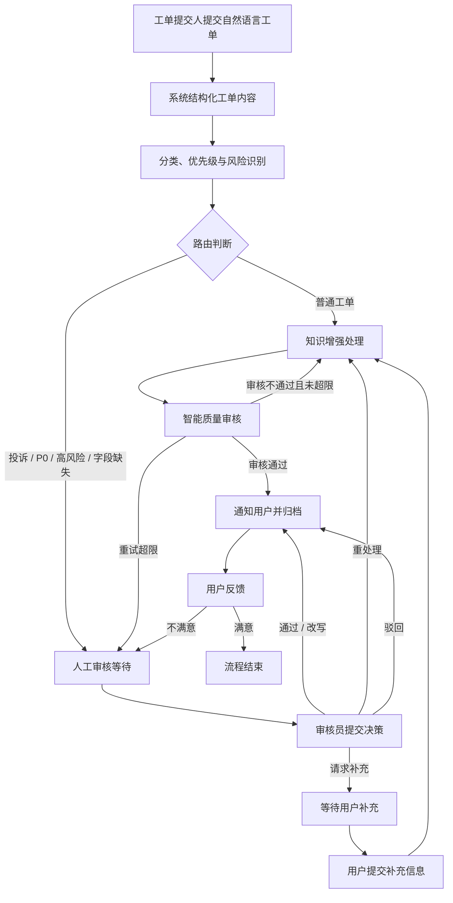

# 智能工单处理系统业务梳理与模块重构设计

> 日期：2026-07-09
> 依据：[docs/design-spec](../design-spec/) 现有设计文档
> 状态：业务重构整理稿；最终定稿口径见 [2026-07-10-ticket-processing-system-final-design.md](./2026-07-10-ticket-processing-system-final-design.md)

## 1. 编写目的

当前系统已经围绕“智能工单处理”形成了较完整的功能闭环，包括用户提单、工单分类、知识增强处理、质量审核、人工审核、用户补充、执行追踪、知识库管理、Prompt 管理、Token 统计和状态机画布等能力。

本设计文档不重新定义系统，不扩展新的业务方向，而是基于现有 [design-spec](../design-spec/) 对业务目标、用户角色、业务流程和功能模块进行重新整理，使系统对外表达从“技术模块堆叠”转为“围绕工单业务流程展开的功能体系”。

## 2. 现有系统业务定位

系统定位为：

**基于知识增强智能体协同的智能工单处理系统。**

系统面向客服、运维和企业内部服务等需要处理工单的场景。用户提交自然语言工单后，系统自动完成意图理解、分类与优先级识别、知识库检索、处理方案生成、质量审核和结果通知；对于高风险、投诉、P0、信息不足、AI 审核失败或用户不满意的工单，系统转入人工审核或用户补充流程，形成可解释、可追踪、可人工接管的工单处理闭环。

该业务定位与现有文档保持一致：

- [系统愿景与目标](../design-spec/00_预设计/01_系统愿景与目标.md) 中定义系统用于客服、运维和企业内部服务场景。
- [工单处理流程设计](../design-spec/01_正式设计/02_工单处理流程设计.md) 已定义从提交工单到分类、处理、审核、人工审核、用户补充、归档的流程。
- [人工审核工作台设计](../design-spec/01_正式设计/09_人工审核工作台设计.md) 已定义人工审核闭环。
- [开发人员工作台设计](../design-spec/01_正式设计/13_开发人员工作台设计.md) 已定义 Trace、Prompt、RAG 调试和 Token 成本控制台。

## 3. 业务问题

传统工单处理流程中存在以下问题：

| 业务问题 | 具体表现 | 系统应对方式 |
| --- | --- | --- |
| 用户描述不规范 | 用户以自然语言提交问题，缺少结构化字段 | TicketIntentAgent 自动提取标题、分类、优先级、影响范围和必要字段 |
| 人工初筛成本高 | 管理员需要逐条判断类型和紧急程度 | ClassifierAgent 进行分类、优先级和风险识别 |
| 常见问题重复处理 | 同类问题需要重复查询知识文档并回复 | ReActProcessorAgent 结合知识库生成处理方案 |
| 自动生成结果不稳定 | 大模型可能生成不完整或不可靠的答案 | ReviewerAgent 对结果评分，不通过则重试或转人工 |
| 高风险工单不能自动闭环 | 投诉、P0、业务操作缺字段等场景需要人工判断 | human_review_wait 挂起工单，进入人工审核工作台 |
| 信息不足时流程中断 | 用户未提供订单号、支付凭证、联系方式等关键字段 | request_info 决策让工单进入 waiting_user_input，用户补充后恢复处理 |
| 处理过程难以解释 | 无法说明工单为什么被分类、升级或重试 | Trace / Span 记录节点输入输出和决策点 |
| 智能系统难以运维 | Prompt、RAG、Token、Agent 调用难以观测 | 开发人员工作台提供状态机画布、Prompt 版本、RAG 调试和 Token 统计 |

## 4. 用户角色

基于现有系统功能，角色不宜只按“用户、管理员、开发人员”抽象描述，而应说明各角色在工单业务中的职责。

| 角色 | 业务职责 | 对应现有模块 |
| --- | --- | --- |
| 工单提交人 | 提交服务请求，查看工单进度，补充信息，反馈处理结果 | 用户模块 |
| 工单审核员 | 处理待人工审核工单，核查 AI 建议，提交审核决策 | 管理员模块 / 人工审核工作台 |
| 系统管理员 | 维护用户、知识库、系统配置和审计日志，查看运营统计 | 管理员模块 |
| 开发运维人员 | 监控 Agent 流程、Trace、Prompt、RAG 检索效果和 Token 成本 | 开发人员模块 |
| 智能处理引擎 | 非登录角色，负责工单理解、分类、处理、审核、协调和状态流转 | 智能算法模块 |

其中，开发运维人员不直接处理业务工单，而是保障智能工单处理链路可解释、可调试、可持续优化。

## 5. 核心业务流程

### 5.1 主流程

现有系统的主流程可以整理为以下业务闭环：

### 5.2 流程阶段说明

| 阶段 | 业务目标 | 现有实现依据 |
| --- | --- | --- |
| 工单提交 | 用户用自然语言提交问题，系统创建工单 | `create_ticket`、TicketIntentAgent、用户模块 U-03 |
| 分类路由 | 识别分类、优先级、风险，决定处理路径 | `classify`、`route`、ClassifierAgent |
| 知识增强处理 | 检索知识库并生成解决方案 | `process`、ReActProcessorAgent、rag-service |
| 质量审核 | 判断生成结果是否可靠 | `review`、ReviewerAgent、`review_threshold` |
| 重试控制 | 低质量结果有限重试 | `retry_check`、`max_retries` |
| 人工审核 | 高风险或失败场景进入人工决策 | `human_review_wait`、ReviewWorkbench |
| 用户补充 | 信息不足时暂停并等待用户补充 | `waiting_user_input`、`ticket_messages` |
| 工作流恢复 | 用户补充或审核员决策后继续处理 | `apply_human_decision`、`resume_from_user_input` |
| 结果归档 | 通知用户、保存结果、记录 trace | `notify`、`complete`、Trace / Span |

## 6. 业务触发条件与处理策略

| 触发条件 | 业务含义 | 系统处理策略 |
| --- | --- | --- |
| 分类为投诉 | 用户表达不满或投诉 | 进入人工审核，避免自动闭环 |
| 优先级为 P0 | 紧急或严重问题 | 进入人工审核或升级处理 |
| `requires_human_review=true` | 风险策略判断需要人工复核 | 创建人工审核单 |
| `requires_business_operation=true` 且字段缺失 | 涉及退款、扣费核查、订单处理等业务操作但缺少关键信息 | 请求用户补充或转人工 |
| `review_score < threshold` | 处理结果质量不达标 | 未超限则重试，超限转人工 |
| 工作流异常 | Agent 或工具执行失败 | 优先创建 error_fallback 人工审核 |
| 用户不满意反馈 | 用户认为处理结果无效 | 创建 user_request 人工审核 |
| rag-service 不可达 | 知识增强服务异常 | 降级为无知识增强处理，流程不中断 |

## 7. 业务模块重构

现有系统原本按照“用户模块、管理员模块、开发人员模块、智能算法模块”划分。该划分可以保留，但对外展示时应使用更贴近业务的名称和说明。

### 7.1 工单提交与跟踪模块

对应原用户模块。最终展示时应把用户侧定位为“服务请求门户”，避免只呈现为“提交工单 + 补充信息”。该模块覆盖用户从发现问题、组织材料、发起请求、跟踪处理、补充资料、验收结果到申诉复盘的完整链条。

| 功能 | 业务说明 |
| --- | --- |
| 服务账号与档案 | 登录注册、会话保护、联系方式、常见问题偏好和服务身份上下文 |
| 自助预诊断 | 用户提交前获得问题类型、紧急程度、风险提示和所需材料提示 |
| 智能提单 | 用户以自然语言提交服务请求，系统自动结构化并创建工单 |
| 材料采集 | 按问题类型采集订单号、支付流水、错误截图、设备环境、影响范围等材料 |
| 进度协同 | 查看个人工单列表、详情、状态、处理时间线和节点进度 |
| 用户补充与双向沟通 | 在 waiting_user_input 状态下补充关键信息，推动工单恢复处理 |
| 处理结果验收 | 查看处理方案、依据和人工审核摘要，确认问题是否解决 |
| 申诉升级与历史复盘 | 对不满意结果发起人工复核，查看历史工单和相似问题经验 |

说明：原“身份认证、注册、联系方式、偏好分类”对外合并为“服务账号与档案”，把模块空间让给预诊断、材料采集、验收和申诉等更能体现业务量的用户侧动作。

### 7.2 工单受理与人工审核模块

对应原管理员模块中的人工审核、工单分析和运营管理能力。

| 功能 | 业务说明 |
| --- | --- |
| 待审核工单队列 | 展示 pending_human_review 工单 |
| 工单详情核查 | 查看原始描述、分类、优先级、处理结果、trace 摘要 |
| AI 建议核查 | 查看 CoordinatorAgent 生成的辅助决策建议 |
| 审核决策提交 | 支持通过、改写、重处理、驳回、请求补充 |
| 审核质量统计 | 统计 AI 建议采纳率、审核通过率、重处理率 |
| 用户反馈分析 | 分析满意度和不满意升级情况 |
| 操作日志审计 | 记录管理员审核、知识库、用户管理等写操作 |

### 7.3 知识库与规则维护模块

对应原管理员模块中的知识库管理能力，以及智能处理所依赖的知识来源。

| 功能 | 业务说明 |
| --- | --- |
| 知识文档上传 | 上传 FAQ、处理手册、业务规则等文档 |
| 知识入库审核与发布 | 控制知识是否进入可检索范围 |
| 知识内容更新 | 更新过期文档和处理规则 |
| 知识版本记录与回滚 | 保留历史版本，支持回滚 |
| 知识库检索支撑 | 为处理 Agent 提供工单处理依据 |

该模块应避免在架构图中只写“RAG 接口、文档解析、知识库入库”等工程动作，而应强调它对业务的作用：提供规则依据、故障处理经验和历史知识。

### 7.4 智能处理与协同编排模块

对应原智能算法模块。

| 功能 | 业务说明 | 技术实现 |
| --- | --- | --- |
| 工单意图理解 | 将用户自然语言转为结构化工单字段 | TicketIntentAgent |
| 分类与优先级识别 | 判断工单类别、紧急程度和风险 | ClassifierAgent |
| 知识增强处理 | 检索知识并生成处理方案 | ReActProcessorAgent + rag-service |
| 质量审核评分 | 判断结果是否可返回用户 | ReviewerAgent |
| 协调与升级建议 | 为人工审核生成辅助决策 | CoordinatorAgent |
| 状态机编排 | 控制自动处理、人工审核、用户补充和恢复流程 | LangGraph |
| 决策追踪 | 记录每个节点的输入、输出和决策依据 | Trace / Span |

对外表达时应把“算法”落到业务处理动作上，例如“分类路由算法、知识增强检索、质量审核评分、人工接管编排”，而不是只写“RAG、LangGraph、多 Agent”。

### 7.5 智能流程运维模块

对应原开发人员模块。

| 功能 | 业务说明 |
| --- | --- |
| 状态机画布 | 查看工单在 LangGraph 节点间的流转路径 |
| Trace 决策树 | 查看每个节点的输入、输出、决策和异常 |
| Prompt 版本管理 | 管理 5 个 Agent 的提示词版本 |
| RAG 检索调试 | 检查知识检索是否命中正确片段 |
| Agent 调用统计 | 统计不同 Agent 的调用次数和耗时 |
| Token 成本控制 | 查看模型调用成本 |
| 服务健康检查 | 检查主系统、rag-service、数据库等状态 |

该模块的业务意义是保障智能工单处理流程可观测、可调优、可稳定运行，而不是让开发人员参与普通工单处理。

## 8. 模块名称调整建议

为了让功能架构图更业务化，建议将模块名称从纯角色/技术命名调整为“角色 + 业务职责”。

| 当前名称 | 建议展示名称 | 调整原因 |
| --- | --- | --- |
| 用户模块 | 工单提交与跟踪模块 | 突出用户围绕工单的业务动作 |
| 管理员模块 | 工单受理与人工审核模块 | 突出管理员处理工单，而不只是系统管理 |
| 知识库管理 | 知识库与规则维护模块 | 强调知识库服务于工单处理规则和经验 |
| 开发人员模块 | 智能流程运维模块 | 说明开发人员功能与工单链路稳定性相关 |
| 智能算法模块 | 智能处理与协同编排模块 | 避免只堆技术名词，突出处理、审核、编排 |

## 9. 关键技术与业务流程映射

| 技术能力 | 在业务流程中的位置 | 输入 | 输出 | 业务价值 |
| --- | --- | --- | --- | --- |
| TicketIntentAgent | 工单提交后 | 用户自然语言描述 | 结构化工单字段 | 降低用户提单门槛 |
| ClassifierAgent | 分类路由阶段 | 工单内容和初步字段 | 分类、优先级、风险 | 降低人工初筛成本 |
| rag-service | 知识增强处理阶段 | 查询文本、分类、上下文 | 知识片段、相关度、重排结果 | 提供处理依据 |
| ReActProcessorAgent | 处理阶段 | 工单上下文和知识片段 | 处理方案 | 自动处理普通工单 |
| ReviewerAgent | 质量审核阶段 | 原始工单和处理结果 | 评分、问题类型、重试建议 | 避免低质量结果返回用户 |
| CoordinatorAgent | 人工审核阶段 | 触发原因、处理结果、评分 | AI 辅助审核建议 | 帮助审核员快速决策 |
| LangGraph | 全流程 | 节点状态和条件判断 | 下一节点 | 保证流程可控、可暂停、可恢复 |
| Trace / Span | 全流程 | 节点输入输出和元数据 | 执行轨迹、决策点 | 支撑解释、复盘和调试 |

## 10. 功能架构图调整原则

后续修改功能架构图时，应遵循以下原则：

1. 不再使用 U-01、A-01、D-01、R-01 这类编号展示，避免看起来像技术清单。
2. 一级模块按业务职责划分，而不是只按登录角色划分。
3. 用户侧模块突出“档案、预诊断、提单、材料、进度、补充、验收、申诉复盘”。
4. 管理员侧模块突出“受理、审核、知识维护、统计、审计”。
5. 开发人员侧模块突出“流程监控、策略调试、成本健康”，说明其服务于工单处理质量。
6. 智能模块突出“理解、分类、检索、处理、审核、编排、追踪”，避免只写 RAG 接口、文档入库等工程步骤。
7. 所有技术能力都要能回答“它处理了业务流程中的哪一步、输入是什么、输出是什么”。

## 11. 对老师反馈的回应口径

可以使用以下说明回应“系统已成型时应整理功能业务”的反馈：

> 当前系统已经形成从用户提单到智能处理、人工审核、用户补充和结果归档的完整闭环。因此本次调整不重新设计新的业务系统，而是在现有智能工单处理系统基础上，对业务流程和模块命名进行重新整理。系统面向客服、运维和企业内部服务类工单，核心业务主线为“工单提交、分类路由、知识增强处理、质量审核、人工复核、用户补充、结果反馈与归档”。在此基础上，将原用户模块整理为工单提交与跟踪模块，将管理员模块整理为工单受理与人工审核模块，将知识库能力整理为知识库与规则维护模块，将开发人员能力整理为智能流程运维模块，将智能算法能力整理为智能处理与协同编排模块。这样既保持现有系统实现不变，又能从业务功能角度体现系统的完整性和工作量。

## 12. 后续落地建议

本设计文档用于指导后续两类调整：

1. **文档调整**：在论文和设计文档中优先使用业务化模块名称，再在小节中说明对应技术实现。
2. **图形调整**：功能架构图按业务模块重新排布，保留现有功能点，但避免编号化和技术堆砌。

当前不建议扩大系统范围到完整财务报销、企业 OA 或复杂 ITSM 平台，以免偏离现有系统实现。
