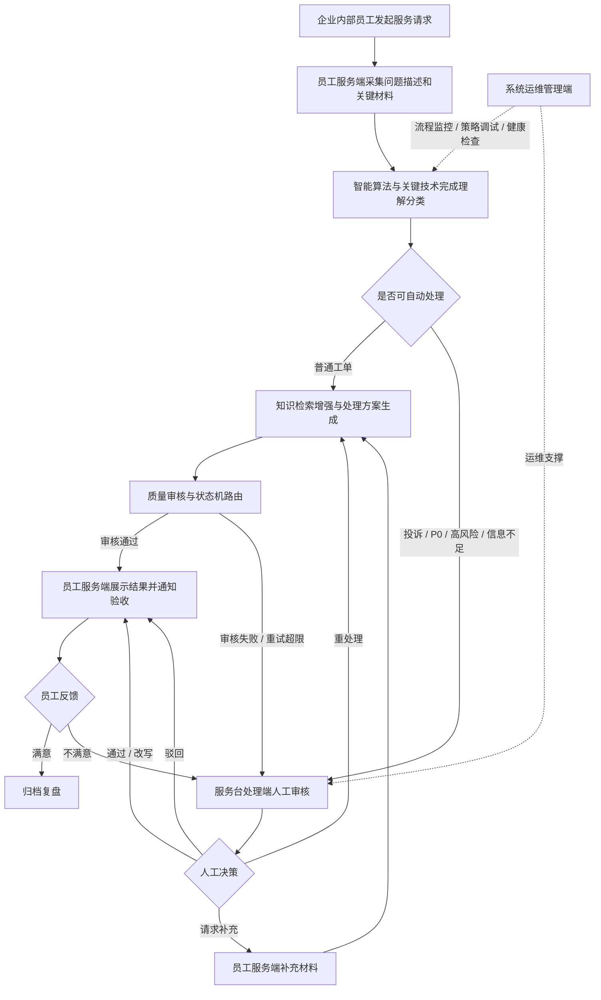

# 企业内部服务台智能工单处理系统业务与总体设计

> 日期：2026-07-10
> 状态：老师反馈后定稿口径，用于同步 `docs/design-spec/` 与论文设计章节
> 关联：[design-spec 业务架构梳理](../design-spec/00_预设计/04_业务架构梳理.md) · [系统框架图](../design-spec/assets/architecture/system-4-modules-tree.drawio)

## 1. 设计定位

本系统定位为：

**基于知识增强智能体协同的工单处理系统。**

系统绑定的具体业务场景为**企业内部服务台工单处理**。企业内部员工在使用账号权限、业务系统、办公设备、网络环境、行政服务等内部服务时，可通过系统发起服务请求；系统先由智能处理引擎完成工单理解、分类、知识检索、方案生成和质量审核；对于高风险、信息不足、处理质量不达标或用户不满意的工单，转入服务台处理人员人工审核；系统运维管理人员负责账号、流程、策略和系统健康治理。

该定位避免把系统表述成单纯的 RAG、Trace、多 Agent 技术堆叠，而是以“内部员工服务请求从提交到处理完成”为主线说明系统业务价值。

## 2. 面向用户与角色边界

系统中可登录使用的角色分为三类，智能处理引擎是后台执行能力，不作为登录用户展示。

| 架构分区 | 面向角色 | 角色职责 | 与工单业务的关系 |
| --- | --- | --- | --- |
| 员工服务端 | 企业内部员工 / 工单提交人 | 建立服务档案，提交服务请求，补充材料，查看进度，验收结果，发起申诉 | 工单业务的发起者和验收者 |
| 服务台处理端 | 服务台处理人员 / 工单审核员 / 知识维护员 | 受理待办工单，核查 AI 建议，提交人工决策，维护处理手册和知识内容，查看运营统计 | 工单业务的人工兜底和知识维护者 |
| 系统运维管理端 | 系统管理员 / 开发运维人员 | 管理账号角色，监控流程状态，调试检索和提示词策略，检查系统健康 | 工单业务稳定运行的保障者 |
| 智能算法与关键技术 | 智能处理引擎 | 执行意图理解、分类路由、知识增强处理、质量审核、状态机编排和决策追踪 | 工单自动处理的后台执行者 |

其中，工单提交人不是外部消费者，而是企业内部员工；管理员不只做账号管理，服务台处理人员承担工单受理、审核和知识维护；开发运维人员不直接处理业务工单，而是保证智能处理链路可观测、可调试、可持续优化。

## 3. 业务主线

系统的核心业务闭环如下：

该流程体现三个用户端的协作关系：

- 员工服务端负责“提出问题、补充上下文、验收结果”。
- 服务台处理端负责“人工受理、审核决策、知识维护、运营分析”。
- 系统运维管理端负责“账号权限、流程观测、策略调优、系统健康”。
- 智能算法与关键技术贯穿中间处理链路，为三类用户提供自动化支撑。

## 4. 四个架构分区设计

### 4.1 员工服务端

员工服务端定位为企业内部员工的服务请求门户，不是单一的提交工单页面。

| 模块 | 功能 | 业务说明 |
| --- | --- | --- |
| 员工档案模块 | 账号登录、联系方式、部门岗位 | 绑定服务请求人的身份和联系信息，便于服务台回访和权限判断 |
| 工单提报模块 | 服务类型选择、问题描述提单、关键信息填写 | 引导员工说明账号、系统、设备、网络、行政等服务问题，并采集必要材料 |
| 进度协同模块 | 工单状态跟踪、员工补充沟通、处理进度通知 | 员工可查看节点进度，在信息不足时补充材料 |
| 验收反馈模块 | 结果验收、申诉升级、历史工单查询 | 员工确认问题是否解决，不满意时触发人工复核 |

员工服务端解决的是“员工如何清楚地发起并跟踪一次服务请求”的业务问题。

### 4.2 服务台处理端

服务台处理端面向内部服务台人员，承担人工受理、审核兜底和知识维护。

| 模块 | 功能 | 业务说明 |
| --- | --- | --- |
| 工单受理模块 | 工单列表筛选、工单详情核查、分类优先级确认 | 处理待办工单，核对 AI 自动分类和优先级是否合理 |
| 人工审核模块 | 待审工单队列、智能建议核查、审核决策提交、补充信息请求 | 对高风险、低质量、异常和用户不满意工单进行人工决策 |
| 知识维护模块 | 文档上传解析、入库审核发布、知识内容更新 | 维护 FAQ、处理手册、故障经验和业务规则，为智能处理提供依据 |
| 运营分析模块 | 处理状态统计、审核质量统计、用户反馈分析 | 分析工单处理效率、AI 建议采纳率和用户满意度 |

服务台处理端解决的是“哪些工单需要人工介入、人工如何做决策、知识如何沉淀回系统”的业务问题。

### 4.3 系统运维管理端

系统运维管理端面向系统管理员和开发运维人员，负责保障智能工单流程稳定运行。

| 模块 | 功能 | 业务说明 |
| --- | --- | --- |
| 账号管理模块 | 账号列表查询、角色状态维护、封禁解封处理 | 管理员工、服务台人员、系统运维人员的账号和权限状态 |
| 流程监控模块 | 流程状态监控、执行轨迹查询、节点输入输出 | 观察工单在状态机和 Agent 节点中的流转过程 |
| 策略调试模块 | 提示词版本、检索效果调试、智能体调用统计 | 调整 Prompt、检索和 Agent 调用策略，提升处理质量 |
| 系统健康模块 | 模型用量统计、服务健康检查、异常日志定位 | 监控模型成本、RAG 服务、数据库、LLM 等依赖状态 |

系统运维管理端解决的是“智能工单系统为什么这样处理、哪里处理异常、如何持续优化”的问题。

### 4.4 智能算法与关键技术

智能算法与关键技术是系统的后台处理引擎，需要从业务处理动作中凝练算法能力。

| 模块 | 功能 | 输入 | 输出 | 智能方法 |
| --- | --- | --- | --- | --- |
| 工单理解分类算法 | 工单意图抽取、关键词兜底分类、分类优先级判定、风险规则评估 | 员工自然语言描述、服务类型、补充材料 | 结构化字段、类别、优先级、风险标签 | LLM 信息抽取、规则兜底、分类路由 |
| 知识检索增强算法 | 查询改写策略、向量语义召回、关键词召回算法、融合排序算法、交叉编码重排 | 工单内容、分类、上下文 | 相关知识片段、重排结果、可引用依据 | Hybrid Retrieval、RRF 融合、Cross-Encoder 重排 |
| 智能体协同算法 | 任务分解调度、处理方案生成、质量审核评分、升级接管协调、工具调用控制 | 结构化工单、知识片段、历史状态 | 处理方案、审核评分、人工接管建议 | 多 Agent 协作、ReAct 工具调用、质量评分 |
| 流程编排策略 | 状态机条件路由、人工接管判断、返工重试控制、处理结果流转 | 节点状态、审核结果、用户补充、异常信息 | 下一节点、工单状态、事件通知 | LangGraph 状态机、条件路由、人工恢复子图 |

该分区的表达重点不是“用了 RAG”或“用了多 Agent”，而是说明智能技术在工单业务中处理了什么输入、产生什么输出、帮助哪个业务环节降本增效。

## 5. 端到端功能协作

| 业务阶段 | 主要角色 | 使用的系统功能 | 智能技术作用 |
| --- | --- | --- | --- |
| 发起服务请求 | 企业内部员工 | 工单提报、材料采集、员工档案 | 工单意图抽取，提示缺失材料 |
| 自动理解分类 | 智能处理引擎 | 工单理解分类算法 | 输出类别、优先级、风险和路由依据 |
| 自动处理普通工单 | 智能处理引擎 | 知识检索增强、处理方案生成 | 从知识库召回依据并生成解决方案 |
| 质量审核与路由 | 智能处理引擎 | 质量审核评分、流程编排 | 判断是否可返回用户、是否需要重试或人工接管 |
| 人工审核兜底 | 服务台处理人员 | 待审队列、智能建议核查、审核决策 | 给出推荐决策和失败原因，降低人工判断成本 |
| 用户补充恢复 | 企业内部员工、服务台处理人员 | 补充信息请求、员工补充沟通 | 将补充内容合并进处理上下文并恢复流程 |
| 结果验收与申诉 | 企业内部员工 | 结果验收、申诉升级、历史查询 | 不满意反馈触发人工复核，沉淀反馈数据 |
| 运维调优 | 系统运维管理人员 | Trace、状态机画布、Prompt、RAG 调试、健康检查 | 定位检索、提示词、Agent 调用和服务依赖问题 |

## 6. 与设计文档同步关系

本定稿文档同步到 `docs/design-spec/` 时采用以下口径：

| design-spec 位置 | 同步内容 |
| --- | --- |
| `00_预设计/01_系统愿景与目标.md` | 将系统场景明确为企业内部服务台工单 |
| `00_预设计/02_系统功能与总体架构.md` | 按四个架构分区重写业务架构概览 |
| `00_预设计/04_业务架构梳理.md` | 将原反馈整理稿升级为定稿业务架构 |
| `02_产品需求/01_核心功能需求.md` | 将角色和功能映射同步为员工服务端、服务台处理端、系统运维管理端、智能算法与关键技术 |
| `assets/system-module-architecture-v2-ascii.md` | 作为 draw.io 架构图的文本存档，保持模块名称一致 |

## 7. 论文表述建议

论文中可以采用以下表述：

> 本系统面向企业内部服务台工单处理场景，服务对象为企业内部员工、服务台处理人员和系统运维管理人员。系统以工单业务闭环为主线，员工通过员工服务端发起服务请求并验收结果，智能算法模块完成工单理解、分类、知识检索、方案生成和质量审核，服务台处理端对高风险、低质量或信息不足的工单进行人工审核与知识维护，系统运维管理端对账号、流程、策略和系统健康进行治理。通过三类用户角色和智能处理引擎的协作，系统实现了可解释、可追踪、可人工接管的智能工单处理流程。

