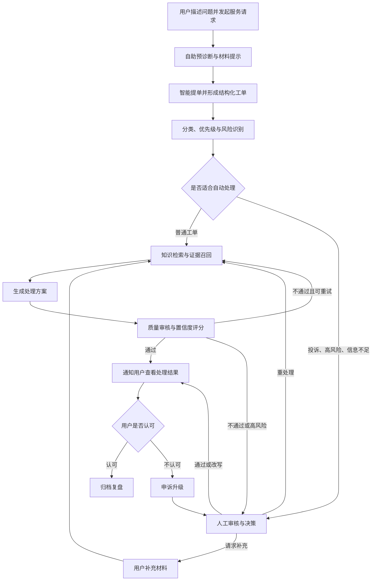

## Context

本设计面向老师对现有功能架构图的反馈：

- 架构图需要像业务功能框架图一样，直接看出系统体量。
- 不要在图上用编号堆清单。
- 用户侧功能体量不够，不能只看到提交工单和补充工单。
- 管理员和用户都参与工单处理，但现有模块名称没有体现工单主线。
- 开发人员模块与工单业务关系不清。
- 智能算法模块不能把 RAG 接口、文档入库、Trace、多 Agent 名词当作算法，需要提炼真正服务业务的智能方法。

因此，本变更采用“工单生命周期优先”的结构：先定义业务目标和主流程，再把角色职责、功能模块、智能技术和任务拆分放回同一条工单处理主线中验证。

## Goals / Non-Goals

### Goals

- 形成一套能回答老师问题的业务架构口径。
- 明确工单处理涉及哪些角色、每个角色参与哪些流程。
- 明确每个流程使用系统的哪些功能，以及这些功能如何协作。
- 明确哪些流程使用智能技术，说明技术输入、输出、处理方法和业务价值。
- 基于业务架构图拆出后续文档、功能、图形和演示任务。
- 让后续系统设计章节、功能架构图、任务计划保持同一套模块名称和逻辑。

### Non-Goals

- 不把系统扩展成完整 ITSM、OA、财务报销或企业客服平台。
- 不新增与工单主线无关的复杂业务域。
- 不把 RAG 入库、接口封装、Trace 存储本身包装成算法创新点。
- 不要求本 change 直接完成所有代码实现。
- 不把开发人员定义为工单审核员或客服人员。

## 核心业务目标

系统业务目标应表述为：

> 面向客服、运维和企业内部服务场景，构建一个可自动理解、分类、检索知识、生成处理方案、质量审核、人工接管和持续复盘的智能工单处理系统，降低用户提单门槛和人工初筛成本，提高常见工单处理效率，并保证高风险工单可人工复核、处理过程可解释。

该目标包含四个关键词：

| 关键词 | 含义 |
| --- | --- |
| 工单处理 | 系统主业务，不是泛聊天、泛知识库或泛 Agent 平台 |
| 人机协同 | 普通工单自动处理，高风险/低置信/用户不满意工单人工接管 |
| 知识增强 | 处理方案必须有知识依据，不只是大模型自由生成 |
| 可解释可复盘 | 通过 Trace、审核记录、用户反馈和运维调优支撑持续改进 |

## 角色与职责

| 角色 | 与工单的关系 | 需要系统提供的功能 |
| --- | --- | --- |
| 工单提交人 | 发起服务请求，补充材料，查看处理进度，验收结果，发起申诉 | 服务档案、预诊断、智能提单、材料采集、进度协同、补充沟通、结果验收、申诉复盘 |
| 工单审核员 | 处理系统无法自动闭环的工单，核查 AI 建议，做人工决策 | 待审队列、工单详情、AI 建议核查、审核决策、补充请求、审核统计 |
| 系统管理员 | 保障账号、知识、配置和审计可控，支撑工单运营 | 账号管理、知识维护、运营分析、操作审计、系统配置查看 |
| 开发运维人员 | 不处理普通工单，负责诊断和优化智能处理链路 | Trace 决策树、RAG 调试、Prompt 版本、Agent 调用统计、Token 成本、服务健康 |
| 智能处理引擎 | 非登录角色，承担自动理解、处理、审核和流转 | 意图抽取、分类风险识别、混合检索、重排、方案生成、质量评分、状态机编排 |

## 工单生命周期

### 业务流程

### 流程与功能映射

| 流程 | 用户侧功能 | 管理员侧功能 | 智能处理能力 | 运维调优能力 |
| --- | --- | --- | --- | --- |
| 发起请求 | 服务档案、智能提单 | 无 | 意图抽取 | Trace 查看提单节点 |
| 材料采集 | 预诊断、材料清单、补充上传 | 补充请求 | 缺字段识别 | Prompt 调优 |
| 分类路由 | 查看分类结果 | 分类优先级确认 | 分类、优先级、风险规则 | 分类错误复盘 |
| 知识处理 | 查看处理依据 | 知识维护 | 混合检索、重排、知识增强生成 | RAG 命中调试 |
| 质量审核 | 等待处理结果 | AI 建议核查 | 质量评分、重试建议 | Agent 调用统计 |
| 人工接管 | 补充信息、等待处理 | 待审队列、审核决策 | 升级决策、协调建议 | 决策点追踪 |
| 结果验收 | 结果确认、满意度反馈 | 用户反馈分析 | 反馈触发复审 | 低满意案例复盘 |
| 归档复盘 | 历史工单查询 | 运营统计、审计日志 | 相似案例沉淀 | 成本与健康检查 |

## 智能技术映射

| 智能方法 | 业务位置 | 输入 | 输出 | 方法说明 | 业务价值 |
| --- | --- | --- | --- | --- | --- |
| 工单意图抽取 | 智能提单 | 用户自然语言、服务档案、补充材料 | 标题、分类候选、影响范围、联系方式、缺失字段 | LLM 结构化抽取 + Schema 校验 + 关键词兜底 | 降低用户填写门槛，把非结构化描述变为可处理工单 |
| 分类与风险识别 | 分类路由 | 结构化工单、关键词、历史规则 | 工单类别、优先级、风险标签、是否人工审核 | LLM 分类 + 规则引擎 + 置信度阈值 | 降低人工初筛成本，避免投诉/P0 自动闭环 |
| 混合检索融合 | 知识处理 | 工单问题、分类、上下文 | 候选知识片段及融合分数 | 向量召回 + BM25 关键词召回 + RRF 融合 | 同时支持语义问题和错误码/型号精确匹配 |
| 交叉编码重排 | 知识处理 | 候选片段、原始问题 | 重排后的 Top-K 证据 | Cross-Encoder 相关性评分 | 提高返回给处理 Agent 的证据质量 |
| 知识增强生成 | 方案生成 | 工单上下文、证据片段、处理规范 | 处理方案、依据引用、下一步建议 | ReAct 工具调用 + 受约束提示词 | 让常见工单可自动生成有依据的处理方案 |
| 质量审核评分 | 质量审核 | 原始工单、处理方案、证据、风险标签 | 评分、问题类型、重试或转人工建议 | LLM 评审 Rubric + 阈值策略 | 防止低质量或无依据结果直接返回用户 |
| 升级与恢复编排 | 人工接管 | 分类结果、审核评分、重试次数、用户反馈 | 下一节点、人工审核原因、恢复入口 | LangGraph 状态机 + 条件路由 | 保证流程可暂停、可人工接管、可恢复 |

## 模块拆分原则

- 模块名称优先使用业务职责，而不是技术组件名称。
- 每个三级模块都要能说明“它处理哪类工单动作”。
- 账号、登录、会话等基础能力合并到“服务档案”或“数据权限”中，不作为多个独立小模块撑体量。
- RAG 文档解析、分块、入库属于知识维护支撑，不单独称为智能算法。
- Trace、Prompt、Token 属于智能流程运维能力，必须说明其与工单处理质量、成本和稳定性的关系。
- 架构图不使用功能编号，但任务文档可以按阶段组织执行。

## 任务拆分策略

后续任务按照“先业务表达，后功能补强，再验证演示”的顺序推进：

| 阶段 | 目标 | 产物 |
| --- | --- | --- |
| 业务口径统一 | 回答业务目标、角色、流程、智能方法 | 业务梳理文档、答辩说明 |
| 架构图同步 | 让图能直接看出系统体量和工单主线 | drawio、PNG、SVG、PDF |
| 用户侧补强 | 让用户模块不只剩提交/补充 | 预诊断、材料采集、进度协同、验收申诉 |
| 管理员侧补强 | 让管理员明确参与工单受理、审核和运营 | 受理队列、人工审核、知识维护、账号管理、统计审计 |
| 智能能力凝练 | 提炼真正的关键技术算法 | 输入输出表、算法说明、流程嵌入点 |
| 运维能力解释 | 说明开发人员模块与工单质量关系 | Trace/RAG/Prompt/Agent/Token 的问题诊断链 |
| 验收演示准备 | 用一个工单案例串起所有角色和模块 | 演示脚本、测试用例、论文章节材料 |
